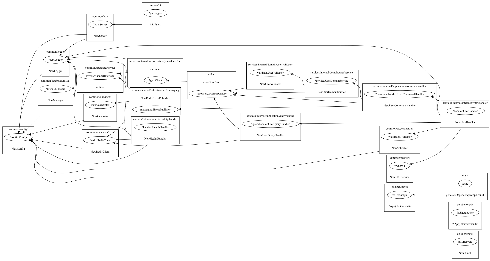

```mermaid
graph TD
    A[main] --> B[go.uber.org/fx]
    B --> C[fx.DotGraph]
    C --> D[*App.dotGraph-fm]
    D --> E[go.uber.org/fx]
    E --> F[fx.Shutdowner]
    F --> G[*App.shutdowner-fm]
    G --> H[go.uber.org/fx]
    H --> I[fx.Lifecycle]
    I --> J[New.func1]

    J --> K[common/config]
    K --> L[*config.Config]
    L --> M[NewConfig]

    M --> N[common/logger]
    N --> O[*zap.Logger]
    O --> P[NewLogger]

    M --> Q[common/databases/mysql]
    Q --> R[*mysql.Manager]
    R --> S[NewManager]

    M --> T[common/databases/redis]
    T --> U[*redis.RedisClient]
    U --> V[NewRedisClient]

    M --> W[common/pkg/idgen]
    W --> X[ulgen.Generator]
    X --> Y[NewGenerator]

    M --> Z[common/http]
    Z --> AA[*gin.Engine]
    AA --> AB[NewServer]

    AB --> AC[common/http]
    AC --> AD[*http.Server]
    AD --> AE[init.func1]

    AE --> AF[common/databases/mysql]
    AF --> AG[mysql.ManagerInterface]
    AG --> AH[init.func1]

    AH --> AI[services/internal/infrastructure/persistence/ent]
    AI --> AJ[*gen.Client]
    AJ --> AK[init.func1]

    AK --> AL[services/internal/infrastructure/messaging]
    AL --> AM[NewRedisEventPublisher]
    AM --> AN[messaging.EventPublisher]

    AN --> AO[services/internal/interfaces/http/handler]
    AO --> AP[*handler.HealthHandler]
    AP --> AQ[NewHealthHandler]

    AQ --> AR[services/internal/application/query/handler]
    AR --> AS[*queryhandler.UserQueryHandler]
    AS --> AT[NewUserQueryHandler]

    AT --> AU[services/internal/domain/user/validator]
    AU --> AV[validator.UserValidator]
    AV --> AW[NewUserValidator]

    AW --> AX[services/internal/domain/user/service]
    AX --> AY[*service.UserDomainService]
    AY --> AZ[NewUserDomainService]

    AZ --> BA[services/internal/application/command/handler]
    BA --> BB[*commandhandler.UserCommandHandler]
    BB --> BC[NewUserCommandHandler]

    BC --> BD[services/internal/interfaces/http/handler]
    BD --> BE[*handler.UserHandler]
    BE --> BF[NewUserHandler]

    BF --> BG[common/pkg/validation]
    BG --> BH[*validation.Validator]
    BH --> BI[NewValidator]

    BI --> BJ[common/pkg/json]
    BJ --> BK[*jwt.JWT]
    BK --> BL[NewJWTService]

    BL --> BM[reflect]
    BM --> BN[mustFuncStub]
    BN --> BO[repository.UserRepository]

    BO --> BP[services/internal/infrastructure/persistence/ent]
    BP --> BQ[*gen.Client]
    BQ --> BR[init.func1]
```

# Go 微服务架构依赖关系图

## 📋 目录

- [概述](#概述)
- [依赖关系图](#依赖关系图)
- [依赖关系说明](#依赖关系说明)
- [可视化图表](#可视化图表)
- [依赖关系文件](#依赖关系文件)

## 概述

本图展示了 Go 微服务架构中的组件依赖关系，包括配置、数据库、HTTP 服务、业务逻辑、验证器等模块之间的调用关系。通过此图可以清晰地了解系统各部分的交互方式和依赖结构。

## 依赖关系图

## 依赖关系说明

### 核心依赖流向

1. **应用启动流程**：[main](./services/cmd/server/main.go) → [go.uber.org/fx](./go.mod) → 配置加载 → 基础设施初始化
2. **配置依赖**：所有模块都依赖于 [common/config](./common/config/config.go) 提供的配置信息
3. **日志系统**：[common/logger](./common/logger/logger.go) 被多个模块使用，作为统一日志输出
4. **数据访问层**：从 [common/databases](./common/databases/module.go) 到 [services/internal/infrastructure/persistence/ent](./services/internal/infrastructure/persistence/ent/module.go) 实现数据持久化
5. **业务逻辑层**：[domain](./services/internal/domain/user/di.go) → [application](./services/internal/application/di.go) → [interfaces](./services/internal/interfaces/http/di.go) 的典型 Clean Architecture 依赖流向

### 关键模块依赖关系

- **HTTP服务**：依赖配置、日志等基础组件
- **数据库访问**：通过 Ent ORM 实现，依赖 MySQL 管理器
- **用户领域服务**：依赖仓储实现和验证器
- **接口层**：依赖应用层的命令和查询处理器

## 可视化图表

## 依赖关系文件

[dependency-graph.dot](./assets/dependency-graph.dot)