# Uber FX 框架完全指南

> 🚀 从零开始学习 Uber FX 依赖注入框架，构建模块化和可维护的 Go 应用程序

## 📚 目录

- [1. 什么是 FX？](#1-什么是-fx)
- [2. 核心概念](#2-核心概念)
- [3. 依赖注入流程图](#3-依赖注入流程图)
- [4. 核心函数详解](#4-核心函数详解)
- [5. 实战示例](#5-实战示例)
- [6. 最佳实践](#6-最佳实践)
- [7. 常见问题与解决方案](#7-常见问题与解决方案)
- [8. 调试与故障排除](#8-调试与故障排除)

---

## 1. 什么是 FX？

### 🎯 简单理解

想象你在组装一台电脑：
- **传统方式**：你需要手动连接每个组件（CPU、内存、硬盘等）
- **FX 方式**：你只需要告诉 FX 你有哪些组件，FX 会自动帮你连接好

```go
// 传统方式 - 手动管理依赖
func main() {
    config := NewConfig()
    logger := NewLogger(config)
    db := NewDatabase(config, logger)
    service := NewUserService(db, logger)
    handler := NewUserHandler(service, logger)
    server := NewServer(handler, logger)
    
    // 手动启动和关闭...
}

// FX 方式 - 自动管理依赖
func main() {
    fx.New(
        fx.Provide(NewConfig, NewLogger, NewDatabase, NewUserService, NewUserHandler, NewServer),
        fx.Invoke(StartServer),
    ).Run()
}
```

### 🌟 FX 的优势

1. **自动依赖注入**：无需手动创建和传递依赖
2. **生命周期管理**：自动处理启动和关闭逻辑
3. **模块化设计**：代码组织更清晰
4. **易于测试**：可以轻松替换依赖进行测试
5. **错误检测**：编译时检测依赖问题

---

## 2. 核心概念

### 🏗️ 依赖注入（Dependency Injection）

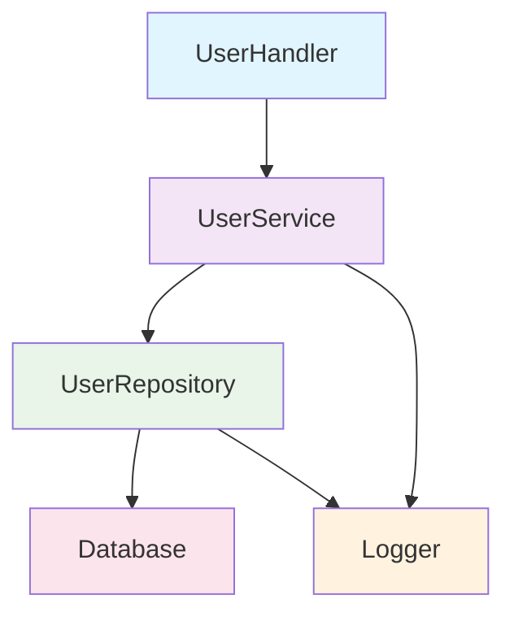

**传统方式的问题**：
```go
// ❌ 紧耦合 - 难以测试和维护
type UserHandler struct {
    service *UserService
}

func NewUserHandler() *UserHandler {
    // 硬编码依赖 - 难以替换
    db := sql.Open("mysql", "...")
    logger := log.New(os.Stdout, "", 0)
    repo := NewUserRepository(db, logger)
    service := NewUserService(repo, logger)
    
    return &UserHandler{service: service}
}
```

**FX 方式的优势**：
```go
// ✅ 松耦合 - 易于测试和维护
type UserHandler struct {
    service UserService // 依赖接口而非具体实现
}

func NewUserHandler(service UserService) *UserHandler {
    return &UserHandler{service: service}
}
```

### 🔄 生命周期管理

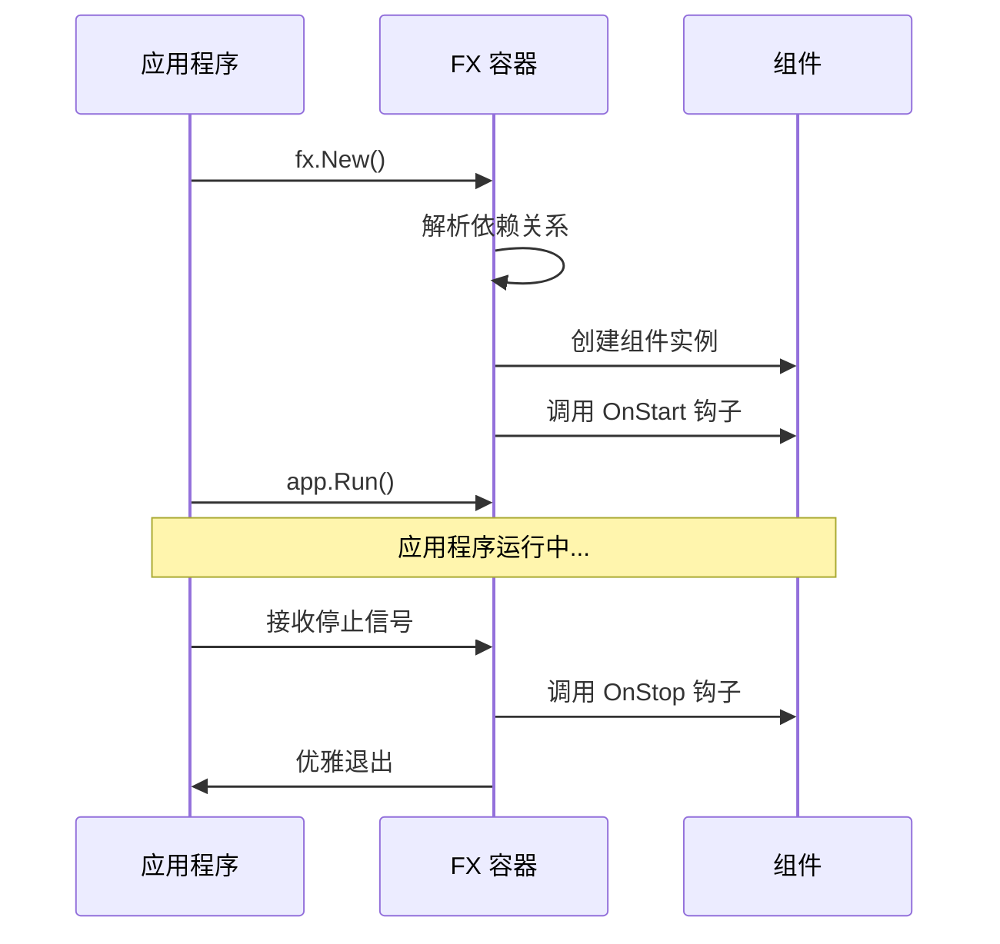

---

## 3. 依赖注入流程图

### 🔍 FX 工作流程

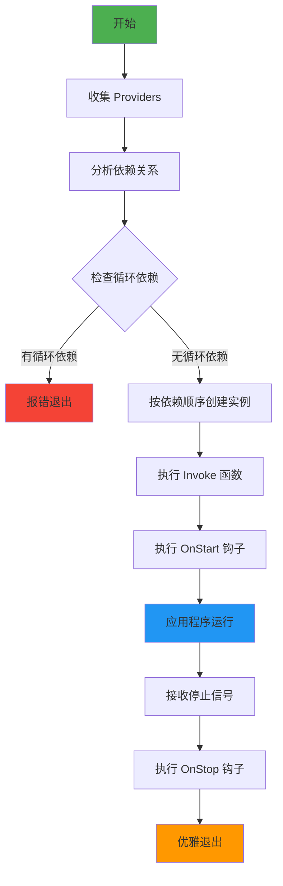

### 🏭 依赖解析示例

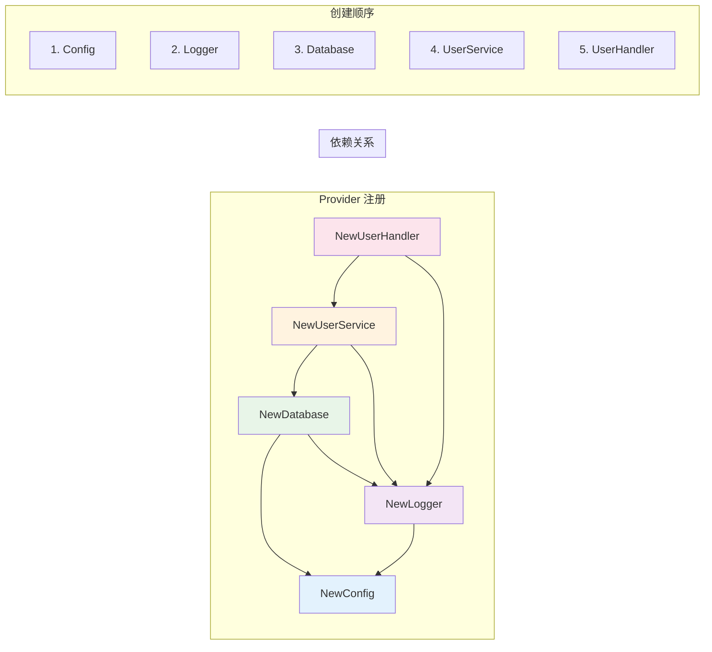

---

## 4. 核心函数详解

### 🎯 fx.Provide - 注册构造函数

#### 💡 简单理解
`fx.Provide` 就像是告诉 FX："我知道如何创建这个东西"

```go
// 告诉 FX 如何创建 Logger
fx.Provide(NewLogger)

// 等价于注册这个工厂函数
func NewLogger(config *Config) *zap.Logger {
    // 创建 logger 的逻辑
    return logger
}
```

#### 🔄 工作流程

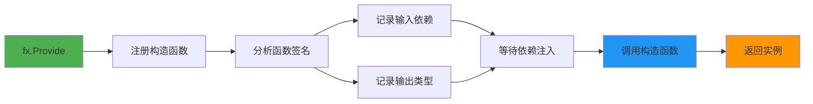

#### 📝 实际示例

```go
// 基础用法
fx.Provide(
    NewConfig,    // func() *Config
    NewLogger,    // func(*Config) *zap.Logger  
    NewDatabase,  // func(*Config, *zap.Logger) *sql.DB
)

// 提供多个返回值
fx.Provide(func() (*Config, error) {
    config, err := LoadConfig()
    return config, err
})

// 提供接口实现
fx.Provide(
    fx.Annotate(
        NewUserRepository,  // 返回具体类型
        fx.As(new(UserRepositoryInterface)), // 绑定到接口
    ),
)
```

### 🚀 fx.Invoke - 启动函数

#### 💡 简单理解
`fx.Invoke` 就像是告诉 FX："应用启动后，请调用这个函数"

```go
// 启动 HTTP 服务器
fx.Invoke(StartServer)

// 等价于在应用启动后调用
func StartServer(server *http.Server, lc fx.Lifecycle) {
    // 启动服务器的逻辑
}
```

#### 🔄 执行时机

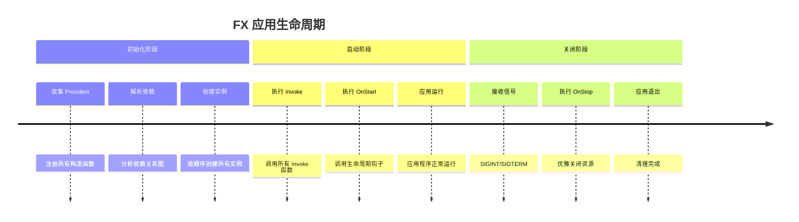

#### 📝 实际示例

```go
// 启动 HTTP 服务器
fx.Invoke(func(server *http.Server, lc fx.Lifecycle, logger *zap.Logger) {
    lc.Append(fx.Hook{
        OnStart: func(ctx context.Context) error {
            logger.Info("Starting HTTP server")
            go server.ListenAndServe()
            return nil
        },
        OnStop: func(ctx context.Context) error {
            logger.Info("Stopping HTTP server")
            return server.Shutdown(ctx)
        },
    })
})

// 注册路由
fx.Invoke(func(router *gin.Engine, userHandler *UserHandler) {
    router.POST("/users", userHandler.CreateUser)
    router.GET("/users/:id", userHandler.GetUser)
})

// 数据库迁移
fx.Invoke(func(db *sql.DB, logger *zap.Logger) {
    logger.Info("Running database migrations")
    // 执行迁移逻辑
})
```

### 📦 fx.Module - 模块化组织

#### 💡 简单理解
`fx.Module` 就像是一个功能包，把相关的东西打包在一起

```go
// 数据库模块 - 包含所有数据库相关的组件
var DatabaseModule = fx.Module("database",
    fx.Provide(NewDatabase, NewUserRepository, NewOrderRepository),
    fx.Invoke(RunMigrations),
)
```

#### 🏗️ 模块结构

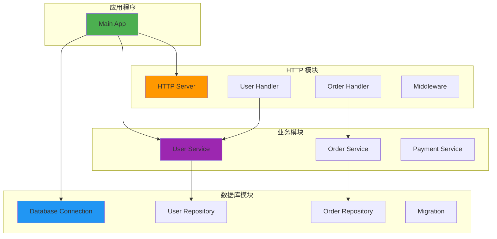

#### 📝 实际示例

```go
// 数据库模块
var DatabaseModule = fx.Module("database",
    fx.Provide(
        NewDatabaseConnection,
        NewUserRepository,
        NewOrderRepository,
    ),
    fx.Invoke(RunDatabaseMigrations),
)

// HTTP 模块
var HTTPModule = fx.Module("http",
    fx.Provide(
        NewHTTPServer,
        NewUserHandler,
        NewOrderHandler,
    ),
    fx.Invoke(SetupRoutes),
)

// 业务逻辑模块
var BusinessModule = fx.Module("business",
    fx.Provide(
        NewUserService,
        NewOrderService,
        NewPaymentService,
    ),
)

// 组合所有模块
func main() {
    fx.New(
        DatabaseModule,
        HTTPModule,
        BusinessModule,
        fx.Invoke(StartApplication),
    ).Run()
}
```

### 🔗 fx.Options - 配置聚合器

#### 💡 简单理解
`fx.Options` 就像是一个配置文件夹，把多个配置放在一起

```go
// 把多个模块组合成一个配置
func GetWebAppModules() fx.Option {
    return fx.Options(
        DatabaseModule,
        HTTPModule,
        BusinessModule,
    )
}
```

#### 📝 实际示例

```go
// 核心模块组合
func GetCoreModules() fx.Option {
    return fx.Options(
        fx.Provide(NewConfig, NewLogger),
        fx.Invoke(SetupLogging),
    )
}

// Web 应用模块组合
func GetWebModules() fx.Option {
    return fx.Options(
        GetCoreModules(),
        DatabaseModule,
        HTTPModule,
        fx.Invoke(StartWebServer),
    )
}

// 微服务模块组合
func GetMicroserviceModules() fx.Option {
    return fx.Options(
        GetCoreModules(),
        DatabaseModule,
        GRPCModule,
        MessageQueueModule,
    )
}

// 使用
func main() {
    fx.New(GetWebModules()).Run()
}
```

### 🎯 fx.Annotate & fx.As - 高级依赖控制

#### 💡 简单理解
- `fx.Annotate`：给构造函数添加"标签"
- `fx.As`：告诉 FX "这个具体实现可以当作那个接口使用"

```go
// 没有 fx.As 的问题
fx.Provide(NewUserRepository) // 只能注入 *UserRepository

// 使用 fx.As 的解决方案
fx.Provide(
    fx.Annotate(
        NewUserRepository,                    // 具体实现
        fx.As(new(UserRepositoryInterface)), // 绑定到接口
    ),
)
// 现在可以注入 UserRepositoryInterface 接口
```

#### 🔄 接口绑定流程

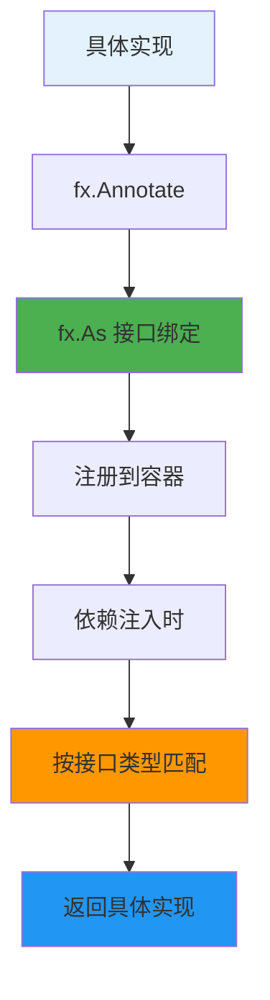

#### 📝 实际示例

```go
// 接口定义
type UserRepository interface {
    Create(user *User) error
    FindByID(id string) (*User, error)
}

// 具体实现
type mysqlUserRepository struct {
    db *sql.DB
}

func NewUserRepository(db *sql.DB) *mysqlUserRepository {
    return &mysqlUserRepository{db: db}
}

// 接口绑定
var RepositoryModule = fx.Module("repository",
    fx.Provide(
        fx.Annotate(
            NewUserRepository,
            fx.As(new(UserRepository)), // 绑定到接口
        ),
    ),
)

// 使用接口
type UserService struct {
    repo UserRepository // 依赖接口，不是具体实现
}

func NewUserService(repo UserRepository) *UserService {
    return &UserService{repo: repo}
}

// 命名依赖 - 解决同类型多实例问题
fx.Provide(
    fx.Annotate(
        NewPrimaryDatabase,
        fx.ResultTags(`name:"primary"`),
    ),
    fx.Annotate(
        NewSecondaryDatabase,
        fx.ResultTags(`name:"secondary"`),
    ),
)

// 注入命名依赖
func NewUserService(
    primaryDB *sql.DB `name:"primary"`,
    secondaryDB *sql.DB `name:"secondary"`,
) *UserService {
    return &UserService{
        primaryDB:   primaryDB,
        secondaryDB: secondaryDB,
    }
}
```

### 🔄 fx.Lifecycle - 生命周期管理

#### 💡 简单理解
`fx.Lifecycle` 就像是应用程序的"开关"，管理启动和关闭

```go
// 注册生命周期钩子
fx.Invoke(func(lc fx.Lifecycle, server *http.Server) {
    lc.Append(fx.Hook{
        OnStart: func(ctx context.Context) error {
            // 启动时执行
            go server.ListenAndServe()
            return nil
        },
        OnStop: func(ctx context.Context) error {
            // 关闭时执行
            return server.Shutdown(ctx)
        },
    })
})
```

#### 🔄 生命周期流程

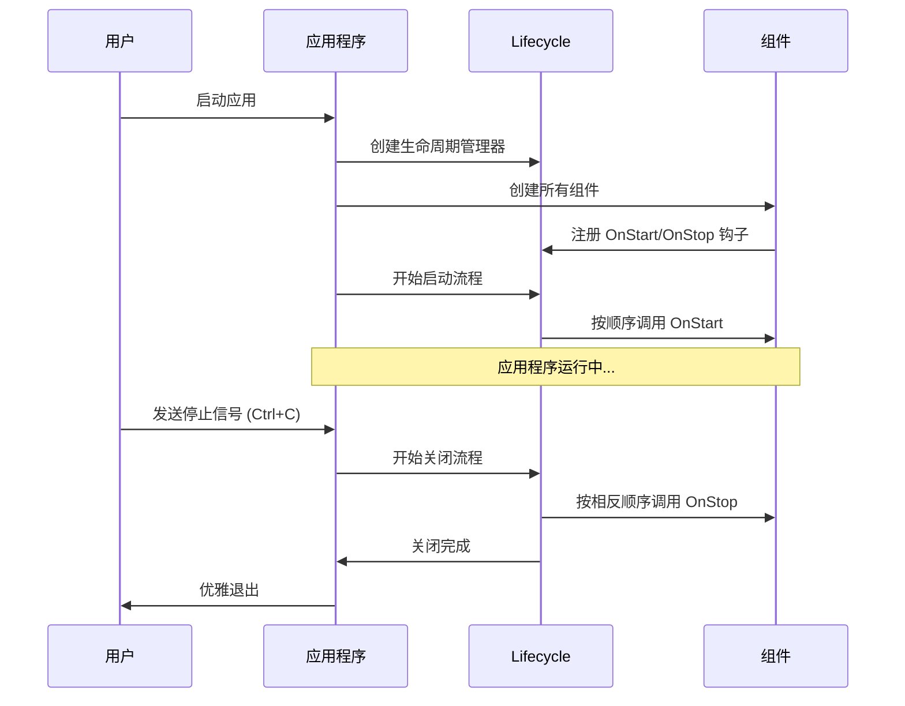

#### 📝 实际示例

```go
// HTTP 服务器生命周期管理
fx.Invoke(func(lc fx.Lifecycle, server *http.Server, logger *zap.Logger) {
    lc.Append(fx.Hook{
        OnStart: func(ctx context.Context) error {
            logger.Info("Starting HTTP server", zap.String("addr", server.Addr))
            go func() {
                if err := server.ListenAndServe(); err != nil && err != http.ErrServerClosed {
                    logger.Error("HTTP server failed", zap.Error(err))
                }
            }()
            return nil
        },
        OnStop: func(ctx context.Context) error {
            logger.Info("Stopping HTTP server")
            ctx, cancel := context.WithTimeout(ctx, 30*time.Second)
            defer cancel()
            return server.Shutdown(ctx)
        },
    })
})

// 数据库连接生命周期管理
fx.Invoke(func(lc fx.Lifecycle, db *sql.DB, logger *zap.Logger) {
    lc.Append(fx.Hook{
        OnStart: func(ctx context.Context) error {
            logger.Info("Testing database connection")
            return db.PingContext(ctx)
        },
        OnStop: func(ctx context.Context) error {
            logger.Info("Closing database connection")
            return db.Close()
        },
    })
})

// 定时任务生命周期管理
fx.Invoke(func(lc fx.Lifecycle, scheduler *cron.Cron, logger *zap.Logger) {
    lc.Append(fx.Hook{
        OnStart: func(ctx context.Context) error {
            logger.Info("Starting scheduler")
            scheduler.Start()
            return nil
        },
        OnStop: func(ctx context.Context) error {
            logger.Info("Stopping scheduler")
            ctx, cancel := context.WithTimeout(ctx, 10*time.Second)
            defer cancel()
            return scheduler.Stop().Done()
        },
    })
})
```

---

## 5. 实战示例

### 🎯 从简单到复杂的学习路径

#### 📚 Level 1: Hello World

```go
package main

import (
    "fmt"
    "go.uber.org/fx"
)

// 简单的服务
type Greeter struct {
    message string
}

func NewGreeter() *Greeter {
    return &Greeter{message: "Hello, FX World!"}
}

func (g *Greeter) Greet() {
    fmt.Println(g.message)
}

func main() {
    fx.New(
        fx.Provide(NewGreeter),           // 注册构造函数
        fx.Invoke(func(g *Greeter) {      // 启动时调用
            g.Greet()
        }),
    ).Run()
}
```

#### 📚 Level 2: 依赖注入

```go
package main

import (
    "fmt"
    "go.uber.org/fx"
)

// 配置
type Config struct {
    Name string
    Port int
}

func NewConfig() *Config {
    return &Config{
        Name: "MyApp",
        Port: 8080,
    }
}

// 日志服务
type Logger struct {
    prefix string
}

func NewLogger(config *Config) *Logger {
    return &Logger{
        prefix: fmt.Sprintf("[%s]", config.Name),
    }
}

func (l *Logger) Info(msg string) {
    fmt.Printf("%s INFO: %s\n", l.prefix, msg)
}

// 应用服务
type App struct {
    config *Config
    logger *Logger
}

func NewApp(config *Config, logger *Logger) *App {
    return &App{
        config: config,
        logger: logger,
    }
}

func (a *App) Start() {
    a.logger.Info(fmt.Sprintf("Starting app on port %d", a.config.Port))
}

func main() {
    fx.New(
        fx.Provide(
            NewConfig,  // FX 会自动注入到 NewLogger 和 NewApp
            NewLogger,  // FX 会自动注入 Config
            NewApp,     // FX 会自动注入 Config 和 Logger
        ),
        fx.Invoke(func(app *App) {
            app.Start()
        }),
    ).Run()
}
```

#### 📚 Level 3: 模块化 Web 应用

```go
package main

import (
    "context"
    "fmt"
    "net/http"
    "time"
    
    "go.uber.org/fx"
    "go.uber.org/zap"
)

// ===== 配置模块 =====
type Config struct {
    Port int    `json:"port"`
    Host string `json:"host"`
}

func NewConfig() *Config {
    return &Config{
        Port: 8080,
        Host: "localhost",
    }
}

var ConfigModule = fx.Module("config",
    fx.Provide(NewConfig),
)

// ===== 日志模块 =====
func NewLogger() (*zap.Logger, error) {
    return zap.NewDevelopment()
}

var LoggerModule = fx.Module("logger",
    fx.Provide(NewLogger),
)

// ===== 数据库模块 =====
type Database struct {
    connected bool
}

func NewDatabase(logger *zap.Logger) *Database {
    logger.Info("Connecting to database")
    return &Database{connected: true}
}

func (db *Database) Close() {
    db.connected = false
}

var DatabaseModule = fx.Module("database",
    fx.Provide(NewDatabase),
    fx.Invoke(func(lc fx.Lifecycle, db *Database, logger *zap.Logger) {
        lc.Append(fx.Hook{
            OnStop: func(ctx context.Context) error {
                logger.Info("Closing database connection")
                db.Close()
                return nil
            },
        })
    }),
)

// ===== 业务逻辑模块 =====
type UserService struct {
    db     *Database
    logger *zap.Logger
}

func NewUserService(db *Database, logger *zap.Logger) *UserService {
    return &UserService{db: db, logger: logger}
}

func (s *UserService) GetUser(id string) string {
    s.logger.Info("Getting user", zap.String("id", id))
    return fmt.Sprintf("User %s", id)
}

var ServiceModule = fx.Module("service",
    fx.Provide(NewUserService),
)

// ===== HTTP 模块 =====
type UserHandler struct {
    service *UserService
    logger  *zap.Logger
}

func NewUserHandler(service *UserService, logger *zap.Logger) *UserHandler {
    return &UserHandler{service: service, logger: logger}
}

func (h *UserHandler) GetUser(w http.ResponseWriter, r *http.Request) {
    h.logger.Info("Handling get user request")
    userID := r.URL.Query().Get("id")
    user := h.service.GetUser(userID)
    fmt.Fprintf(w, "Hello, %s!", user)
}

func NewHTTPServer(config *Config, handler *UserHandler, logger *zap.Logger) *http.Server {
    mux := http.NewServeMux()
    mux.HandleFunc("/user", handler.GetUser)
    
    server := &http.Server{
        Addr:    fmt.Sprintf("%s:%d", config.Host, config.Port),
        Handler: mux,
    }
    
    return server
}

var HTTPModule = fx.Module("http",
    fx.Provide(
        NewUserHandler,
        NewHTTPServer,
    ),
    fx.Invoke(func(lc fx.Lifecycle, server *http.Server, logger *zap.Logger) {
        lc.Append(fx.Hook{
            OnStart: func(ctx context.Context) error {
                logger.Info("Starting HTTP server", zap.String("addr", server.Addr))
                go func() {
                    if err := server.ListenAndServe(); err != nil && err != http.ErrServerClosed {
                        logger.Error("HTTP server failed", zap.Error(err))
                    }
                }()
                return nil
            },
            OnStop: func(ctx context.Context) error {
                logger.Info("Stopping HTTP server")
                ctx, cancel := context.WithTimeout(ctx, 5*time.Second)
                defer cancel()
                return server.Shutdown(ctx)
            },
        })
    }),
)

// ===== 主应用 =====
func main() {
    fx.New(
        ConfigModule,
        LoggerModule,
        DatabaseModule,
        ServiceModule,
        HTTPModule,
    ).Run()
}
```

#### 📚 Level 4: 接口绑定和测试

```go
package main

import (
    "context"
    "errors"
    "go.uber.org/fx"
    "go.uber.org/zap"
)

// ===== 接口定义 =====
type UserRepository interface {
    GetUser(id string) (*User, error)
    SaveUser(user *User) error
}

type User struct {
    ID   string
    Name string
}

// ===== 生产环境实现 =====
type mysqlUserRepository struct {
    logger *zap.Logger
}

func NewMySQLUserRepository(logger *zap.Logger) UserRepository {
    return &mysqlUserRepository{logger: logger}
}

func (r *mysqlUserRepository) GetUser(id string) (*User, error) {
    r.logger.Info("Getting user from MySQL", zap.String("id", id))
    return &User{ID: id, Name: "John Doe"}, nil
}

func (r *mysqlUserRepository) SaveUser(user *User) error {
    r.logger.Info("Saving user to MySQL", zap.String("id", user.ID))
    return nil
}

// ===== 测试环境实现 =====
type mockUserRepository struct {
    users map[string]*User
}

func NewMockUserRepository() UserRepository {
    return &mockUserRepository{
        users: make(map[string]*User),
    }
}

func (r *mockUserRepository) GetUser(id string) (*User, error) {
    if user, exists := r.users[id]; exists {
        return user, nil
    }
    return nil, errors.New("user not found")
}

func (r *mockUserRepository) SaveUser(user *User) error {
    r.users[user.ID] = user
    return nil
}

// ===== 业务逻辑 =====
type UserService struct {
    repo   UserRepository
    logger *zap.Logger
}

func NewUserService(repo UserRepository, logger *zap.Logger) *UserService {
    return &UserService{repo: repo, logger: logger}
}

func (s *UserService) ProcessUser(id string) error {
    user, err := s.repo.GetUser(id)
    if err != nil {
        return err
    }
    
    s.logger.Info("Processing user", zap.String("name", user.Name))
    return nil
}

// ===== 模块定义 =====
var ProductionModule = fx.Module("production",
    fx.Provide(
        fx.Annotate(
            NewMySQLUserRepository,
            fx.As(new(UserRepository)),
        ),
        NewUserService,
        zap.NewProduction,
    ),
)

var TestModule = fx.Module("test",
    fx.Provide(
        fx.Annotate(
            NewMockUserRepository,
            fx.As(new(UserRepository)),
        ),
        NewUserService,
        zap.NewDevelopment,
    ),
)

// ===== 应用启动 =====
func main() {
    // 生产环境
    fx.New(
        ProductionModule,
        fx.Invoke(func(service *UserService) {
            service.ProcessUser("123")
        }),
    ).Run()
}

// 测试函数
func TestApp() {
    fx.New(
        TestModule,
        fx.Invoke(func(service *UserService) {
            service.ProcessUser("test-user")
        }),
    ).Run()
}
```

### 🏗️ 微服务架构示例

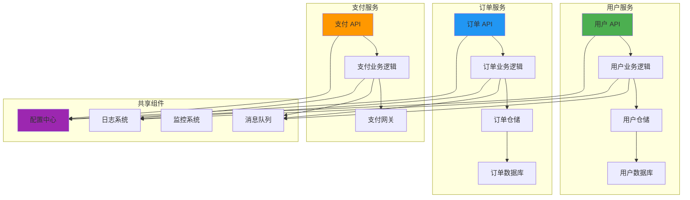

---

## 6. 最佳实践

### 🎯 项目结构建议

```
my-fx-app/
├── cmd/
│   └── server/
│       └── main.go              # 应用入口
├── internal/
│   ├── config/
│   │   ├── config.go           # 配置定义
│   │   └── module.go           # 配置模块
│   ├── domain/
│   │   ├── user/
│   │   │   ├── entity.go       # 实体定义
│   │   │   ├── repository.go   # 仓储接口
│   │   │   └── service.go      # 领域服务
│   │   └── module.go           # 领域模块
│   ├── infrastructure/
│   │   ├── database/
│   │   │   ├── mysql.go        # 数据库实现
│   │   │   └── repository.go   # 仓储实现
│   │   └── module.go           # 基础设施模块
│   ├── application/
│   │   ├── service/
│   │   │   └── user_service.go # 应用服务
│   │   └── module.go           # 应用模块
│   └── interfaces/
│       ├── http/
│       │   ├── handler/
│       │   │   └── user_handler.go # HTTP 处理器
│       │   └── server.go       # HTTP 服务器
│       └── module.go           # 接口模块
└── pkg/
    ├── logger/
    │   └── logger.go           # 日志工具
    └── database/
        └── connection.go       # 数据库连接
```

### 📋 编码规范

#### ✅ 推荐做法

```go
// ✅ 使用接口进行依赖注入
type UserService struct {
    repo   UserRepository    // 依赖接口
    logger Logger           // 依赖接口
}

// ✅ 构造函数返回接口
func NewUserService(repo UserRepository, logger Logger) UserService {
    return &userServiceImpl{repo: repo, logger: logger}
}

// ✅ 使用 fx.As 进行接口绑定
fx.Provide(
    fx.Annotate(
        NewMySQLUserRepository,
        fx.As(new(UserRepository)),
    ),
)

// ✅ 模块化组织
var UserModule = fx.Module("user",
    fx.Provide(
        NewUserService,
        fx.Annotate(NewUserRepository, fx.As(new(UserRepository))),
    ),
)

// ✅ 使用生命周期管理资源
fx.Invoke(func(lc fx.Lifecycle, db *sql.DB) {
    lc.Append(fx.Hook{
        OnStop: func(ctx context.Context) error {
            return db.Close()
        },
    })
})
```

#### ❌ 避免的做法

```go
// ❌ 直接依赖具体实现
type UserService struct {
    repo *MySQLUserRepository  // 紧耦合
}

// ❌ 在构造函数中创建依赖
func NewUserService() *UserService {
    db := sql.Open("mysql", "...")  // 硬编码依赖
    repo := NewUserRepository(db)
    return &UserService{repo: repo}
}

// ❌ 使用全局变量
var globalDB *sql.DB

func NewUserService() *UserService {
    return &UserService{db: globalDB}  // 依赖全局状态
}

// ❌ 忘记资源清理
fx.Provide(func() *sql.DB {
    db, _ := sql.Open("mysql", "...")
    return db  // 没有注册关闭逻辑
})
```

### 🧪 测试策略

#### 单元测试

```go
func TestUserService(t *testing.T) {
    // 创建测试专用的 FX 应用
    var service *UserService
    
    app := fx.New(
        fx.Provide(
            // 使用 mock 实现
            fx.Annotate(
                NewMockUserRepository,
                fx.As(new(UserRepository)),
            ),
            NewMockLogger,
            NewUserService,
        ),
        fx.Populate(&service),  // 填充到测试变量
    )
    
    err := app.Start(context.Background())
    require.NoError(t, err)
    defer app.Stop(context.Background())
    
    // 执行测试
    user, err := service.GetUser("123")
    assert.NoError(t, err)
    assert.Equal(t, "123", user.ID)
}
```

#### 集成测试

```go
func TestUserAPI(t *testing.T) {
    // 使用测试数据库
    testDB := setupTestDatabase(t)
    defer cleanupTestDatabase(t, testDB)
    
    var server *http.Server
    
    app := fx.New(
        fx.Supply(testDB),  // 提供测试数据库
        UserModule,
        HTTPModule,
        fx.Populate(&server),
    )
    
    err := app.Start(context.Background())
    require.NoError(t, err)
    defer app.Stop(context.Background())
    
    // 执行 HTTP 测试
    resp, err := http.Get("http://localhost:8080/users/123")
    assert.NoError(t, err)
    assert.Equal(t, 200, resp.StatusCode)
}
```

### ⚡ 性能优化

#### 延迟初始化

```go
// 对于昂贵的资源，使用延迟初始化
type ExpensiveService struct {
    client *http.Client
    once   sync.Once
}

func (s *ExpensiveService) getClient() *http.Client {
    s.once.Do(func() {
        s.client = &http.Client{
            Timeout: 30 * time.Second,
            Transport: &http.Transport{
                MaxIdleConns:        100,
                MaxIdleConnsPerHost: 10,
            },
        }
    })
    return s.client
}
```

#### 连接池管理

```go
func NewDatabasePool(config *Config) *sql.DB {
    db, err := sql.Open("mysql", config.DatabaseURL)
    if err != nil {
        panic(err)
    }
    
    // 配置连接池
    db.SetMaxOpenConns(25)
    db.SetMaxIdleConns(5)
    db.SetConnMaxLifetime(5 * time.Minute)
    
    return db
}
```

### 🔧 配置管理

```go
// 环境配置
type Config struct {
    Environment string `env:"ENVIRONMENT" envDefault:"development"`
    Port        int    `env:"PORT" envDefault:"8080"`
    DatabaseURL string `env:"DATABASE_URL" envDefault:"mysql://localhost/myapp"`
    LogLevel    string `env:"LOG_LEVEL" envDefault:"info"`
}

func NewConfig() (*Config, error) {
    cfg := &Config{}
    if err := env.Parse(cfg); err != nil {
        return nil, err
    }
    return cfg, nil
}

// 配置验证
fx.Invoke(func(config *Config, logger *zap.Logger) error {
    if config.DatabaseURL == "" {
        return errors.New("DATABASE_URL is required")
    }
    
    logger.Info("Configuration loaded",
        zap.String("environment", config.Environment),
        zap.Int("port", config.Port),
    )
    return nil
})
```

---

## 7. 常见问题与解决方案

### 🚨 循环依赖问题

#### 问题描述
```go
// ❌ 循环依赖示例
type UserService struct {
    orderService *OrderService
}

type OrderService struct {
    userService *UserService  // 循环依赖！
}
```

#### 解决方案

**方案1：引入中介者模式**
```go
// ✅ 使用事件总线解耦
type EventBus interface {
    Publish(event interface{})
    Subscribe(eventType reflect.Type, handler func(interface{}))
}

type UserService struct {
    eventBus EventBus
}

func (s *UserService) CreateUser(user *User) {
    // 创建用户逻辑
    s.eventBus.Publish(UserCreatedEvent{UserID: user.ID})
}

type OrderService struct {
    eventBus EventBus
}

func NewOrderService(eventBus EventBus) *OrderService {
    service := &OrderService{eventBus: eventBus}
    
    // 订阅用户创建事件
    eventBus.Subscribe(reflect.TypeOf(UserCreatedEvent{}), func(event interface{}) {
        userEvent := event.(UserCreatedEvent)
        service.handleUserCreated(userEvent.UserID)
    })
    
    return service
}
```

**方案2：提取共同依赖**
```go
// ✅ 提取共同的仓储层
type UserRepository interface {
    GetUser(id string) (*User, error)
}

type OrderRepository interface {
    GetOrdersByUser(userID string) ([]*Order, error)
}

type UserService struct {
    userRepo UserRepository
}

type OrderService struct {
    orderRepo OrderRepository
    userRepo  UserRepository  // 共享仓储，而不是服务
}
```

### 🔍 依赖未找到问题

#### 问题描述
```
[Fx] ERROR    Failed to build dependency graph: missing dependencies for function "main.NewUserService"
```

#### 解决方案

**检查依赖注册**
```go
// ❌ 忘记注册依赖
fx.New(
    fx.Provide(NewUserService),  // UserService 需要 UserRepository，但没有注册
    fx.Invoke(StartApp),
)

// ✅ 注册所有依赖
fx.New(
    fx.Provide(
        NewUserRepository,  // 先注册依赖
        NewUserService,     // 再注册使用者
    ),
    fx.Invoke(StartApp),
)
```

**检查接口绑定**
```go
// ❌ 接口没有绑定到具体实现
fx.Provide(NewMySQLUserRepository)  // 返回 *MySQLUserRepository

func NewUserService(repo UserRepository) *UserService {  // 需要 UserRepository 接口
    return &UserService{repo: repo}
}

// ✅ 使用 fx.As 绑定接口
fx.Provide(
    fx.Annotate(
        NewMySQLUserRepository,
        fx.As(new(UserRepository)),  // 绑定到接口
    ),
)
```

### 🏷️ 同类型多实例问题

#### 问题描述
```go
// 需要两个不同的数据库连接
func NewPrimaryDB() *sql.DB { /* ... */ }
func NewSecondaryDB() *sql.DB { /* ... */ }

// ❌ FX 不知道注入哪个
func NewUserService(db *sql.DB) *UserService {  // 歧义！
    return &UserService{db: db}
}
```

#### 解决方案

**使用命名依赖**
```go
// ✅ 使用标签区分
fx.Provide(
    fx.Annotate(
        NewPrimaryDB,
        fx.ResultTags(`name:"primary"`),
    ),
    fx.Annotate(
        NewSecondaryDB,
        fx.ResultTags(`name:"secondary"`),
    ),
)

// 注入时指定标签
func NewUserService(
    primaryDB *sql.DB `name:"primary"`,
    secondaryDB *sql.DB `name:"secondary"`,
) *UserService {
    return &UserService{
        primaryDB:   primaryDB,
        secondaryDB: secondaryDB,
    }
}
```

### 🔧 生命周期钩子问题

#### 问题描述
```go
// ❌ 阻塞的 OnStart 钩子
lc.Append(fx.Hook{
    OnStart: func(ctx context.Context) error {
        return server.ListenAndServe()  // 这会阻塞！
    },
})
```

#### 解决方案
```go
// ✅ 在 goroutine 中启动服务
lc.Append(fx.Hook{
    OnStart: func(ctx context.Context) error {
        go func() {
            if err := server.ListenAndServe(); err != nil && err != http.ErrServerClosed {
                logger.Error("Server failed", zap.Error(err))
            }
        }()
        return nil  // 立即返回
    },
    OnStop: func(ctx context.Context) error {
        return server.Shutdown(ctx)
    },
})
```

---

## 8. 调试与故障排除

### 🔍 启用详细日志

```go
import "go.uber.org/fx/fxevent"

func main() {
    fx.New(
        // 启用详细的 FX 日志
        fx.WithLogger(func(logger *zap.Logger) fxevent.Logger {
            return &fxevent.ZapLogger{Logger: logger}
        }),
        
        // 你的模块...
        UserModule,
        HTTPModule,
    ).Run()
}
```

### 📊 依赖关系可视化

```go
func main() {
    app := fx.New(
        UserModule,
        HTTPModule,
    )
    
    // 打印依赖关系图
    fmt.Println(app.DotGraph())
    
    // 或者保存到文件
    if err := os.WriteFile("dependencies.dot", []byte(app.DotGraph()), 0644); err != nil {
        log.Fatal(err)
    }
    
    app.Run()
}
```

然后使用 Graphviz 生成可视化图：
```bash
dot -Tpng dependencies.dot -o dependencies.png
```

### 🐛 错误诊断流程

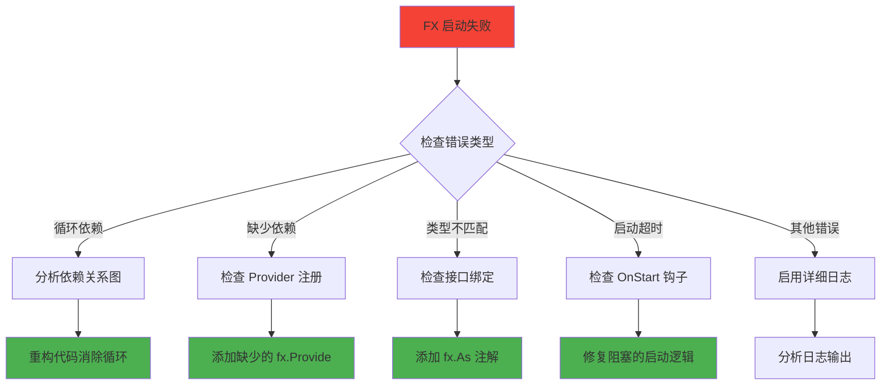

### 🛠️ 常用调试技巧

#### 1. 使用 fx.Populate 检查依赖

```go
func main() {
    var (
        userService *UserService
        httpServer  *http.Server
    )
    
    app := fx.New(
        UserModule,
        HTTPModule,
        fx.Populate(&userService, &httpServer),  // 填充变量以便检查
    )
    
    if err := app.Start(context.Background()); err != nil {
        log.Fatal("Failed to start:", err)
    }
    
    // 检查依赖是否正确注入
    fmt.Printf("UserService: %+v\n", userService)
    fmt.Printf("HTTPServer: %+v\n", httpServer)
    
    app.Stop(context.Background())
}
```

#### 2. 分阶段启动调试

```go
func main() {
    // 第一阶段：只启动核心依赖
    coreApp := fx.New(
        ConfigModule,
        LoggerModule,
        fx.Invoke(func(logger *zap.Logger) {
            logger.Info("Core dependencies loaded")
        }),
    )
    
    if err := coreApp.Start(context.Background()); err != nil {
        log.Fatal("Core failed:", err)
    }
    coreApp.Stop(context.Background())
    
    // 第二阶段：添加数据库
    dbApp := fx.New(
        ConfigModule,
        LoggerModule,
        DatabaseModule,
        fx.Invoke(func(logger *zap.Logger) {
            logger.Info("Database dependencies loaded")
        }),
    )
    
    if err := dbApp.Start(context.Background()); err != nil {
        log.Fatal("Database failed:", err)
    }
    dbApp.Stop(context.Background())
    
    // 最终：完整应用
    fx.New(
        ConfigModule,
        LoggerModule,
        DatabaseModule,
        UserModule,
        HTTPModule,
    ).Run()
}
```

#### 3. 错误处理最佳实践

```go
func main() {
    app := fx.New(
        UserModule,
        HTTPModule,
        fx.WithLogger(func() fxevent.Logger {
            logger, _ := zap.NewDevelopment()
            return &fxevent.ZapLogger{Logger: logger}
        }),
    )
    
    // 检查构建错误
    if err := app.Err(); err != nil {
        // 尝试可视化错误
        if visualization, verr := fx.VisualizeError(err); verr == nil {
            fmt.Println("Dependency error visualization:")
            fmt.Println(visualization)
        }
        log.Fatal("Failed to build app:", err)
    }
    
    // 启动应用
    ctx, cancel := context.WithTimeout(context.Background(), 30*time.Second)
    defer cancel()
    
    if err := app.Start(ctx); err != nil {
        log.Fatal("Failed to start app:", err)
    }
    
    // 优雅关闭
    defer func() {
        ctx, cancel := context.WithTimeout(context.Background(), 30*time.Second)
        defer cancel()
        app.Stop(ctx)
    }()
    
    // 等待信号
    sigChan := make(chan os.Signal, 1)
    signal.Notify(sigChan, syscall.SIGINT, syscall.SIGTERM)
    <-sigChan
}
```

### 📈 性能监控

```go
// 监控依赖创建时间
fx.Provide(
    fx.Annotate(
        func(logger *zap.Logger) *ExpensiveService {
            start := time.Now()
            defer func() {
                logger.Info("ExpensiveService created",
                    zap.Duration("duration", time.Since(start)))
            }()
            
            return NewExpensiveService()
        },
    ),
)

// 监控应用启动时间
func main() {
    start := time.Now()
    
    app := fx.New(
        UserModule,
        HTTPModule,
        fx.Invoke(func(logger *zap.Logger) {
            logger.Info("Application started",
                zap.Duration("startup_time", time.Since(start)))
        }),
    )
    
    app.Run()
}
```

---

## 9. 总结

### 🎯 FX 的核心价值

1. **简化依赖管理**：自动解析和注入依赖
2. **提高代码质量**：促进接口编程和模块化设计
3. **增强可测试性**：轻松替换依赖进行测试
4. **优雅的生命周期管理**：自动处理启动和关闭逻辑
5. **更好的错误处理**：编译时检测依赖问题

### 📚 学习路径建议

1. **入门阶段**：理解依赖注入概念，练习基本的 fx.Provide 和 fx.Invoke
2. **进阶阶段**：学习模块化设计，掌握 fx.Module 和 fx.Options
3. **高级阶段**：掌握接口绑定、生命周期管理和错误处理
4. **专家阶段**：设计复杂的微服务架构，优化性能和可维护性

### 🚀 下一步

- 在实际项目中应用 FX
- 阅读 FX 源码深入理解原理
- 贡献开源项目，分享经验
- 探索其他依赖注入框架的设计思想

---

**Happy Coding with Uber FX! 🎉**

## 5. fx.Annotate 和 fx.As

### 作用

- `fx.Annotate` 用于为 Provider 函数添加**元数据（注解）**，以精确控制依赖注入的行为，解决 Go 语言中依赖注入的复杂场景。
- `fx.As` 是 `fx.Annotate` 最常用的参数之一，用于实现**接口绑定**。

### 核心功能

1. **`fx.As` (接口绑定)：** Fx 默认根据具体类型进行依赖匹配。使用 `fx.As` 可以将一个**具体实现（struct）绑定到一个接口类型**上。
   - **优势：** 实现了**依赖倒置原则**和**解耦**。领域层可以只依赖接口 (`domainrepo.UserRepository`)，而不需要知道底层使用的是哪个具体的仓储实现（`entrepo.NewUserRepository`）。
2. **命名依赖 (`fx.ResultTags`)：** 通过 Tag 为组件命名，解决同一类型有多个实现的问题（例如，一个 `Logger` 接口需要注入一个 `"request-logger"` 和一个 `"background-logger"`）。

### 使用场景

- 接口绑定
- 命名依赖
- 可选依赖
- 实现依赖倒置原则

### 示例

```go
var DomainModule = fx.Module("domain",
    fx.Provide(
        // 仓储实现 - 将具体的 Ent 实现绑定到领域接口
        fx.Annotate(
            entrepo.NewUserRepository,              // 1. 具体实现（返回 *entrepo.UserRepository）
            fx.As(new(domainrepo.UserRepository)), // 2. 绑定到领域接口（要求依赖方注入 domainrepo.UserRepository 接口）
        ),
    ),
)
```

### 优势

- **解耦**：领域层不依赖基础设施层的具体实现
- **可测试性**：可以轻松地注入模拟实现进行测试
- **可替换性**：可以轻松替换不同的仓储实现

## 6. lc.Append

### 作用

`lc.Append` 用于向应用程序的**生命周期**中添加**钩子（Hook）**。它提供了一个优雅、可靠的机制来管理应用程序启动和停止时必须执行的操作。

### 工作原理

- **启动钩子（OnStart）：** 应用程序启动时，`OnStart` 钩子会**按顺序**依次执行。
- **停止钩子（OnStop）：** 应用程序收到停止信号（如 SIGINT）时，`OnStop` 钩子会**按相反的顺序**依次执行。

### 示例

```go
fx.Invoke(func(lc fx.Lifecycle, server *http.Server, logger *zap.Logger) {
    lc.Append(fx.Hook{
        OnStart: func(ctx context.Context) error {
            // 在应用启动时，启动 Web 服务器
            logger.Info("Starting HTTP server...")
            go server.ListenAndServe()
            return nil
        },
        OnStop: func(ctx context.Context) error {
            // 在应用停止时，优雅地关闭 Web 服务器
            logger.Info("Stopping HTTP server...")
            return server.Shutdown(ctx)
        },
    })
}),
```

### 其他应用场景

```go
// HTTP服务器管理
lc.Append(fx.Hook{
    OnStart: func(ctx context.Context) error {
        logger.Info("Starting server")
        go func() {
            if err := server.ListenAndServe(); err != nil && err != http.ErrServerClosed {
                logger.Error("Server failed to start", zap.Error(err))
            }
        }()
        return nil
    },
    OnStop: func(ctx context.Context) error {
        logger.Info("Stopping server")
        return server.Shutdown(ctx)
    },
})

// 数据库服务管理
lc.Append(fx.Hook{
    OnStop: func(ctx context.Context) error {
        logger.Info("Closing database connection")
        return db.Close()
    },
})
```

### 使用场景

1. **资源清理**：确保在应用退出时正确关闭数据库连接、Redis连接等
2. **服务启动**：启动HTTP服务器、定时任务等需要在应用启动时运行的组件
3. **优雅关闭**：确保应用能够优雅地处理关闭信号，完成正在进行的请求处理

### 优势

1. **自动管理**：不需要手动管理资源的生命周期
2. **顺序保证**：启动和停止都有明确的顺序保证
3. **错误处理**：提供了统一的错误处理机制
4. **解耦**：组件不需要知道其他组件的生命周期管理细节

## 7. fx.Populate 和 fx.Supply

### fx.Populate

#### 作用

`fx.Populate` 用于将容器中的依赖项填充到已存在的变量中，而不是通过构造函数创建新的实例。这在需要将依赖项注入到现有结构体字段或全局变量时非常有用。

#### 使用场景

- **填充现有结构体字段**：当你有一个已经存在的结构体实例，但需要填充其依赖字段时
- **填充全局变量**：当你需要将容器中的依赖项赋值给全局变量时
- **测试场景**：在测试中填充 mock 对象

#### 示例

```go
// 填充结构体字段
type Server struct {
    Router *mux.Router `name:"main"`
    Logger *zap.Logger
}

var server Server

app := fx.New(
    fx.Provide(
        NewRouter,
        NewLogger,
    ),
    fx.Populate(&server),
)

// 填充多个变量
var (
    router *mux.Router
    logger *zap.Logger
)

fx.New(
    fx.Provide(NewRouter, NewLogger),
    fx.Populate(&router, &logger),
)
```

### fx.Supply

#### 作用

`fx.Supply` 用于直接向容器提供值，而不是通过构造函数。这对于提供配置值、已经创建的实例或外部依赖非常有用。

#### 使用场景

- **提供配置值**：直接提供配置参数或环境变量
- **提供已创建的实例**：当你已经有了一个实例，不想通过构造函数重新创建时
- **提供外部依赖**：提供第三方库的实例

#### 示例

```go
// 提供配置值
fx.Supply(
    fx.Annotate(
        Config{
            Port: 8080,
            Host: "localhost",
        },
        fx.ResultTags(`name:"server-config"`),
    ),
)

// 提供已创建的实例
logger := zap.NewProduction()
defer logger.Sync()

fx.Supply(logger)

// 提供多个值
fx.Supply(
    "localhost",
    8080,
    true, // debug mode
)
```

## 8. 错误处理和调试

### 常见错误

1. **循环依赖**：当两个或多个组件相互依赖时会发生循环依赖错误
2. **缺少依赖**：当构造函数需要的依赖在容器中找不到时
3. **类型不匹配**：当依赖的类型与提供者的返回类型不匹配时

### 调试技巧

```go
// 启用详细日志
app := fx.New(
    fx.WithLogger(func() fxevent.Logger {
        return fxevent.NopLogger
    }),
    // 其他选项...
)

// 使用 fx.VisualizeError 可视化错误信息
if err := app.Err(); err != nil {
    if visualization, verr := fx.VisualizeError(err); verr == nil {
        fmt.Println(visualization)
    }
    log.Fatal("Failed to build dependencies:", err)
}
```

### 最佳实践

1. **命名依赖**：使用 `fx.ResultTags` 和 `fx.ParamTags` 为依赖项命名，避免歧义
2. **模块化设计**：将相关功能组织到模块中，提高代码可维护性
3. **接口绑定**：使用 `fx.As` 实现接口绑定，提高代码的可测试性和可替换性
4. **生命周期管理**：使用 `lc.Append` 管理资源的生命周期，确保正确启动和关闭

## 9. 实际应用示例

### 完整的 Web 应用示例

```go
package main


import (
    "context"
    "fmt"
    "log"
    "net/http"
    "time"

    "go.uber.org/fx"
    "go.uber.org/fx/fxevent"
    "go.uber.org/zap"
)

// 配置结构体
type Config struct {
    Port int `name:"port"`
    Host string `name:"host"`
}

// 服务接口
type Service interface {
    GetData() string
}

// 服务实现
type serviceImpl struct {
    logger *zap.Logger
}

func NewService(logger *zap.Logger) Service {
    return &serviceImpl{logger: logger}
}

func (s *serviceImpl) GetData() string {
    s.logger.Info("Getting data")
    return "Hello, FX!"
}

// 处理器
type Handler struct {
    service Service
    logger  *zap.Logger
}

func NewHandler(service Service, logger *zap.Logger) *Handler {
    return &Handler{service: service, logger: logger}
}

func (h *Handler) Handle(w http.ResponseWriter, r *http.Request) {
    h.logger.Info("Handling request")
    data := h.service.GetData()
    fmt.Fprint(w, data)
}

// HTTP 服务器
type Server struct {
    server *http.Server
    logger *zap.Logger
}

func NewServer(handler *Handler, logger *zap.Logger, config Config) *Server {
    mux := http.NewServeMux()
    mux.HandleFunc("/", handler.Handle)

    server := &http.Server{
        Addr:    fmt.Sprintf("%s:%d", config.Host, config.Port),
        Handler: mux,
    }
      
    return &Server{
        server: server,
        logger: logger,
    }
}

// 应用模块
var AppModule = fx.Module("app",
    fx.Provide(
        NewService,
        NewHandler,
        NewServer,
        func() Config {
            return Config{
                Port: 8080,
                Host: "localhost",
            }
        },
        zap.NewProduction,
    ),
    fx.Invoke(func(s *Server, lc fx.Lifecycle, logger *zap.Logger) {
        lc.Append(fx.Hook{
            OnStart: func(ctx context.Context) error {
                logger.Info("Starting server", zap.String("addr", s.server.Addr))
                go func() {
                    if err := s.server.ListenAndServe(); err != nil && err != http.ErrServerClosed {
                        logger.Error("Server failed", zap.Error(err))
                    }
                }()
                return nil
            },
            OnStop: func(ctx context.Context) error {
                logger.Info("Stopping server")
                ctx, cancel := context.WithTimeout(ctx, 5*time.Second)
                defer cancel()
                return s.server.Shutdown(ctx)
            },
        })
    }),
)

func main() {
    app := fx.New(
        fx.WithLogger(func(logger *zap.Logger) fxevent.Logger {
            return &fxevent.ZapLogger{Logger: logger}
        }),
        AppModule,
    )

    app.Run()
}
```

通过这个完善的文档，你应该能够更好地理解和使用 Uber FX 框架的各种功能。
