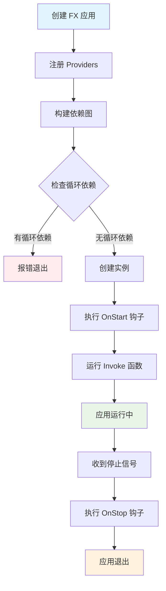
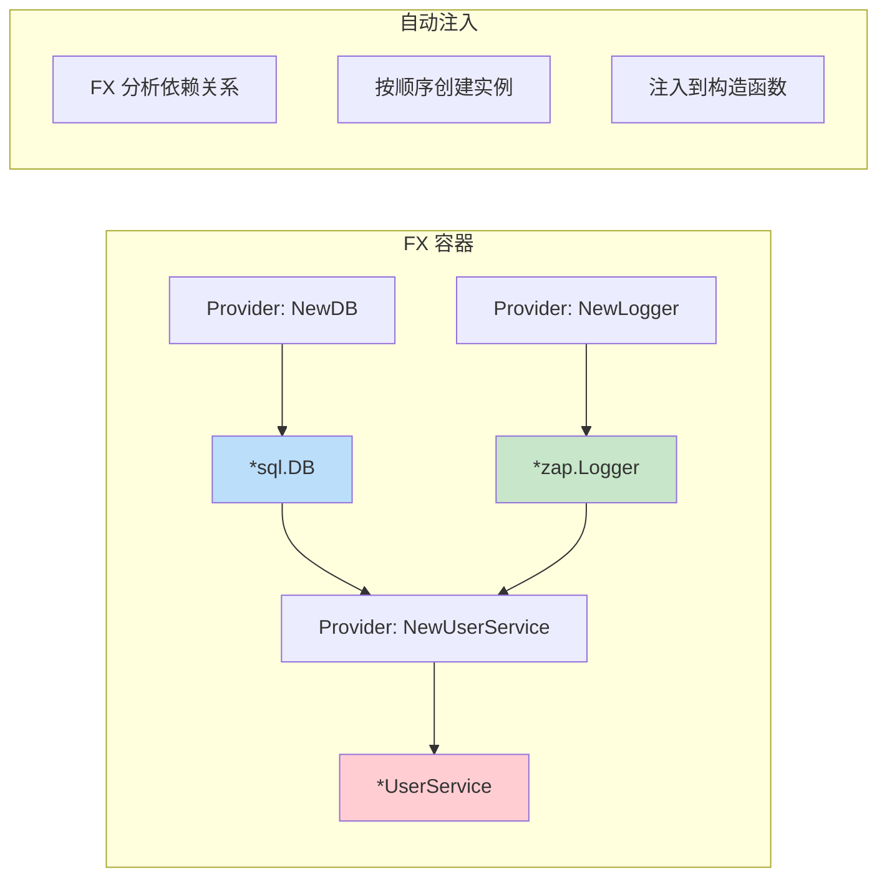
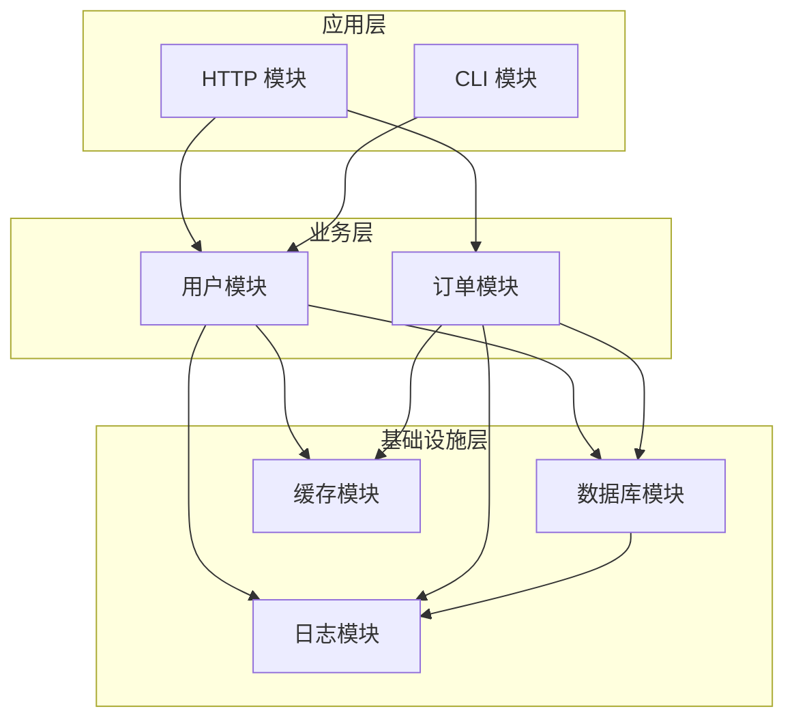
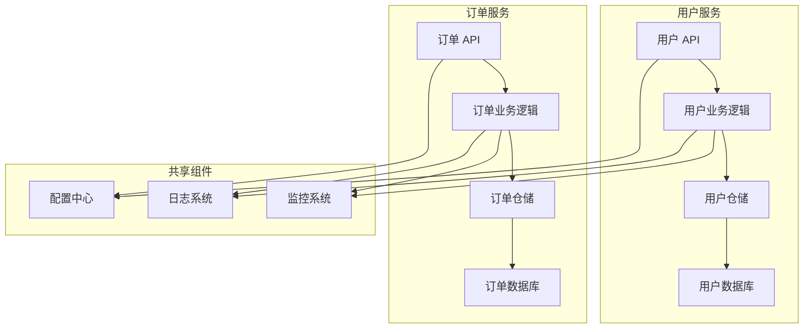
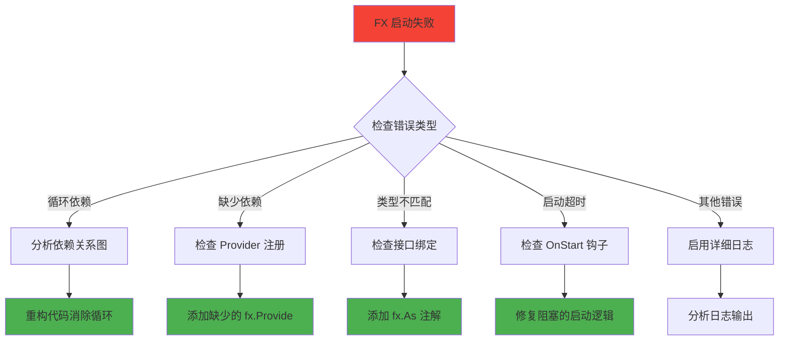

# Uber FX 框架完整学习指南

## 📚 目录

- [1. 什么是 Uber FX](#1-什么是-uber-fx)
- [2. 核心概念](#2-核心概念)
- [3. FX 核心函数详解](#3-fx-核心函数详解)
- [4. 实战示例](#4-实战示例)
- [5. 常见问题与解决方案](#5-常见问题与解决方案)
- [6. 调试与故障排除](#6-调试与故障排除)
- [7. 最佳实践](#7-最佳实践)
- [8. 总结](#8-总结)

---

## 1. 什么是 Uber FX

### 🎯 简介

Uber FX 是一个基于**依赖注入（Dependency Injection）**的 Go 应用程序框架。它帮助开发者构建**模块化**、**可测试**、**易维护**的应用程序。

### 🚀 核心价值

- **自动依赖管理**：无需手动创建和传递依赖
- **模块化设计**：将应用拆分为独立的模块
- **生命周期管理**：自动处理启动和关闭逻辑
- **提高可测试性**：轻松替换依赖进行测试

### 📊 FX 应用启动流程



---

## 2. 核心概念

### 🔧 依赖注入（Dependency Injection）

**传统方式**：
```go
// ❌ 硬编码依赖
func NewUserService() *UserService {
    db := mysql.Connect("localhost:3306")  // 硬编码
    logger := zap.NewProduction()          // 硬编码
    return &UserService{db: db, logger: logger}
}
```

**FX 方式**：
```go
// ✅ 依赖注入
func NewUserService(db *sql.DB, logger *zap.Logger) *UserService {
    return &UserService{db: db, logger: logger}
}
```

### 🏗️ 依赖注入工作原理



### 📦 模块化架构



---

## 3. FX 核心函数详解

### 3.1 fx.New

#### 🎯 作用
创建一个新的 FX 应用实例，这是所有 FX 应用的入口点。

#### 📝 语法
```go
app := fx.New(options...)
```

#### 🌟 示例
```go
func main() {
    app := fx.New(
        fx.Provide(NewDatabase),
        fx.Provide(NewUserService),
        fx.Invoke(StartServer),
    )
    
    app.Run() // 启动应用并等待信号
}
```

### 3.2 fx.Provide

#### 🎯 作用
注册**构造函数（Provider）**到 FX 容器中。FX 会自动调用这些函数来创建依赖实例。

#### 📝 语法
```go
fx.Provide(constructorFunc)
```

#### 🌟 示例
```go
// 简单的 Provider
fx.Provide(func() *Config {
    return &Config{Port: 8080}
})

// 带依赖的 Provider
fx.Provide(func(config *Config, logger *zap.Logger) *Server {
    return &Server{
        port:   config.Port,
        logger: logger,
    }
})

// 多个返回值的 Provider
fx.Provide(func() (*Database, error) {
    db, err := sql.Open("mysql", "connection-string")
    return &Database{db}, err
})
```

### 3.3 fx.Invoke

#### 🎯 作用
注册**启动函数**，在所有依赖创建完成后执行。通常用于启动服务、注册路由等。

#### 📝 语法
```go
fx.Invoke(startupFunc)
```

#### 🌟 示例
```go
// 启动 HTTP 服务器
fx.Invoke(func(server *http.Server, lc fx.Lifecycle) {
    lc.Append(fx.Hook{
        OnStart: func(ctx context.Context) error {
            go server.ListenAndServe()
            return nil
        },
        OnStop: func(ctx context.Context) error {
            return server.Shutdown(ctx)
        },
    })
})

// 注册路由
fx.Invoke(func(router *gin.Engine, userHandler *UserHandler) {
    router.GET("/users", userHandler.GetUsers)
    router.POST("/users", userHandler.CreateUser)
})
```

### 3.4 fx.Module

#### 🎯 作用
将相关的 Providers 和 Invokes 组织成一个**模块**，提高代码的组织性和复用性。

#### 📝 语法
```go
var ModuleName = fx.Module("module-name", options...)
```

#### 🌟 示例
```go
// 数据库模块
var DatabaseModule = fx.Module("database",
    fx.Provide(
        NewDatabaseConfig,
        NewDatabase,
        NewUserRepository,
    ),
)

// 用户模块
var UserModule = fx.Module("user",
    fx.Provide(
        NewUserService,
        NewUserHandler,
    ),
)

// HTTP 模块
var HTTPModule = fx.Module("http",
    fx.Provide(NewGinEngine),
    fx.Invoke(SetupRoutes),
)

// 主应用
func main() {
    fx.New(
        DatabaseModule,
        UserModule,
        HTTPModule,
    ).Run()
}
```

### 3.5 fx.Annotate 和 fx.As

#### 🎯 作用
- `fx.Annotate`：为 Provider 添加元数据
- `fx.As`：实现接口绑定，支持依赖倒置原则

#### 📝 语法
```go
fx.Annotate(
    constructorFunc,
    fx.As(new(InterfaceType)),
)
```

#### 🌟 示例
```go
// 接口定义
type UserRepository interface {
    GetUser(id string) (*User, error)
}

// 具体实现
type MySQLUserRepository struct {
    db *sql.DB
}

func NewMySQLUserRepository(db *sql.DB) *MySQLUserRepository {
    return &MySQLUserRepository{db: db}
}

// 接口绑定
var RepositoryModule = fx.Module("repository",
    fx.Provide(
        fx.Annotate(
            NewMySQLUserRepository,
            fx.As(new(UserRepository)), // 绑定到接口
        ),
    ),
)

// 使用接口
func NewUserService(repo UserRepository) *UserService {
    return &UserService{repo: repo}
}
```

#### 🏷️ 命名依赖
```go
// 多个相同类型的依赖
fx.Provide(
    fx.Annotate(
        NewPrimaryDB,
        fx.ResultTags(`name:"primary"`),
    ),
    fx.Annotate(
        NewSecondaryDB,
        fx.ResultTags(`name:"secondary"`),
    ),
)

// 注入时指定名称
func NewUserService(
    primaryDB *sql.DB `name:"primary"`,
    secondaryDB *sql.DB `name:"secondary"`,
) *UserService {
    return &UserService{
        primaryDB:   primaryDB,
        secondaryDB: secondaryDB,
    }
}
```

### 3.6 生命周期管理 (fx.Lifecycle)

#### 🎯 作用
管理应用程序的启动和关闭过程，确保资源的正确初始化和清理。

#### 📝 语法
```go
fx.Invoke(func(lc fx.Lifecycle) {
    lc.Append(fx.Hook{
        OnStart: func(ctx context.Context) error { /* 启动逻辑 */ },
        OnStop:  func(ctx context.Context) error { /* 关闭逻辑 */ },
    })
})
```

#### 🌟 示例
```go
// HTTP 服务器生命周期管理
fx.Invoke(func(server *http.Server, lc fx.Lifecycle, logger *zap.Logger) {
    lc.Append(fx.Hook{
        OnStart: func(ctx context.Context) error {
            logger.Info("Starting HTTP server", zap.String("addr", server.Addr))
            go func() {
                if err := server.ListenAndServe(); err != nil && err != http.ErrServerClosed {
                    logger.Error("Server failed", zap.Error(err))
                }
            }()
            return nil
        },
        OnStop: func(ctx context.Context) error {
            logger.Info("Stopping HTTP server")
            ctx, cancel := context.WithTimeout(ctx, 5*time.Second)
            defer cancel()
            return server.Shutdown(ctx)
        },
    })
})

// 数据库连接生命周期管理
fx.Invoke(func(db *sql.DB, lc fx.Lifecycle, logger *zap.Logger) {
    lc.Append(fx.Hook{
        OnStart: func(ctx context.Context) error {
            logger.Info("Testing database connection")
            return db.PingContext(ctx)
        },
        OnStop: func(ctx context.Context) error {
            logger.Info("Closing database connection")
            return db.Close()
        },
    })
})
```

---

## 4. 实战示例

### 4.1 简单的 Hello World

```go
package main

import (
    "fmt"
    "go.uber.org/fx"
    "go.uber.org/zap"
)

// 服务定义
type Greeter struct {
    logger *zap.Logger
}

func NewGreeter(logger *zap.Logger) *Greeter {
    return &Greeter{logger: logger}
}

func (g *Greeter) Greet(name string) {
    g.logger.Info("Greeting", zap.String("name", name))
    fmt.Printf("Hello, %s!\n", name)
}

func main() {
    fx.New(
        fx.Provide(
            zap.NewDevelopment, // 提供 logger
            NewGreeter,         // 提供 greeter
        ),
        fx.Invoke(func(greeter *Greeter) {
            greeter.Greet("FX World")
        }),
    ).Run()
}
```

### 4.2 完整的 Web 应用

```go
package main

import (
    "context"
    "fmt"
    "net/http"
    "time"

    "go.uber.org/fx"
    "go.uber.org/zap"
)

// ===== 配置 =====
type Config struct {
    Port int
    Host string
}

func NewConfig() Config {
    return Config{
        Port: 8080,
        Host: "localhost",
    }
}

// ===== 服务层 =====
type UserService struct {
    logger *zap.Logger
}

func NewUserService(logger *zap.Logger) *UserService {
    return &UserService{logger: logger}
}

func (s *UserService) GetUsers() []string {
    s.logger.Info("Getting users")
    return []string{"Alice", "Bob", "Charlie"}
}

// ===== 处理器层 =====
type UserHandler struct {
    service *UserService
    logger  *zap.Logger
}

func NewUserHandler(service *UserService, logger *zap.Logger) *UserHandler {
    return &UserHandler{service: service, logger: logger}
}

func (h *UserHandler) HandleUsers(w http.ResponseWriter, r *http.Request) {
    h.logger.Info("Handling users request")
    users := h.service.GetUsers()
    
    w.Header().Set("Content-Type", "application/json")
    fmt.Fprintf(w, `{"users": %q}`, users)
}

// ===== HTTP 服务器 =====
type Server struct {
    server *http.Server
    logger *zap.Logger
}

func NewServer(handler *UserHandler, config Config, logger *zap.Logger) *Server {
    mux := http.NewServeMux()
    mux.HandleFunc("/users", handler.HandleUsers)

    server := &http.Server{
        Addr:    fmt.Sprintf("%s:%d", config.Host, config.Port),
        Handler: mux,
    }

    return &Server{server: server, logger: logger}
}

// ===== 模块定义 =====
var ConfigModule = fx.Module("config",
    fx.Provide(NewConfig),
)

var ServiceModule = fx.Module("service",
    fx.Provide(NewUserService),
)

var HandlerModule = fx.Module("handler",
    fx.Provide(NewUserHandler),
)

var ServerModule = fx.Module("server",
    fx.Provide(NewServer),
    fx.Invoke(func(s *Server, lc fx.Lifecycle) {
        lc.Append(fx.Hook{
            OnStart: func(ctx context.Context) error {
                s.logger.Info("Starting server", zap.String("addr", s.server.Addr))
                go func() {
                    if err := s.server.ListenAndServe(); err != nil && err != http.ErrServerClosed {
                        s.logger.Error("Server failed", zap.Error(err))
                    }
                }()
                return nil
            },
            OnStop: func(ctx context.Context) error {
                s.logger.Info("Stopping server")
                ctx, cancel := context.WithTimeout(ctx, 5*time.Second)
                defer cancel()
                return s.server.Shutdown(ctx)
            },
        })
    }),
)

// ===== 主应用 =====
func main() {
    fx.New(
        fx.Provide(zap.NewDevelopment),
        ConfigModule,
        ServiceModule,
        HandlerModule,
        ServerModule,
    ).Run()
}
```

### 4.3 微服务架构示例



```go
// 用户服务模块
var UserServiceModule = fx.Module("user-service",
    fx.Provide(
        NewUserRepository,
        NewUserService,
        NewUserHandler,
    ),
)

// 订单服务模块
var OrderServiceModule = fx.Module("order-service",
    fx.Provide(
        NewOrderRepository,
        NewOrderService,
        NewOrderHandler,
    ),
)

// 共享模块
var SharedModule = fx.Module("shared",
    fx.Provide(
        NewConfig,
        NewLogger,
        NewDatabase,
        NewMetrics,
    ),
)

// 微服务应用
func main() {
    fx.New(
        SharedModule,
        UserServiceModule,
        OrderServiceModule,
        HTTPModule,
    ).Run()
}
```

---

## 5. 常见问题与解决方案

### 🚨 循环依赖问题

#### 问题描述
```go
// ❌ 循环依赖示例
type UserService struct {
    orderService *OrderService
}

type OrderService struct {
    userService *UserService  // 循环依赖！
}
```

#### 解决方案

**方案1：引入中介者模式**
```go
// ✅ 使用事件总线解耦
type EventBus interface {
    Publish(event interface{})
    Subscribe(eventType string, handler func(interface{}))
}

type UserService struct {
    eventBus EventBus
}

func (s *UserService) CreateUser(user *User) {
    // 创建用户逻辑
    s.eventBus.Publish("user.created", UserCreatedEvent{UserID: user.ID})
}

type OrderService struct {
    eventBus EventBus
}

func NewOrderService(eventBus EventBus) *OrderService {
    service := &OrderService{eventBus: eventBus}
    
    // 订阅用户创建事件
    eventBus.Subscribe("user.created", func(event interface{}) {
        userEvent := event.(UserCreatedEvent)
        service.handleUserCreated(userEvent.UserID)
    })
    
    return service
}
```

**方案2：提取共同依赖**
```go
// ✅ 提取共同的仓储层
type UserRepository interface {
    GetUser(id string) (*User, error)
}

type OrderRepository interface {
    GetOrdersByUser(userID string) ([]*Order, error)
}

type UserService struct {
    userRepo UserRepository
}

type OrderService struct {
    orderRepo OrderRepository
    userRepo  UserRepository  // 共享仓储，而不是服务
}
```

### 🔍 依赖未找到问题

#### 问题描述
```
[Fx] ERROR    Failed to build dependency graph: missing dependencies for function "main.NewUserService"
```

#### 解决方案

**检查依赖注册**
```go
// ❌ 忘记注册依赖
fx.New(
    fx.Provide(NewUserService),  // UserService 需要 UserRepository，但没有注册
    fx.Invoke(StartApp),
)

// ✅ 注册所有依赖
fx.New(
    fx.Provide(
        NewUserRepository,  // 先注册依赖
        NewUserService,     // 再注册使用者
    ),
    fx.Invoke(StartApp),
)
```

**检查接口绑定**
```go
// ❌ 接口没有绑定到具体实现
fx.Provide(NewMySQLUserRepository)  // 返回 *MySQLUserRepository

func NewUserService(repo UserRepository) *UserService {  // 需要 UserRepository 接口
    return &UserService{repo: repo}
}

// ✅ 使用 fx.As 绑定接口
fx.Provide(
    fx.Annotate(
        NewMySQLUserRepository,
        fx.As(new(UserRepository)),  // 绑定到接口
    ),
)
```

### 🏷️ 同类型多实例问题

#### 问题描述
```go
// 需要两个不同的数据库连接
func NewPrimaryDB() *sql.DB { /* ... */ }
func NewSecondaryDB() *sql.DB { /* ... */ }

// ❌ FX 不知道注入哪个
func NewUserService(db *sql.DB) *UserService {  // 歧义！
    return &UserService{db: db}
}
```

#### 解决方案

**使用命名依赖**
```go
// ✅ 使用标签区分
fx.Provide(
    fx.Annotate(
        NewPrimaryDB,
        fx.ResultTags(`name:"primary"`),
    ),
    fx.Annotate(
        NewSecondaryDB,
        fx.ResultTags(`name:"secondary"`),
    ),
)

// 注入时指定标签
func NewUserService(
    primaryDB *sql.DB `name:"primary"`,
    secondaryDB *sql.DB `name:"secondary"`,
) *UserService {
    return &UserService{
        primaryDB:   primaryDB,
        secondaryDB: secondaryDB,
    }
}
```

### 🔧 生命周期钩子问题

#### 问题描述
```go
// ❌ 阻塞的 OnStart 钩子
lc.Append(fx.Hook{
    OnStart: func(ctx context.Context) error {
        return server.ListenAndServe()  // 这会阻塞！
    },
})
```

#### 解决方案
```go
// ✅ 在 goroutine 中启动服务
lc.Append(fx.Hook{
    OnStart: func(ctx context.Context) error {
        go func() {
            if err := server.ListenAndServe(); err != nil && err != http.ErrServerClosed {
                logger.Error("Server failed", zap.Error(err))
            }
        }()
        return nil  // 立即返回
    },
    OnStop: func(ctx context.Context) error {
        return server.Shutdown(ctx)
    },
})
```

---

## 6. 调试与故障排除

### 🔍 启用详细日志

```go
import "go.uber.org/fx/fxevent"

func main() {
    fx.New(
        // 启用详细的 FX 日志
        fx.WithLogger(func(logger *zap.Logger) fxevent.Logger {
            return &fxevent.ZapLogger{Logger: logger}
        }),
        
        // 你的模块...
        UserModule,
        HTTPModule,
    ).Run()
}
```

### 📊 依赖关系可视化

```go
func main() {
    app := fx.New(
        UserModule,
        HTTPModule,
    )
    
    // 打印依赖关系图
    fmt.Println(app.DotGraph())
    
    // 或者保存到文件
    if err := os.WriteFile("dependencies.dot", []byte(app.DotGraph()), 0644); err != nil {
        log.Fatal(err)
    }
    
    app.Run()
}
```

然后使用 Graphviz 生成可视化图：
```bash
dot -Tpng dependencies.dot -o dependencies.png
```

### 🐛 错误诊断流程



### 🛠️ 常用调试技巧

#### 1. 使用 fx.Populate 检查依赖

```go
func main() {
    var (
        userService *UserService
        httpServer  *http.Server
    )
    
    app := fx.New(
        UserModule,
        HTTPModule,
        fx.Populate(&userService, &httpServer),  // 填充变量以便检查
    )
    
    if err := app.Start(context.Background()); err != nil {
        log.Fatal("Failed to start:", err)
    }
    
    // 检查依赖是否正确注入
    fmt.Printf("UserService: %+v\n", userService)
    fmt.Printf("HTTPServer: %+v\n", httpServer)
    
    app.Stop(context.Background())
}
```

#### 2. 分阶段启动调试

```go
func main() {
    // 第一阶段：只启动核心依赖
    coreApp := fx.New(
        ConfigModule,
        LoggerModule,
        fx.Invoke(func(logger *zap.Logger) {
            logger.Info("Core dependencies loaded")
        }),
    )
    
    if err := coreApp.Start(context.Background()); err != nil {
        log.Fatal("Core failed:", err)
    }
    coreApp.Stop(context.Background())
    
    // 第二阶段：添加数据库
    dbApp := fx.New(
        ConfigModule,
        LoggerModule,
        DatabaseModule,
        fx.Invoke(func(logger *zap.Logger) {
            logger.Info("Database dependencies loaded")
        }),
    )
    
    if err := dbApp.Start(context.Background()); err != nil {
        log.Fatal("Database failed:", err)
    }
    dbApp.Stop(context.Background())
    
    // 最终：完整应用
    fx.New(
        ConfigModule,
        LoggerModule,
        DatabaseModule,
        UserModule,
        HTTPModule,
    ).Run()
}
```

---

## 7. 最佳实践

### 📁 项目结构建议

```
project/
├── cmd/
│   └── server/
│       └── main.go          # 应用入口
├── internal/
│   ├── config/
│   │   └── config.go        # 配置模块
│   ├── domain/
│   │   ├── user/
│   │   │   ├── service.go   # 业务逻辑
│   │   │   └── repository.go # 仓储接口
│   │   └── order/
│   ├── infrastructure/
│   │   ├── database/
│   │   │   └── mysql.go     # 数据库实现
│   │   └── cache/
│   │       └── redis.go     # 缓存实现
│   ├── interfaces/
│   │   └── http/
│   │       ├── handler/     # HTTP 处理器
│   │       └── middleware/  # 中间件
│   └── modules/
│       ├── config.go        # 配置模块
│       ├── database.go      # 数据库模块
│       ├── user.go          # 用户模块
│       └── http.go          # HTTP 模块
└── go.mod
```

### 🎯 模块设计原则

#### 1. 单一职责原则
```go
// ✅ 每个模块只负责一个领域
var UserModule = fx.Module("user",
    fx.Provide(
        NewUserRepository,
        NewUserService,
        NewUserHandler,
    ),
)

var OrderModule = fx.Module("order",
    fx.Provide(
        NewOrderRepository,
        NewOrderService,
        NewOrderHandler,
    ),
)
```

#### 2. 依赖倒置原则
```go
// ✅ 依赖接口而不是具体实现
type UserService struct {
    repo   UserRepository    // 接口
    logger Logger           // 接口
}

// 在模块中绑定具体实现
var UserModule = fx.Module("user",
    fx.Provide(
        fx.Annotate(
            NewMySQLUserRepository,
            fx.As(new(UserRepository)),
        ),
        NewUserService,
    ),
)
```

#### 3. 接口隔离原则
```go
// ✅ 小而专一的接口
type UserReader interface {
    GetUser(id string) (*User, error)
}

type UserWriter interface {
    CreateUser(user *User) error
    UpdateUser(user *User) error
}

// 根据需要组合接口
type UserRepository interface {
    UserReader
    UserWriter
}
```

### 🧪 测试策略

#### 1. 单元测试
```go
func TestUserService(t *testing.T) {
    // 创建测试模块
    var testModule = fx.Module("test",
        fx.Provide(
            fx.Annotate(
                NewMockUserRepository,
                fx.As(new(UserRepository)),
            ),
            NewUserService,
            zap.NewNop, // 测试用的空日志
        ),
    )
    
    var service *UserService
    
    app := fx.New(
        testModule,
        fx.Populate(&service),
    )
    
    require.NoError(t, app.Start(context.Background()))
    defer app.Stop(context.Background())
    
    // 测试业务逻辑
    user, err := service.GetUser("123")
    assert.NoError(t, err)
    assert.Equal(t, "test-user", user.Name)
}
```

#### 2. 集成测试
```go
func TestHTTPEndpoints(t *testing.T) {
    var server *http.Server
    
    app := fx.New(
        ConfigModule,
        DatabaseModule,
        UserModule,
        HTTPModule,
        fx.Populate(&server),
    )
    
    require.NoError(t, app.Start(context.Background()))
    defer app.Stop(context.Background())
    
    // 测试 HTTP 端点
    resp, err := http.Get("http://localhost:8080/users")
    assert.NoError(t, err)
    assert.Equal(t, http.StatusOK, resp.StatusCode)
}
```

### ⚡ 性能优化

#### 1. 延迟初始化
```go
// 对于昂贵的资源，使用延迟初始化
fx.Provide(func() func() *ExpensiveResource {
    var resource *ExpensiveResource
    var once sync.Once
    
    return func() *ExpensiveResource {
        once.Do(func() {
            resource = NewExpensiveResource()
        })
        return resource
    }
})
```

#### 2. 监控依赖创建时间
```go
fx.Provide(
    fx.Annotate(
        func(logger *zap.Logger) *ExpensiveService {
            start := time.Now()
            defer func() {
                logger.Info("ExpensiveService created",
                    zap.Duration("duration", time.Since(start)))
            }()
            
            return NewExpensiveService()
        },
    ),
)
```

---

## 8. 总结

### 🎯 FX 的核心价值

1. **简化依赖管理**：自动解析和注入依赖
2. **提高代码质量**：促进接口编程和模块化设计
3. **增强可测试性**：轻松替换依赖进行测试
4. **优雅的生命周期管理**：自动处理启动和关闭逻辑
5. **更好的错误处理**：编译时检测依赖问题

### 📚 学习路径建议

1. **入门阶段**：理解依赖注入概念，练习基本的 fx.Provide 和 fx.Invoke
2. **进阶阶段**：学习模块化设计，掌握 fx.Module 和 fx.Options
3. **高级阶段**：掌握接口绑定、生命周期管理和错误处理
4. **专家阶段**：设计复杂的微服务架构，优化性能和可维护性

### 🚀 下一步

- 在实际项目中应用 FX
- 阅读 FX 源码深入理解原理
- 贡献开源项目，分享经验
- 探索其他依赖注入框架的设计思想

### 📖 参考资源

- [Uber FX 官方文档](https://uber-go.github.io/fx/)
- [Go 依赖注入最佳实践](https://github.com/google/wire)
- [Clean Architecture in Go](https://blog.cleancoder.com/uncle-bob/2012/08/13/the-clean-architecture.html)

---

**Happy Coding with Uber FX! 🎉**