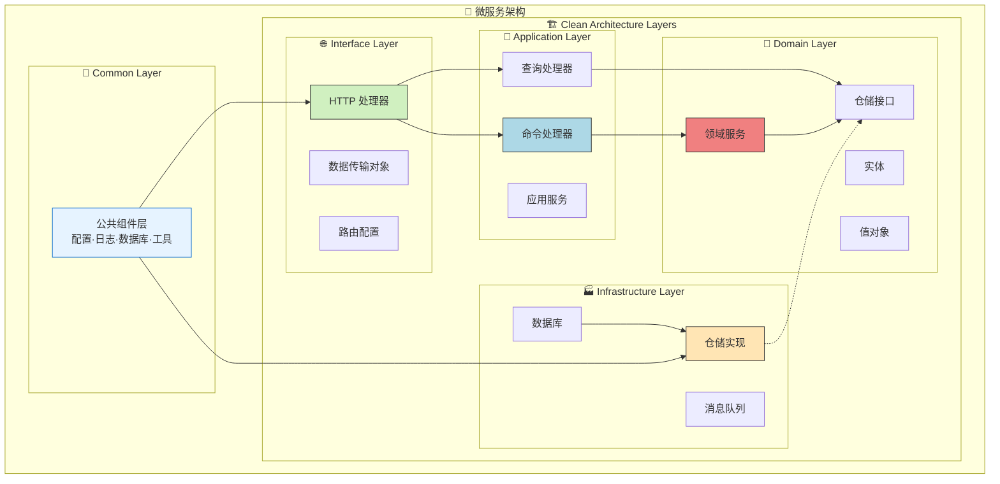

[TOC]

# Go Micro Scaffold

Go Micro Scaffold 是一个基于 Go 语言的微服务脚手架项目，采用 Clean Architecture 架构设计，集成了常用的微服务组件和最佳实践。

## 🚀 项目特点

- **🏗️ Clean Architecture**: 采用领域驱动设计（DDD）和六边形架构

- **🔧 模块化设计**: 使用 Uber FX 进行依赖注入和模块管理

- **⚡ 高性能**: 基于 Gin Web 框架构建

- **💾 数据库集成**: 集成 Ent ORM，支持 MySQL/PostgreSQL/SQLite

- **⚙️ 配置管理**: 基于 Viper 的配置管理，支持多环境

- **📝 日志系统**: 集成 Zap 高性能日志库，支持日志分割和多输出

- **✅ 验证系统**: 集成验证器，支持多语言错误提示

- **🛡️ 中间件**: 内置常用中间件（CORS、认证、限流、日志等）

- **🔐 JWT 认证**: 完整的 JWT 认证体系

- **🆔 ID 生成**: 集成雪花算法生成唯一ID

- **🌍 时区管理**: 全局时区管理支持

- **📊 多数据源**: 支持主从数据库配置

- **🔄 Redis 缓存**: 集成 Redis 缓存支持

  

## 🛠️ 技术栈

### 核心框架
- **Go**: 1.24.1 - 编程语言
- **Gin**: v1.11.0 - 高性能HTTP Web框架
- **Uber FX**: v1.24.0 - 依赖注入框架，模块化应用管理
- **Ent**: v0.14.5 - 简单而强大的Go实体框架
- **Viper**: v1.21.0 - 完整的配置解决方案
- **Zap**: v1.27.0 - 高性能日志库
- **Cobra**: v1.10.1 - 现代CLI应用构建器

### 数据库与缓存
- **MySQL**: 8.0+ - 主数据库 (驱动: go-sql-driver/mysql v1.9.3)
- **Redis**: 6.0+ - 缓存数据库 (客户端: go-redis/redis/v8 v8.11.5)
- **支持**: PostgreSQL 12+, SQLite 3+ - 可选数据库

### 安全与认证
- **JWT**: golang-jwt/jwt/v4 v4.5.2 - JSON Web Token 实现
- **Casbin**: v2.127.0 - 权限控制框架
- **Validator**: go-playground/validator/v10 v10.27.0 - 数据验证库

### 工具库
- **UUID**: google/uuid v1.6.0 - UUID 生成库
- **Snowflake**: bwmarrin/snowflake v0.3.0 - 雪花算法ID生成
- **Rate Limit**: juju/ratelimit v1.0.2 - 令牌桶限流算法
- **HTTP Client**: go-resty/resty/v2 v2.16.5 - HTTP客户端库
- **File Rotation**: lestrrat-go/file-rotatelogs v2.4.0+ - 日志文件轮转

## 📁 项目结构

```
go-micro-scaffold/
├── 📁 common/                    # 🔧 公共组件库
│   ├── config/                   # ⚙️ 配置管理
│   ├── databases/                # 💾 数据库连接管理
│   │   ├── mysql/                # MySQL 连接池
│   │   └── redis/                # Redis 客户端
│   ├── di/                       # 🔗 依赖注入模块
│   ├── http/                     # 🌐 HTTP 服务器
│   ├── logger/                   # 📝 日志系统
│   ├── middleware/               # 🛡️ 通用中间件
│   ├── pkg/                      # 🛠️ 工具包集合
│   │   ├── casbin/               # 权限控制
│   │   ├── contextutil/          # 上下文工具
│   │   ├── httpclient/           # HTTP 客户端
│   │   ├── idgen/                # ID 生成器（雪花算法）
│   │   ├── jwt/                  # JWT 认证
│   │   ├── netutil/              # 网络工具
│   │   ├── pagination/           # 分页工具
│   │   ├── timezone/             # 时区管理
│   │   └── validation/           # 数据验证
│   ├── response/                 # 📤 统一响应格式
│   └── schema/                   # 📋 共享数据模型
├── 📁 services/                  # 🏢 业务服务模块
│   ├── cmd/                      # 🚀 应用入口
│   │   ├── cli/                  # CLI 工具
│   │   └── server/               # HTTP 服务器
│   ├── configs/                  # ⚙️ 配置文件
│   │   ├── app.yaml              # 应用配置
│   │   └── app.yaml.example      # 配置模板
│   ├── internal/                 # 🏗️ Clean Architecture 实现
│   │   ├── application/          # 🔧 应用层 - 用例编排
│   │   │   ├── command/          # 命令对象
│   │   │   ├── commandhandler/   # 命令处理器
│   │   │   ├── query/            # 查询对象
│   │   │   ├── queryhandler/     # 查询处理器
│   │   │   ├── service/          # 应用服务
│   │   │   └── errors/           # 应用层错误
│   │   ├── domain/               # 🎯 领域层 - 核心业务
│   │   │   ├── shared/           # 共享领域组件
│   │   │   └── user/             # 用户领域
│   │   │       ├── entity/       # 实体
│   │   │       ├── valueobject/  # 值对象
│   │   │       ├── repository/   # 仓储接口
│   │   │       ├── service/      # 领域服务
│   │   │       ├── validator/    # 业务验证器
│   │   │       └── errors/       # 领域错误
│   │   ├── infrastructure/       # 🏭 基础设施层 - 外部实现
│   │   │   ├── persistence/      # 数据持久化
│   │   │   │   └── ent/          # Ent ORM 实现
│   │   │   │       ├── gen/      # 生成代码
│   │   │   │       ├── repository/ # 仓储实现
│   │   │   │       └── schema/   # 数据库模式
│   │   │   ├── messaging/        # 消息发布
│   │   │   └── errors/           # 基础设施错误
│   │   └── interfaces/           # 🌐 接口层 - 外部适配
│   │       └── http/             # HTTP 接口
│   │           ├── dto/          # 数据传输对象
│   │           │   ├── request/  # 请求 DTO
│   │           │   └── response/ # 响应 DTO
│   │           ├── handler/      # HTTP 处理器
│   │           ├── routes/       # 路由配置
│   │           └── middleware/   # 接口中间件
│   └── logs/                     # 📋 应用日志
├── 📁 assets/                    # 📊 项目资源
│   ├── dependency-graph.dot      # 依赖关系图
│   └── graph.png                 # 架构图片
├── 📁 logs/                      # 📋 全局日志
├── 📄 go.work                    # Go 工作区配置
└── 📄 README.md                  # 项目文档
```

### 🏗️ 架构层次说明

| 层次 | 目录 | 职责 | 依赖方向 |
|------|------|------|----------|
| **🌐 接口层** | `interfaces/` | HTTP API、路由、DTO | → 应用层 |
| **🔧 应用层** | `application/` | 用例编排、命令查询处理 | → 领域层 |
| **🎯 领域层** | `domain/` | 核心业务逻辑、实体、规则 | 独立核心 |
| **🏭 基础设施层** | `infrastructure/` | 数据库、外部服务实现 | ← 领域层接口 |
| **🔧 公共层** | `common/` | 跨服务共享组件 | 被各层使用 |

## 快速开始

### 📋 环境要求

- **Go**: 1.24.1+ (推荐使用最新版本)
- **MySQL**: 8.0+ 或 **PostgreSQL**: 12+
- **Redis**: 6.0+ (推荐 7.0+)
- **操作系统**: Linux, macOS, Windows
- **内存**: 最小 512MB，推荐 2GB+
- **磁盘**: 最小 1GB 可用空间

### 📦 安装依赖

```bash
# 1. 克隆项目
git clone <repository-url>
cd go-micro-scaffold

# 2. 初始化 Go 工作区（如果不存在）
go work init
go work use ./services
go work use ./common

# 3. 安装依赖
cd services && go mod tidy
cd ../common && go mod tidy

# 4. 生成 Ent 代码（可选，如果修改了数据库模式）
cd services/internal/infrastructure/persistence/ent
go run -mod=mod entgo.io/ent/cmd/ent generate ./schema
```

### 配置文件

1. 复制配置文件模板：
```bash
cd services/configs
cp app.yaml.example app.yaml
```

2. 根据实际环境修改 [app.yaml](./services/configs/app.yaml) 配置文件

### 数据库迁移

```bash
# 执行数据库迁移
cd services
go run cmd/cli/main.go migrate
```

### 启动服务

```bash
# 启动服务
cd services
go run cmd/server/main.go
```

## 📡 API 接口

### 🏥 健康检查

```bash
GET /health          # 健康检查
GET /ping           # 简单ping检查
```

### 👤 用户相关

```bash
POST /api/v1/users   # 创建用户
GET  /api/v1/users   # 获取用户列表
```

### 📝 请求示例

**创建用户**
```bash
curl -X POST http://localhost:8080/api/v1/users \
  -H "Content-Type: application/json" \
  -d '{
    "open_id": "user_12345",
    "name": "张三",
    "phone_number": "13800138000",
    "password": "123456",
    "gender": 100
  }'
```

**响应格式**
```json
{
    "code": 0,
    "message": "操作成功",
    "data": {
        "id": "18f473ae-e359-42df-af82-d4b2f38e2976",
        "open_id": "a89a96ef-f1c1-40ba-b8a3-3988c31107b0",
        "name": "张三",
        "gender": 100,
        "phone_number": "13800138000",
        "created_at": 1759048877198,
        "updated_at": 1759048877198
    }
}
```


## 🏗️ Clean Architecture 设计

本项目采用 Clean Architecture 设计原则，实现高内聚、低耦合的微服务架构。

### 🔄 架构层次图



### 📋 各层职责说明

| 层次 | 核心职责 | 主要组件 | 依赖方向 |
|------|----------|----------|----------|
| **🌐 接口层** | 外部请求适配 | HTTP处理器、DTO、路由、中间件 | → 应用层 |
| **🔧 应用层** | 业务用例编排 | 命令/查询处理器、应用服务 | → 领域层 |
| **🎯 领域层** | 核心业务逻辑 | 实体、值对象、仓储接口、领域服务 | 独立核心 |
| **🏭 基础设施层** | 外部技术实现 | 仓储实现、数据库、消息队列 | ← 实现领域接口 |
| **🔧 公共层** | 跨服务基础设施 | 配置、日志、数据库连接、工具包 | 被各层使用 |

### 🔄 核心设计原则

1. **🎯 依赖倒置**: 高层模块不依赖低层模块，都依赖抽象接口
2. **🔒 单一职责**: 每层专注自己的职责，边界清晰
3. **🔓 开闭原则**: 对扩展开放，对修改封闭
4. **🧩 接口隔离**: 客户端不依赖不需要的接口

### 📊 请求处理流程

```
HTTP请求 → 中间件 → 处理器 → 命令/查询处理器 → 领域服务 → 仓储接口
   ↓         ↓        ↓           ↓            ↓         ↓
HTTP响应 ← 响应格式 ← DTO ← 处理结果 ← 业务逻辑 ← 数据库操作
```

### 🎯 领域驱动设计 (DDD)

**用户领域示例**：
```go
package domain

import "context"

// 实体 - 具有唯一标识的业务对象
type User struct {
    id          string    // 唯一标识
    name        string    // 业务属性
    phoneNumber string
    // ... 业务方法
}

// 值对象 - 不可变的业务概念
type Gender int
const (
    GenderMale   Gender = 100
    GenderFemale Gender = 200
)

// 仓储接口 - 数据访问抽象
type UserRepository interface {
    Create(ctx context.Context, user *User) error
    FindByID(ctx context.Context, id string) (*User, error)
}

// 领域服务 - 核心业务逻辑
type UserDomainService struct {
    userRepo UserRepository
}
```

### 🏗️ 架构优势

- ✅ **高可测试性**: 每层独立，易于单元测试
- ✅ **低耦合性**: 依赖抽象，易于替换实现
- ✅ **高可维护性**: 职责清晰，修改影响范围小
- ✅ **技术无关性**: 核心业务不依赖具体技术栈
- ✅ **易扩展性**: 新功能遵循相同模式，快速开发

## 依赖注入

项目使用 Uber FX 进行依赖注入管理，各模块通过 FX 模块进行组织和注入。

有关 Uber FX 框架核心概念的详细说明，请参考 [FX 框架指南](FX_FRAMEWORK_GUIDE.md)。

有关项目中各模块之间的具体依赖关系，请参考 [FX 依赖架构图](FX_DEPENDENCY_ARCHITECTURE.md)。

## 配置说明

项目支持丰富的配置选项，详细配置说明请参考 [app.yaml.example](./services/configs/app.yaml.example) 文件。

## 日志系统

项目集成了 Zap 日志库，支持结构化日志输出和日志级别控制。

## 验证系统

项目集成了验证器，支持请求参数验证和多语言错误提示。


## 🛡️ 中间件系统

项目内置了丰富的中间件，支持各种常见的 Web 服务需求：

### 核心中间件
- **🌐 CORS 中间件**: 跨域资源共享支持
- **🔐 认证中间件**: JWT 令牌验证
- **🚦 限流中间件**: 基于令牌桶算法的请求限流
- **📝 请求日志中间件**: 详细的请求响应日志记录
- **🛡️ IP 白名单中间件**: IP 访问控制
- **🔄 Recovery 中间件**: 异常恢复和错误处理

### 中间件配置示例

```go
package main

import (
    "github.com/gin-gonic/gin"
    "common/middleware"
)

func setupRoutes(router *gin.Engine, cfg *Config, jwtService *JWTService) {
    // 全局中间件
    router.Use(middleware.CORSMiddleware(cfg.Server))
    router.Use(middleware.RequestLogMiddleware())
    router.Use(middleware.RecoveryMiddleware())

    // 需要认证的路由组
    authGroup := router.Group("/api/v1")
    authGroup.Use(middleware.AuthMiddleware(jwtService))
}
```


### 🌍 时区管理

项目提供了时区管理模块，用于全局设置应用程序的时区。该模块从配置文件中读取时区设置，如果没有配置则默认使用 "Asia/Shanghai"。

**使用方法：**

1. **配置时区设置**：
```yaml
system:
  timezone: "Asia/Shanghai"  # 或其他时区，如 "America/New_York"
```

2. **自动初始化**：
```go
package di

import (
    "go.uber.org/fx"
    "common/pkg/timezone"
)

// 在 common/di/modules.go 中已经注册
var CommonModules = fx.Options(
    // ... 其他模块
    timezone.Module,  // 时区模块自动初始化
)
```

时区模块会全局设置 time.Local 和环境变量，确保整个应用程序使用统一的时区。时区只在应用启动时初始化一次，而不是在每个请求中都设置。

## 🛠️ 开发指南

### 📝 添加新业务模块

以添加 "订单(Order)" 模块为例，展示完整的开发流程：

#### 1️⃣ 领域层 (Domain Layer)

**创建实体**
```bash
# 创建目录结构
mkdir -p services/internal/domain/order/{entity,valueobject,repository,service,validator,errors}
```

```go
// services/internal/domain/order/entity/order.go
package entity

import (
    "time"
    "github.com/google/uuid"
    "services/internal/domain/order/valueobject"
)

type Order struct {
    id          string
    userID      string
    totalAmount int64
    status      valueobject.OrderStatus
    createdAt   time.Time
    updatedAt   time.Time
}

func NewOrder(userID string, totalAmount int64) *Order {
    return &Order{
        id:          uuid.New().String(),
        userID:      userID,
        totalAmount: totalAmount,
        status:      valueobject.OrderStatusPending,
        createdAt:   time.Now(),
        updatedAt:   time.Now(),
    }
}

// Getter 方法
func (o *Order) ID() string { return o.id }
func (o *Order) UserID() string { return o.userID }
func (o *Order) TotalAmount() int64 { return o.totalAmount }
func (o *Order) Status() valueobject.OrderStatus { return o.status }
```

**创建值对象**
```go
// services/internal/domain/order/valueobject/order_status.go
package valueobject

type OrderStatus int

const (
    OrderStatusPending OrderStatus = iota + 1
    OrderStatusPaid
    OrderStatusShipped
    OrderStatusDelivered
    OrderStatusCancelled
)

func (s OrderStatus) String() string {
    switch s {
    case OrderStatusPending:
        return "pending"
    case OrderStatusPaid:
        return "paid"
    case OrderStatusShipped:
        return "shipped"
    case OrderStatusDelivered:
        return "delivered"
    case OrderStatusCancelled:
        return "cancelled"
    default:
        return "unknown"
    }
}
```

**定义仓储接口**
```go
// services/internal/domain/order/repository/order_repository.go
package repository

import (
    "context"
    "services/internal/domain/order/entity"
)

type OrderRepository interface {
    Create(ctx context.Context, order *entity.Order) error
    FindByID(ctx context.Context, id string) (*entity.Order, error)
    FindByUserID(ctx context.Context, userID string) ([]*entity.Order, error)
    Update(ctx context.Context, order *entity.Order) error
}
```

**创建领域服务**
```go
// services/internal/domain/order/service/order_domain_service.go
package service

import (
    "context"
    "services/internal/domain/order/entity"
    "services/internal/domain/order/repository"
)

type OrderDomainService struct {
    orderRepo repository.OrderRepository
}

func NewOrderDomainService(orderRepo repository.OrderRepository) *OrderDomainService {
    return &OrderDomainService{orderRepo: orderRepo}
}

func (s *OrderDomainService) CreateOrder(ctx context.Context, userID string, totalAmount int64) (*entity.Order, error) {
    // 业务规则验证
    if totalAmount <= 0 {
        return nil, errors.New("订单金额必须大于0")
    }
    
    order := entity.NewOrder(userID, totalAmount)
    if err := s.orderRepo.Create(ctx, order); err != nil {
        return nil, err
    }
    
    return order, nil
}
```

**依赖注入配置**
```go
// services/internal/domain/order/di.go
package order

import (
    "go.uber.org/fx"
    "services/internal/domain/order/service"
    "services/internal/infrastructure/persistence/ent/repository"
)

var DomainModule = fx.Module("order_domain",
    fx.Provide(
        service.NewOrderDomainService,
        fx.Annotate(
            repository.NewOrderRepository,
            fx.As(new(repository.OrderRepository)),
        ),
    ),
)
```

#### 2️⃣ 应用层 (Application Layer)

**创建命令**
```go
// services/internal/application/command/order/create_order_command.go
package order

type CreateOrderCommand struct {
    UserID      string `json:"user_id" validate:"required"`
    TotalAmount int64  `json:"total_amount" validate:"required,min=1"`
}
```

**创建命令处理器**
```go
// services/internal/application/commandhandler/order_command_handler.go
package commandhandler

import (
    "context"
    command "services/internal/application/command/order"
    "services/internal/domain/order/entity"
    "services/internal/domain/order/service"
)

type OrderCommandHandler struct {
    orderDomainService *service.OrderDomainService
}

func NewOrderCommandHandler(orderDomainService *service.OrderDomainService) *OrderCommandHandler {
    return &OrderCommandHandler{orderDomainService: orderDomainService}
}

func (h *OrderCommandHandler) HandleCreateOrder(ctx context.Context, cmd *command.CreateOrderCommand) (*entity.Order, error) {
    return h.orderDomainService.CreateOrder(ctx, cmd.UserID, cmd.TotalAmount)
}
```

#### 3️⃣ 基础设施层 (Infrastructure Layer)

**创建数据库模式**
```go
// services/internal/infrastructure/persistence/ent/schema/order.go
package schema

import (
    "entgo.io/ent"
    "entgo.io/ent/schema/field"
    "entgo.io/ent/schema/index"
    "github.com/google/uuid"
    "time"
)

type Order struct {
    ent.Schema
}

func (Order) Fields() []ent.Field {
    return []ent.Field{
        field.UUID("id", uuid.UUID{}).Default(uuid.New),
        field.String("user_id").NotEmpty(),
        field.Int64("total_amount"),
        field.Int("status").Default(1),
        field.Time("created_at").Default(time.Now),
        field.Time("updated_at").Default(time.Now).UpdateDefault(time.Now),
    }
}

func (Order) Indexes() []ent.Index {
    return []ent.Index{
        index.Fields("user_id"),
        index.Fields("status"),
        index.Fields("created_at"),
    }
}
```

**实现仓储**
```go
// services/internal/infrastructure/persistence/ent/repository/order_repository_impl.go
package repository

import (
    "context"
    "github.com/google/uuid"
    "services/internal/domain/order/entity"
    "services/internal/infrastructure/persistence/ent/gen"
)

type OrderRepositoryImpl struct {
    client *gen.Client
}

func NewOrderRepository(client *gen.Client) *OrderRepositoryImpl {
    return &OrderRepositoryImpl{client: client}
}

func (r *OrderRepositoryImpl) Create(ctx context.Context, order *entity.Order) error {
    _, err := r.client.Order.Create().
        SetID(uuid.MustParse(order.ID())).
        SetUserID(order.UserID()).
        SetTotalAmount(order.TotalAmount()).
        SetStatus(int(order.Status())).
        Save(ctx)
    return err
}
```

#### 4️⃣ 接口层 (Interface Layer)

**创建 DTO**
```go
// services/internal/interfaces/http/dto/request/order_request.go
package request

type CreateOrderRequest struct {
    TotalAmount int64 `json:"total_amount" binding:"required,min=1" label:"订单金额"`
}

// services/internal/interfaces/http/dto/response/order_response.go
package response

type OrderResponse struct {
    ID          string `json:"id"`
    UserID      string `json:"user_id"`
    TotalAmount int64  `json:"total_amount"`
    Status      int    `json:"status"`
    CreatedAt   int64  `json:"created_at"`
}
```

**创建处理器**
```go
// services/internal/interfaces/http/handler/order_handler.go
package handler

import (
    "github.com/gin-gonic/gin"
    "services/internal/application/commandhandler"
    "services/internal/interfaces/http/dto/request"
    "services/internal/interfaces/http/middleware"
    "common/response"
)

type OrderHandler struct {
    commandHandler *commandhandler.OrderCommandHandler
}

func NewOrderHandler(commandHandler *commandhandler.OrderCommandHandler) *OrderHandler {
    return &OrderHandler{commandHandler: commandHandler}
}

func (h *OrderHandler) CreateOrder(c *gin.Context) {
    // 获取当前用户ID
    userID, exists := middleware.GetCurrentUserID(c)
    if !exists {
        response.Unauthorized(c, "用户未登录")
        return
    }
    
    var req request.CreateOrderRequest
    if err := c.ShouldBindJSON(&req); err != nil {
        response.BadRequest(c, err.Error())
        return
    }
    
    command := &command.CreateOrderCommand{
        UserID:      userID,
        TotalAmount: req.TotalAmount,
    }
    
    order, err := h.commandHandler.HandleCreateOrder(c.Request.Context(), command)
    if err != nil {
        response.Handle(c, nil, err)
        return
    }
    
    response.Handle(c, toOrderResponse(order), nil)
}
```

**添加路由**

```go
// services/internal/interfaces/http/routes.go
func SetupRoutesFinal(engine *gin.Engine, ..., orderHandler *handler.OrderHandler, ...) {
    // ... 现有代码
    
    v1 := engine.Group("/api/v1")
    v1.Use(authMiddleware.RequireAuth()) // 需要认证
    {
        // 订单路由
        orders := v1.Group("/orders")
        {
            orders.POST("", orderHandler.CreateOrder)
            orders.GET("", orderHandler.ListOrders)
            orders.GET("/:id", orderHandler.GetOrder)
        }
    }
}
```

#### 5️⃣ 注册依赖注入

```go
// services/cmd/server/main.go
func main() {
    app := fx.New(
        // ... 现有模块
        order.DomainModule,  // 添加订单领域模块
        // ... 其他模块
    )
    app.Run()
}
```

#### 6️⃣ 生成数据库代码

```bash
# 生成 Ent 代码
cd services/internal/infrastructure/persistence/ent
go run -mod=mod entgo.io/ent/cmd/ent generate ./schema

# 运行数据库迁移
cd services
go run cmd/cli/main.go migrate
```

### 🧪 测试新模块

```go
// services/internal/domain/order/service/order_domain_service_test.go
package service_test

import (
    "context"
    "testing"
    "services/internal/domain/order/service"
    // ... 其他导入
)

func TestOrderDomainService_CreateOrder(t *testing.T) {
    // 设置测试
    mockRepo := &MockOrderRepository{}
    service := service.NewOrderDomainService(mockRepo)
    
    // 执行测试
    order, err := service.CreateOrder(context.Background(), "user123", 10000)
    
    // 验证结果
    assert.NoError(t, err)
    assert.NotNil(t, order)
    assert.Equal(t, "user123", order.UserID())
    assert.Equal(t, int64(10000), order.TotalAmount())
}
```

### 📋 开发检查清单

- [ ] 领域实体和值对象已创建
- [ ] 仓储接口已定义
- [ ] 领域服务已实现
- [ ] 应用层命令/查询已创建
- [ ] 命令/查询处理器已实现
- [ ] 数据库模式已定义
- [ ] 仓储实现已完成
- [ ] HTTP 处理器已创建
- [ ] DTO 已定义
- [ ] 路由已配置
- [ ] 依赖注入已注册
- [ ] 单元测试已编写
- [ ] 集成测试已编写
- [ ] API 文档已更新

这样的模块化开发流程确保了：
- ✅ 架构层次清晰
- ✅ 职责分离明确
- ✅ 代码可测试性强
- ✅ 易于维护和扩展

### 数据库操作

项目使用 Ent ORM 进行数据库操作，可通过以下方式生成代码：

```bash
cd services/internal/infrastructure/persistence/ent
go run -mod=mod entgo.io/ent/cmd/ent generate ./schema
```

## 🚀 部署指南

### 📦 构建应用

```bash
# 构建服务端
cd services
go build -o bin/server cmd/server/main.go

# 构建 CLI 工具
go build -o bin/cli cmd/cli/main.go

# 或使用 Makefile（如果有）
make build
```

### 🐳 Docker 部署

**Dockerfile 示例：**
```dockerfile
# Dockerfile 示例
FROM golang:1.24-alpine AS builder

WORKDIR /app
COPY . .
RUN go mod download
RUN CGO_ENABLED=0 GOOS=linux go build -o server services/cmd/server/main.go

FROM alpine:latest
RUN apk --no-cache add ca-certificates tzdata
WORKDIR /root/
COPY --from=builder /app/server .
COPY --from=builder /app/services/configs ./configs
CMD ["./server"]
```

**构建和运行：**

```bash
# 构建镜像
docker build -t go-micro-scaffold .

# 运行容器
docker run -p 8080:8080 go-micro-scaffold
```

### 🔧 生产环境配置

1. **环境变量配置**
```bash
export GO_ENV=production
export DB_HOST=your-db-host
export REDIS_HOST=your-redis-host
```

2. **系统服务配置**
```ini
# /etc/systemd/system/go-micro-scaffold.service
[Unit]
Description=Go Micro Scaffold Service
After=network.target

[Service]
Type=simple
User=app
WorkingDirectory=/opt/go-micro-scaffold
ExecStart=/opt/go-micro-scaffold/bin/server
Restart=always
RestartSec=5

[Install]
WantedBy=multi-user.target
```

3. **启动服务**
```bash
sudo systemctl enable go-micro-scaffold
sudo systemctl start go-micro-scaffold
sudo systemctl status go-micro-scaffold
```

### 📊 监控和日志

- **日志文件**: `/var/log/go-micro-scaffold/`
- **健康检查**: `GET /health`
- **指标监控**: 可集成 Prometheus
- **链路追踪**: 支持 Jaeger 集成

## 🔒 安全配置

### JWT 安全
```yaml
# 配置强密钥
system:
  secret_key: "your-super-secret-key-at-least-32-characters"

# Token 过期时间
token:
  expired_time: 30  # 分钟
```

### 数据库安全
- 使用专用数据库用户，避免使用 root
- 启用 SSL 连接
- 定期备份数据库
- 限制数据库访问 IP

### Redis 安全
- 设置强密码
- 禁用危险命令
- 使用 SSL/TLS 连接

## 🧪 测试

### 单元测试
```bash
# 运行所有测试
go test ./...

# 运行测试并显示覆盖率
go test -cover ./...

# 生成覆盖率报告
go test -coverprofile=coverage.out ./...
go tool cover -html=coverage.out
```

### 集成测试
```bash
# 启动测试数据库
docker run -d --name test-mysql -e MYSQL_ROOT_PASSWORD=test -p 3307:3306 mysql:8.0

# 运行集成测试
go test -tags=integration ./...
```

### 性能测试
```bash
# 使用 wrk 进行压力测试
wrk -t12 -c400 -d30s http://localhost:8080/health

# 使用 ab 进行基准测试
ab -n 10000 -c 100 http://localhost:8080/ping
```

## 📈 性能优化建议

### 数据库优化
- 合理设计索引
- 使用连接池
- 启用查询缓存
- 定期分析慢查询

### 缓存策略
- 热点数据 Redis 缓存
- 合理设置过期时间
- 使用缓存预热
- 避免缓存雪崩

### 应用优化
- 启用 Gzip 压缩
- 使用 CDN 加速静态资源
- 合理设置超时时间
- 使用连接复用

## 🤝 贡献指南

我们欢迎所有形式的贡献！请遵循以下指南：

### 📋 贡献方式

1. **报告 Bug**: 在 Issues 中详细描述问题
2. **功能建议**: 提出新功能的想法和用例
3. **代码贡献**: 提交 Pull Request
4. **文档改进**: 完善项目文档

### 🔄 开发流程

1. **Fork 项目**
```bash
git clone https://github.com/your-username/go-micro-scaffold.git
cd go-micro-scaffold
```

2. **创建功能分支**
```bash
git checkout -b feature/your-feature-name
```

3. **开发和测试**
```bash
# 运行测试
go test ./...

# 代码格式化
go fmt ./...

# 代码检查
go vet ./...
```

4. **提交代码**
```bash
git add .
git commit -m "feat: add your feature description"
git push origin feature/your-feature-name
```

5. **创建 Pull Request**

### 📝 代码规范

- 遵循 Go 官方代码规范
- 使用有意义的变量和函数名
- 添加必要的注释和文档
- 保持测试覆盖率 > 80%
- 遵循 Clean Architecture 原则

### 🏷️ 提交信息规范

使用 [Conventional Commits](https://www.conventionalcommits.org/) 规范：

```
feat: 新功能
fix: 修复 Bug
docs: 文档更新
style: 代码格式调整
refactor: 代码重构
test: 测试相关
chore: 构建工具或辅助工具的变动
```

## 🔧 开发工具

### Makefile 示例
```
.PHONY: build test clean run fmt lint migrate gen

# 构建应用
build:
	cd services && go build -o ../bin/server cmd/server/main.go
	cd services && go build -o ../bin/cli cmd/cli/main.go

# 运行测试
test:
	go test -v ./...

# 代码格式化
fmt:
	go fmt ./...

# 代码检查
lint:
	golangci-lint run

# 清理构建文件
clean:
	rm -rf bin/

# 运行服务
run:
	cd services && go run cmd/server/main.go

# 数据库迁移
migrate:
	cd services && go run cmd/cli/main.go migrate

# 生成 Ent 代码
gen:
	cd services/internal/infrastructure/persistence/ent && \
	go run -mod=mod entgo.io/ent/cmd/ent generate ./schema

# 运行所有测试并显示覆盖率
test-cover:
	go test -cover ./...

# 生成覆盖率报告
cover:
	go test -coverprofile=coverage.out ./...
	go tool cover -html=coverage.out
```

### Docker Compose 示例

```yaml
version: '3.8'
services:
  app:
    build: .
    ports:
      - "8080:8080"
    depends_on:
      - mysql
      - redis
    environment:
      - DB_HOST=mysql
      - REDIS_HOST=redis

  mysql:
    image: mysql:8.0
    environment:
      MYSQL_ROOT_PASSWORD: password
      MYSQL_DATABASE: go-micro-scaffold
    ports:
      - "3306:3306"
    volumes:
      - mysql_data:/var/lib/mysql

  redis:
    image: redis:7-alpine
    ports:
      - "6379:6379"
    command: redis-server --requirepass password

volumes:
  mysql_data:
```

## 📚 相关资源

### 📖 学习资料

- [Clean Architecture](https://blog.cleancoder.com/uncle-bob/2012/08/13/the-clean-architecture.html)
- [Go 语言官方文档](https://golang.org/doc/)
- [Gin Web 框架](https://gin-gonic.com/)
- [Ent ORM 文档](https://entgo.io/docs/getting-started)
- [Uber FX 依赖注入](https://uber-go.github.io/fx/)
- [领域驱动设计](https://domainlanguage.com/ddd/)

### 🛠️ 开发工具推荐

- **IDE**: GoLand, VS Code with Go extension
- **API 测试**: Postman, Insomnia, HTTPie
- **数据库管理**: DBeaver, MySQL Workbench, Adminer
- **容器管理**: Docker Desktop, Portainer
- **代码质量**: golangci-lint, SonarQube
- **性能分析**: pprof, Grafana, Prometheus

### 🔗 相关项目

- [Go 微服务最佳实践](https://github.com/go-microservice/best-practices)
- [Clean Architecture Go 示例](https://github.com/bxcodec/go-clean-arch)
- [Go 项目布局标准](https://github.com/golang-standards/project-layout)

## ❓ 常见问题

### Q: 如何切换数据库？
A: 修改配置文件中的数据库连接信息，Ent ORM 支持 MySQL、PostgreSQL、SQLite 等。

### Q: 如何添加新的中间件？
A: 在 `common/middleware` 目录下创建新的中间件文件，然后在路由中注册使用。

### Q: 如何自定义日志格式？
A: 修改 `common/logger/logger.go` 中的 Zap 配置，支持 JSON 和 Console 格式。

### Q: 如何进行性能优化？
A: 
- 使用连接池优化数据库连接
- 添加 Redis 缓存减少数据库查询
- 使用 pprof 进行性能分析
- 启用 Gzip 压缩

### Q: 如何添加新的领域模块？
A: 
1. 在 `services/internal/domain/` 下创建新模块目录
2. 定义实体、值对象、仓储接口
3. 在 `services/internal/application/` 中添加应用服务
4. 在 `services/internal/infrastructure/` 中实现仓储
5. 在 `services/internal/interfaces/` 中添加 HTTP 处理器
6. 注册到依赖注入容器

## 📄 许可证

本项目采用 [MIT License](LICENSE) 开源协议。

## 🙏 致谢

感谢所有为这个项目做出贡献的开发者！

---

**如果这个项目对你有帮助，请给我们一个 ⭐️ Star！**
