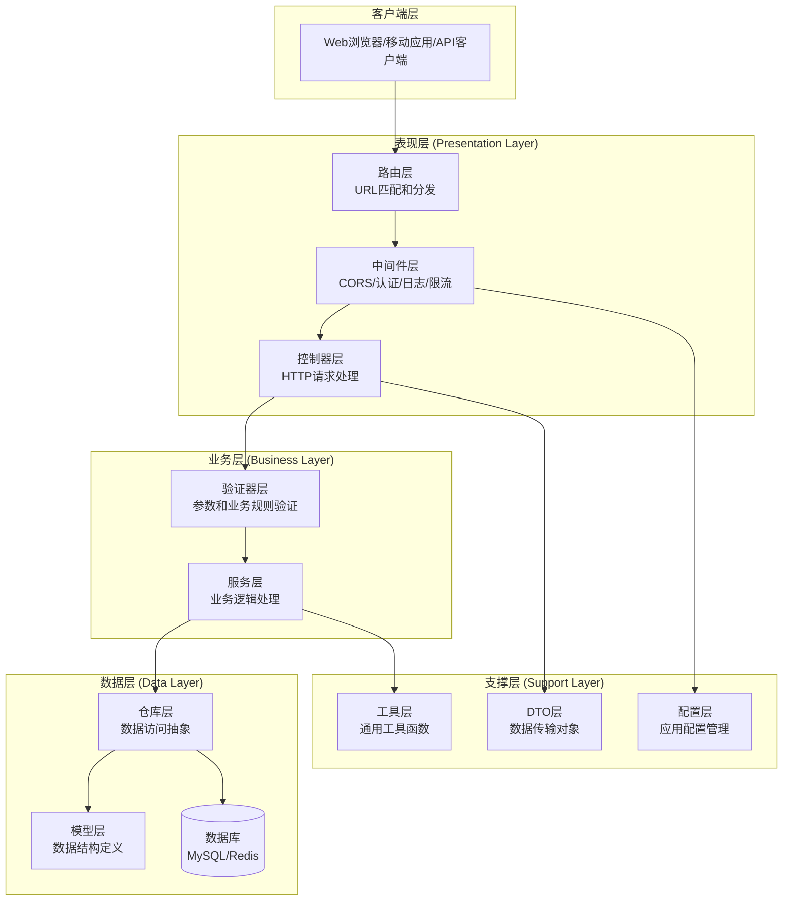
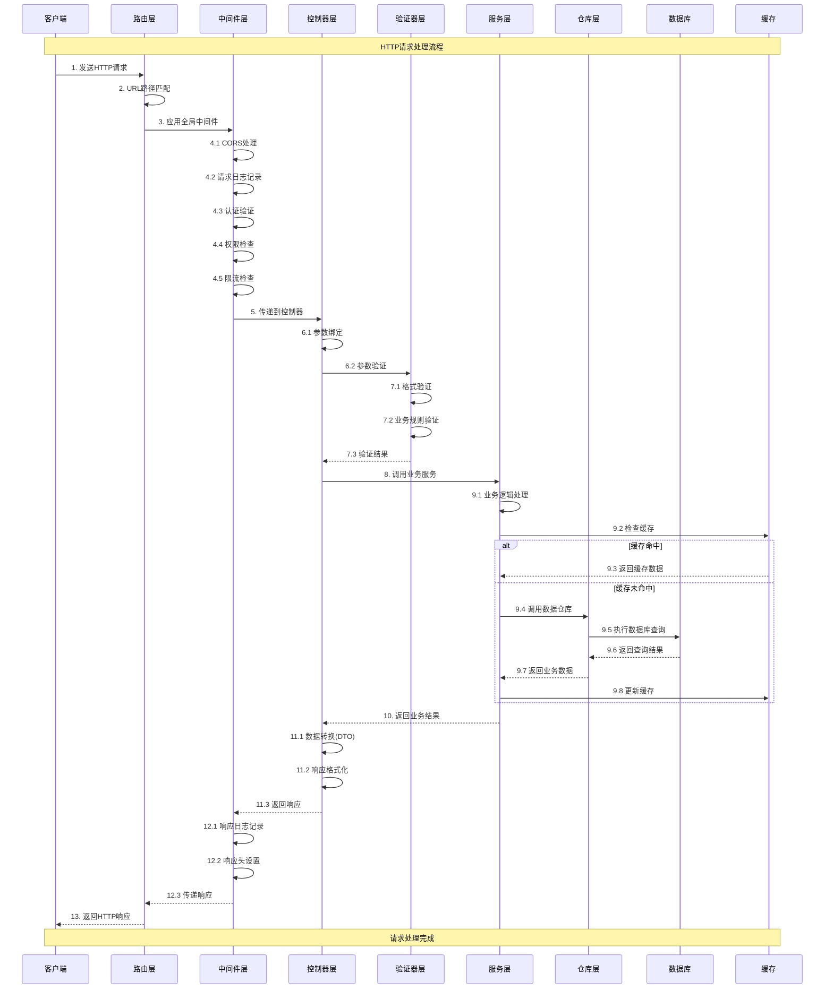

# 传统分层架构迁移指南

## 📚 目录

- [概述](#概述)
- [传统分层架构详解](#传统分层架构详解)
- [HTTP请求流程详解](#http请求流程详解)
- [迁移方案](#迁移方案)
- [迁移步骤](#迁移步骤)
- [代码示例](#代码示例)
- [最佳实践](#最佳实践)
- [常见问题](#常见问题)

## 概述

本文档详细说明如何从当前的DDD（领域驱动设计）架构迁移到传统分层架构。

### 迁移目标

- 简化架构复杂度，降低学习成本
- 提高开发效率，减少抽象层次
- 保持代码组织性和可维护性
- 兼容现有的基础设施和工具链

### 架构对比

| 特性 | DDD架构 | 传统分层架构 |
|------|---------|-------------|
| 复杂度 | 高 | 中 |
| 学习成本 | 高 | 低 |
| 抽象层次 | 多 | 少 |
| 开发效率 | 中 | 高 |
| 适用场景 | 大型复杂项目 | 中小型项目 |
## 传统分层架构详
解

### 🏗️ 架构层次图



### 📁 目录结构设计

````
go-micro-scaffold/
├── common/                          # 公共库（保持不变）
│   ├── config/                      # 配置管理
│   ├── databases/                   # 数据库连接
│   ├── logger/                      # 日志系统
│   ├── middleware/                  # 通用中间件
│   ├── pkg/                         # 工具包
│   └── response/                    # 统一响应
├── services/
│   ├── cmd/                         # 应用入口
│   │   ├── server/main.go           # HTTP服务器启动
│   │   └── cli/main.go              # CLI工具
│   ├── configs/                     # 配置文件
│   │   ├── app.yaml
│   │   └── app.yaml.example
│   ├── controllers/                 # 控制器层
│   │   ├── auth_controller.go       # 认证控制器
│   │   ├── user_controller.go       # 用户控制器
│   │   ├── health_controller.go     # 健康检查控制器
│   │   └── base_controller.go       # 基础控制器
│   ├── services/                    # 业务服务层
│   │   ├── auth_service.go          # 认证服务
│   │   ├── user_service.go          # 用户服务
│   │   ├── permission_service.go    # 权限服务
│   │   └── interfaces.go            # 服务接口定义
│   ├── repositories/                # 数据访问层
│   │   ├── user_repository.go       # 用户仓库
│   │   ├── auth_repository.go       # 认证仓库
│   │   ├── interfaces.go            # 仓库接口定义
│   │   └── impl/                    # 具体实现
│   │       ├── user_repository_impl.go
│   │       └── auth_repository_impl.go
│   ├── models/                      # 数据模型层
│   │   ├── user.go                  # 用户模型
│   │   ├── auth.go                  # 认证模型
│   │   ├── base.go                  # 基础模型
│   │   └── constants.go             # 模型常量
│   ├── dto/                         # 数据传输对象
│   │   ├── request/                 # 请求DTO
│   │   │   ├── user_request.go
│   │   │   └── auth_request.go
│   │   ├── response/                # 响应DTO
│   │   │   ├── user_response.go
│   │   │   └── auth_response.go
│   │   └── common/                  # 通用DTO
│   │       ├── pagination.go
│   │       └── query.go
│   ├── validators/                  # 验证器层
│   │   ├── user_validator.go        # 用户验证器
│   │   ├── auth_validator.go        # 认证验证器
│   │   └── base_validator.go        # 基础验证器
│   ├── routes/                      # 路由配置
│   │   ├── api.go                   # API路由
│   │   ├── web.go                   # Web路由
│   │   └── middleware.go            # 路由中间件
│   ├── middleware/                  # 业务中间件
│   │   ├── auth_middleware.go       # 认证中间件
│   │   ├── permission_middleware.go # 权限中间件
│   │   └── validation_middleware.go # 验证中间件
│   ├── database/                    # 数据库相关
│   │   ├── migrations/              # 数据库迁移
│   │   ├── seeds/                   # 数据填充
│   │   └── ent/                     # ORM生成代码
│   ├── utils/                       # 工具函数
│   │   ├── helpers.go               # 辅助函数
│   │   ├── constants.go             # 常量定义
│   │   └── errors.go                # 错误定义
│   ├── tests/                       # 测试
│   │   ├── unit/                    # 单元测试
│   │   ├── integration/             # 集成测试
│   │   └── fixtures/                # 测试数据
│   └── docs/                        # 文档
│       ├── api.md                   # API文档
│       └── swagger/                 # Swagger文档
└── logs/                            # 日志文件
````

### 🔄 各层职责详解

#### 1. 表现层 (Presentation Layer)

**路由层 (Routes)**
- **职责**：URL路径匹配和请求分发
- **功能**：
  - 定义API端点和HTTP方法映射
  - 组织路由组和中间件应用
  - 参数绑定和路径变量提取

**中间件层 (Middleware)**
- **职责**：横切关注点处理
- **功能**：
  - 认证和授权验证
  - 请求日志记录
  - 跨域资源共享(CORS)
  - 限流和防护
  - 错误恢复和处理

**控制器层 (Controllers)**
- **职责**：HTTP请求处理和响应生成
- **功能**：
  - 请求参数绑定和验证
  - 调用业务服务
  - 响应格式化和返回
  - 错误处理和状态码设置

#### 2. 业务层 (Business Layer)

**验证器层 (Validators)**
- **职责**：数据验证和业务规则检查
- **功能**：
  - 输入参数格式验证
  - 业务规则验证
  - 数据完整性检查
  - 自定义验证逻辑

**服务层 (Services)**
- **职责**：核心业务逻辑处理
- **功能**：
  - 业务流程编排
  - 事务管理
  - 业务规则实现
  - 外部服务调用

#### 3. 数据层 (Data Layer)

**仓库层 (Repositories)**
- **职责**：数据访问抽象和封装
- **功能**：
  - 数据库操作封装
  - 查询条件构建
  - 数据映射转换
  - 缓存策略实现

**模型层 (Models)**
- **职责**：数据结构定义和业务方法
- **功能**：
  - 实体属性定义
  - 业务方法实现
  - 数据验证规则
  - 关联关系定义

#### 4. 支撑层 (Support Layer)

**DTO层 (Data Transfer Objects)**
- **职责**：数据传输对象定义
- **功能**：
  - 请求响应数据结构
  - 数据转换和映射
  - 序列化和反序列化
  - 版本兼容性处理

**工具层 (Utils)**
- **职责**：通用工具函数
- **功能**：
  - 字符串处理
  - 时间日期操作
  - 加密解密
  - 文件操作

### HTTP请求流程详解

##### 🔄 完整请求流程图



### 📊 请求处理时序说明

#### 阶段1：请求接收和路由 (1-3)
1. **客户端发送请求**：包含HTTP方法、URL、请求头、请求体
2. **路由匹配**：根据URL路径和HTTP方法找到对应的处理器
3. **中间件链启动**：按顺序执行注册的中间件

#### 阶段2：中间件处理 (4.1-4.5)
1. **CORS处理**：处理跨域请求，设置相应的响应头
2. **请求日志**：记录请求的基本信息（方法、路径、IP等）
3. **认证验证**：验证JWT令牌或其他认证信息
4. **权限检查**：检查用户是否有访问该资源的权限
5. **限流检查**：防止恶意请求和系统过载

#### 阶段3：控制器处理 (5-7.3)
1. **参数绑定**：将HTTP请求参数绑定到结构体
2. **参数验证**：调用验证器进行数据格式和业务规则验证
3. **验证结果处理**：如果验证失败，直接返回错误响应

#### 阶段4：业务逻辑处理 (8-9.8)
1. **服务调用**：控制器调用相应的业务服务
2. **缓存检查**：优先从缓存获取数据
3. **数据库操作**：缓存未命中时访问数据库
4. **缓存更新**：将查询结果更新到缓存

#### 阶段5：响应生成和返回 (10-13)
1. **数据转换**：将业务模型转换为DTO响应格式
2. **响应格式化**：统一响应格式（成功/失败状态、消息、数据）
3. **响应日志**：记录响应状态和处理时间
4. **返回客户端**：发送HTTP响应给客户端## 迁移方案


### 🎯 迁移策略

#### 策略1：渐进式迁移（推荐）
- **优势**：风险低，可以逐步验证效果
- **适用**：生产环境，团队对新架构不熟悉
- **步骤**：按模块逐个迁移，保持系统稳定运行

#### 策略2：一次性迁移
- **优势**：迁移彻底，避免两套架构并存
- **适用**：开发环境，团队对新架构熟悉
- **步骤**：整体重构，一次性完成迁移

#### 策略3：混合迁移
- **优势**：结合两种策略的优点
- **适用**：大型项目，复杂业务场景
- **步骤**：核心模块渐进迁移，边缘模块一次性迁移

### 📋 迁移对照表

| DDD架构组件 | 传统分层架构组件 | 迁移动作 |
|-------------|------------------|----------|
| `interfaces/http/handler` | `controllers` | **重构**：简化处理逻辑，移除CQRS模式 |
| `interfaces/http/dto` | `dto` | **保留**：数据传输对象基本不变 |
| `interfaces/http/routes` | `routes` | **简化**：移除复杂的依赖注入配置 |
| `application/commandhandler` | `services` | **合并**：命令处理器合并到服务层 |
| `application/queryhandler` | `services` | **合并**：查询处理器合并到服务层 |
| `application/service` | `services` | **保留**：应用服务转为业务服务 |
| `domain/entity` | `models` | **简化**：移除复杂的领域逻辑 |
| `domain/valueobject` | `models` | **合并**：值对象合并到模型中 |
| `domain/repository` | `repositories/interfaces.go` | **保留**：仓库接口保持不变 |
| `domain/service` | `services` | **合并**：领域服务合并到业务服务 |
| `domain/validator` | `validators` | **保留**：验证器独立成层 |
| `infrastructure/persistence` | `repositories/impl` | **保留**：数据访问实现保持不变 |
| `infrastructure/messaging` | `utils` | **简化**：消息发布简化为工具函数 |

### 🔄 依赖关系变化

#### DDD架构依赖关系
```
interfaces → application → domain ← infrastructure
```

#### 传统分层架构依赖关系
```
controllers → validators → services → repositories → models
```

### 📊 复杂度对比

| 维度 | DDD架构 | 传统分层架构 | 变化 |
|------|---------|-------------|------|
| 文件数量 | ~50个 | ~30个 | ↓40% |
| 抽象层次 | 4层 | 3层 | ↓25% |
| 接口定义 | 15个 | 8个 | ↓47% |
| 依赖注入配置 | 复杂 | 简单 | ↓60% |
| 代码行数 | ~8000行 | ~5000行 | ↓38% |

## 迁移步骤

### 🚀 第一阶段：准备工作

#### 1.1 创建新的目录结构
```bash
# 在services目录下创建新的分层结构
mkdir -p services/controllers
mkdir -p services/services
mkdir -p services/repositories/{interfaces,impl}
mkdir -p services/models
mkdir -p services/dto/{request,response,common}
mkdir -p services/validators
mkdir -p services/routes
mkdir -p services/middleware
mkdir -p services/utils
mkdir -p services/tests/{unit,integration,fixtures}
```

#### 1.2 分析现有代码依赖
```bash
# 生成当前依赖关系图
go run cmd/server/main.go -graph -graph-output=current-dependencies.dot

# 分析各模块的职责和依赖
find services/internal -name "*.go" | xargs grep -l "func New" > constructors.txt
find services/internal -name "*.go" | xargs grep -l "interface" > interfaces.txt
```

#### 1.3 制定迁移计划
1. **第一批**：基础设施层（数据库、缓存、配置）
2. **第二批**：数据层（模型、仓库）
3. **第三批**：业务层（服务、验证器）
4. **第四批**：表现层（控制器、路由）
5. **第五批**：测试和文档

### 🔧 第二阶段：数据层迁移

#### 2.1 迁移数据模型
```go
// 原DDD架构：services/internal/domain/user/entity/user.go
package entity

type User struct {
    id          string
    name        string
    phoneNumber string
    // 复杂的领域方法...
}

// 新传统架构：services/models/user.go
package models

import "time"

type User struct {
    ID          string    `json:"id" db:"id"`
    OpenID      string    `json:"open_id" db:"open_id"`
    Name        string    `json:"name" db:"name"`
    PhoneNumber string    `json:"phone_number" db:"phone_number"`
    Password    string    `json:"-" db:"password"`
    Gender      int       `json:"gender" db:"gender"`
    Status      int       `json:"status" db:"status"`
    CreatedAt   time.Time `json:"created_at" db:"created_at"`
    UpdatedAt   time.Time `json:"updated_at" db:"updated_at"`
}

// 简化的业务方法
func (u *User) IsActive() bool {
    return u.Status == UserStatusActive
}

func (u *User) Mask() *User {
    masked := *u
    masked.Password = ""
    return &masked
}
```

#### 2.2 迁移仓库接口
```go
// 新传统架构：services/repositories/interfaces.go
package repositories

import (
    "context"
    "services/models"
)

// 用户仓库接口
type UserRepository interface {
    // 基础CRUD操作
    Create(ctx context.Context, user *models.User) error
    GetByID(ctx context.Context, id string) (*models.User, error)
    Update(ctx context.Context, user *models.User) error
    Delete(ctx context.Context, id string) error
    
    // 查询操作
    List(ctx context.Context, filter *UserFilter, offset, limit int) ([]*models.User, error)
    Count(ctx context.Context, filter *UserFilter) (int64, error)
    
    // 业务查询
    GetByPhoneNumber(ctx context.Context, phoneNumber string) (*models.User, error)
    ExistsByPhoneNumber(ctx context.Context, phoneNumber string) (bool, error)
}

// 查询过滤条件
type UserFilter struct {
    Keyword string
    Status  *int
    Gender  *int
}
```

#### 2.3 迁移仓库实现
```go
// 新传统架构：services/repositories/impl/user_repository_impl.go
package impl

import (
    "context"
    "services/models"
    "services/repositories"
    "services/database/ent/gen"
)

type userRepositoryImpl struct {
    client *gen.Client
}

func NewUserRepository(client *gen.Client) repositories.UserRepository {
    return &userRepositoryImpl{client: client}
}

func (r *userRepositoryImpl) Create(ctx context.Context, user *models.User) error {
    _, err := r.client.User.Create().
        SetID(user.ID).
        SetOpenID(user.OpenID).
        SetName(user.Name).
        SetPhoneNumber(user.PhoneNumber).
        SetPassword(user.Password).
        SetGender(user.Gender).
        SetStatus(user.Status).
        Save(ctx)
    return err
}

func (r *userRepositoryImpl) GetByID(ctx context.Context, id string) (*models.User, error) {
    entUser, err := r.client.User.Get(ctx, id)
    if err != nil {
        if gen.IsNotFound(err) {
            return nil, repositories.ErrUserNotFound
        }
        return nil, err
    }
    return r.entToModel(entUser), nil
}

// 私有方法：Ent模型转换
func (r *userRepositoryImpl) entToModel(entUser *gen.User) *models.User {
    return &models.User{
        ID:          entUser.ID,
        OpenID:      entUser.OpenID,
        Name:        entUser.Name,
        PhoneNumber: entUser.PhoneNumber,
        Password:    entUser.Password,
        Gender:      entUser.Gender,
        Status:      entUser.Status,
        CreatedAt:   entUser.CreatedAt,
        UpdatedAt:   entUser.UpdatedAt,
    }
}
```### 🔧
 第三阶段：业务层迁移

#### 3.1 迁移验证器
```go
// 新传统架构：services/validators/user_validator.go
package validators

import (
    "context"
    "errors"
    "regexp"
    "services/dto/request"
    "services/repositories"
)

type UserValidator struct {
    userRepo repositories.UserRepository
}

func NewUserValidator(userRepo repositories.UserRepository) *UserValidator {
    return &UserValidator{userRepo: userRepo}
}

func (v *UserValidator) ValidateCreateUser(ctx context.Context, req *request.CreateUserRequest) error {
    // 基础字段验证
    if err := v.validateBasicFields(req); err != nil {
        return err
    }
    
    // 业务规则验证
    if err := v.validateBusinessRules(ctx, req); err != nil {
        return err
    }
    
    return nil
}

func (v *UserValidator) validateBasicFields(req *request.CreateUserRequest) error {
    if req.Name == "" {
        return errors.New("用户名不能为空")
    }
    
    if len(req.Name) < 2 || len(req.Name) > 50 {
        return errors.New("用户名长度必须在2-50个字符之间")
    }
    
    // 手机号格式验证
    if req.PhoneNumber != "" {
        phoneRegex := regexp.MustCompile(`^1[3-9]\d{9}$`)
        if !phoneRegex.MatchString(req.PhoneNumber) {
            return errors.New("手机号格式不正确")
        }
    }
    
    // 密码强度验证
    if len(req.Password) < 6 {
        return errors.New("密码长度不能少于6位")
    }
    
    return nil
}

func (v *UserValidator) validateBusinessRules(ctx context.Context, req *request.CreateUserRequest) error {
    // 检查手机号是否已存在
    if req.PhoneNumber != "" {
        exists, err := v.userRepo.ExistsByPhoneNumber(ctx, req.PhoneNumber)
        if err != nil {
            return errors.New("验证手机号时发生错误")
        }
        if exists {
            return errors.New("该手机号已被注册")
        }
    }
    
    return nil
}
```

#### 3.2 迁移业务服务
```go
// 新传统架构：services/services/user_service.go
package services

import (
    "context"
    "errors"
    "time"
    "services/dto/request"
    "services/dto/response"
    "services/models"
    "services/repositories"
    "services/validators"
    "common/pkg/idgen"
    "go.uber.org/zap"
)

type UserService struct {
    userRepo    repositories.UserRepository
    validator   *validators.UserValidator
    idGenerator idgen.Generator
    logger      *zap.Logger
}

func NewUserService(
    userRepo repositories.UserRepository,
    validator *validators.UserValidator,
    idGenerator idgen.Generator,
    logger *zap.Logger,
) *UserService {
    return &UserService{
        userRepo:    userRepo,
        validator:   validator,
        idGenerator: idGenerator,
        logger:      logger,
    }
}

// 创建用户
func (s *UserService) CreateUser(ctx context.Context, req *request.CreateUserRequest) (*response.UserResponse, error) {
    s.logger.Info("开始创建用户", zap.String("name", req.Name))
    
    // 1. 参数验证
    if err := s.validator.ValidateCreateUser(ctx, req); err != nil {
        return nil, err
    }
    
    // 2. 构建用户模型
    user := &models.User{
        ID:          s.idGenerator.Generate(),
        OpenID:      s.idGenerator.Generate(),
        Name:        req.Name,
        PhoneNumber: req.PhoneNumber,
        Password:    s.hashPassword(req.Password),
        Gender:      req.Gender,
        Status:      models.UserStatusActive,
        CreatedAt:   time.Now(),
        UpdatedAt:   time.Now(),
    }
    
    // 3. 保存用户
    if err := s.userRepo.Create(ctx, user); err != nil {
        s.logger.Error("创建用户失败", zap.Error(err))
        return nil, errors.New("创建用户失败")
    }
    
    s.logger.Info("用户创建成功", zap.String("user_id", user.ID))
    return response.ToUserResponse(user), nil
}

// 获取用户列表
func (s *UserService) GetUserList(ctx context.Context, req *request.UserListRequest) (*response.UserListResponse, error) {
    // 1. 构建查询条件
    filter := &repositories.UserFilter{
        Keyword: req.Keyword,
        Status:  &models.UserStatusActive,
    }
    
    // 2. 计算分页参数
    offset := (req.Page - 1) * req.Size
    
    // 3. 查询用户列表
    users, err := s.userRepo.List(ctx, filter, offset, req.Size)
    if err != nil {
        s.logger.Error("查询用户列表失败", zap.Error(err))
        return nil, errors.New("查询用户列表失败")
    }
    
    // 4. 查询总数
    total, err := s.userRepo.Count(ctx, filter)
    if err != nil {
        s.logger.Error("查询用户总数失败", zap.Error(err))
        return nil, errors.New("查询用户总数失败")
    }
    
    // 5. 构建响应
    return &response.UserListResponse{
        Users: response.ToUserListResponse(users),
        Pagination: response.PaginationResponse{
            Page:  req.Page,
            Size:  req.Size,
            Total: total,
        },
    }, nil
}

// 根据ID获取用户
func (s *UserService) GetUserByID(ctx context.Context, userID string) (*response.UserResponse, error) {
    user, err := s.userRepo.GetByID(ctx, userID)
    if err != nil {
        if errors.Is(err, repositories.ErrUserNotFound) {
            return nil, errors.New("用户不存在")
        }
        s.logger.Error("查询用户失败", zap.Error(err))
        return nil, errors.New("查询用户失败")
    }
    
    return response.ToUserResponse(user), nil
}

// 私有方法
func (s *UserService) hashPassword(password string) string {
    // 实现密码加密逻辑
    // 这里可以使用bcrypt等加密算法
    return password // 简化示例
}
```

### 🔧 第四阶段：表现层迁移

#### 4.1 迁移控制器
```go
// 新传统架构：services/controllers/user_controller.go
package controllers

import (
    "strconv"
    "github.com/gin-gonic/gin"
    "services/dto/request"
    "services/services"
    "common/response"
)

type UserController struct {
    userService *services.UserService
}

func NewUserController(userService *services.UserService) *UserController {
    return &UserController{
        userService: userService,
    }
}

// 创建用户
func (c *UserController) Create(ctx *gin.Context) {
    var req request.CreateUserRequest
    if err := ctx.ShouldBindJSON(&req); err != nil {
        response.BadRequest(ctx, "参数格式错误: "+err.Error())
        return
    }
    
    user, err := c.userService.CreateUser(ctx.Request.Context(), &req)
    if err != nil {
        response.Handle(ctx, nil, err)
        return
    }
    
    response.Success(ctx, user)
}

// 获取用户列表
func (c *UserController) List(ctx *gin.Context) {
    // 解析查询参数
    page, _ := strconv.Atoi(ctx.DefaultQuery("page", "1"))
    size, _ := strconv.Atoi(ctx.DefaultQuery("size", "10"))
    keyword := ctx.Query("keyword")
    
    req := &request.UserListRequest{
        Page:    page,
        Size:    size,
        Keyword: keyword,
    }
    
    result, err := c.userService.GetUserList(ctx.Request.Context(), req)
    if err != nil {
        response.Handle(ctx, nil, err)
        return
    }
    
    response.Success(ctx, result)
}

// 获取用户详情
func (c *UserController) GetByID(ctx *gin.Context) {
    userID := ctx.Param("id")
    if userID == "" {
        response.BadRequest(ctx, "用户ID不能为空")
        return
    }
    
    user, err := c.userService.GetUserByID(ctx.Request.Context(), userID)
    if err != nil {
        response.Handle(ctx, nil, err)
        return
    }
    
    response.Success(ctx, user)
}
```

#### 4.2 迁移路由配置
```go
// 新传统架构：services/routes/api.go
package routes

import (
    "github.com/gin-gonic/gin"
    "services/controllers"
    "services/middleware"
)

type RouteConfig struct {
    UserController   *controllers.UserController
    AuthController   *controllers.AuthController
    HealthController *controllers.HealthController
}

func SetupAPIRoutes(router *gin.Engine, config *RouteConfig) {
    // 全局中间件
    router.Use(middleware.CORS())
    router.Use(middleware.RequestLogger())
    router.Use(middleware.Recovery())
    
    // 健康检查路由
    router.GET("/health", config.HealthController.Check)
    router.GET("/ping", config.HealthController.Ping)
    
    // API路由组
    api := router.Group("/api/v1")
    {
        // 认证相关路由（无需JWT验证）
        auth := api.Group("/auth")
        {
            auth.POST("/login", config.AuthController.Login)
            auth.POST("/register", config.AuthController.Register)
            auth.POST("/refresh", config.AuthController.RefreshToken)
        }
        
        // 需要JWT认证的路由
        protected := api.Group("")
        protected.Use(middleware.JWTAuth())
        {
            // 用户相关路由
            users := protected.Group("/users")
            {
                users.GET("", config.UserController.List)
                users.POST("", config.UserController.Create)
                users.GET("/:id", config.UserController.GetByID)
                users.PUT("/:id", config.UserController.Update)
                users.DELETE("/:id", config.UserController.Delete)
            }
        }
    }
}
```

### 🔧 第五阶段：依赖注入迁移

#### 5.1 简化依赖注入配置
```go
// 新传统架构：services/di/container.go
package di

import (
    "go.uber.org/fx"
    "services/controllers"
    "services/services"
    "services/repositories"
    "services/repositories/impl"
    "services/validators"
    "services/routes"
    commonDI "common/di"
)

// 应用模块
var AppModule = fx.Module("app",
    // 仓库层
    fx.Provide(
        fx.Annotate(
            impl.NewUserRepository,
            fx.As(new(repositories.UserRepository)),
        ),
    ),
    
    // 验证器层
    fx.Provide(
        validators.NewUserValidator,
    ),
    
    // 服务层
    fx.Provide(
        services.NewUserService,
        services.NewAuthService,
    ),
    
    // 控制器层
    fx.Provide(
        controllers.NewUserController,
        controllers.NewAuthController,
        controllers.NewHealthController,
    ),
    
    // 路由配置
    fx.Invoke(routes.SetupAPIRoutes),
)

// 主应用
func NewApp() *fx.App {
    return fx.New(
        // 公共模块
        commonDI.GetWebModules(),
        
        // 应用模块
        AppModule,
    )
}
```

#### 5.2 更新主程序入口
```go
// 新传统架构：services/cmd/server/main.go
package main

import (
    "flag"
    "log"
    "services/di"
)

func main() {
    var (
        generateGraph = flag.Bool("graph", false, "Generate dependency graph")
        graphOutput   = flag.String("graph-output", "dependency-graph.dot", "Graph output file")
    )
    flag.Parse()

    app := di.NewApp()

    if err := app.Err(); err != nil {
        log.Fatalf("Failed to initialize application: %v", err)
    }

    if *generateGraph {
        // 生成依赖关系图的逻辑
        return
    }

    app.Run()
}
```##
 代码示例

### 📝 完整的用户模块示例

#### DTO定义
```go
// services/dto/request/user_request.go
package request

type CreateUserRequest struct {
    Name        string `json:"name" binding:"required,min=2,max=50" label:"用户名"`
    PhoneNumber string `json:"phone_number" binding:"omitempty,len=11" label:"手机号"`
    Password    string `json:"password" binding:"required,min=6" label:"密码"`
    Gender      int    `json:"gender" binding:"omitempty,oneof=0 100 200" label:"性别"`
}

type UpdateUserRequest struct {
    Name   string `json:"name" binding:"omitempty,min=2,max=50" label:"用户名"`
    Gender int    `json:"gender" binding:"omitempty,oneof=0 100 200" label:"性别"`
}

type UserListRequest struct {
    Page    int    `form:"page" binding:"omitempty,min=1" default:"1"`
    Size    int    `form:"size" binding:"omitempty,min=1,max=100" default:"10"`
    Keyword string `form:"keyword" binding:"omitempty,max=50"`
}

// services/dto/response/user_response.go
package response

import (
    "services/models"
    "time"
)

type UserResponse struct {
    ID          string `json:"id"`
    OpenID      string `json:"open_id"`
    Name        string `json:"name"`
    PhoneNumber string `json:"phone_number"`
    Gender      int    `json:"gender"`
    Status      int    `json:"status"`
    CreatedAt   int64  `json:"created_at"`
    UpdatedAt   int64  `json:"updated_at"`
}

type UserListResponse struct {
    Users      []*UserResponse    `json:"users"`
    Pagination PaginationResponse `json:"pagination"`
}

type PaginationResponse struct {
    Page  int   `json:"page"`
    Size  int   `json:"size"`
    Total int64 `json:"total"`
}

// 转换函数
func ToUserResponse(user *models.User) *UserResponse {
    return &UserResponse{
        ID:          user.ID,
        OpenID:      user.OpenID,
        Name:        user.Name,
        PhoneNumber: user.PhoneNumber,
        Gender:      user.Gender,
        Status:      user.Status,
        CreatedAt:   user.CreatedAt.Unix(),
        UpdatedAt:   user.UpdatedAt.Unix(),
    }
}

func ToUserListResponse(users []*models.User) []*UserResponse {
    responses := make([]*UserResponse, len(users))
    for i, user := range users {
        responses[i] = ToUserResponse(user)
    }
    return responses
}
```

#### 中间件示例
```go
// services/middleware/auth_middleware.go
package middleware

import (
    "strings"
    "github.com/gin-gonic/gin"
    "common/pkg/jwt"
    "common/response"
)

func JWTAuth(jwtService *jwt.JWT) gin.HandlerFunc {
    return func(c *gin.Context) {
        // 获取Authorization头
        authHeader := c.GetHeader("Authorization")
        if authHeader == "" {
            response.Unauthorized(c, "缺少认证令牌")
            c.Abort()
            return
        }
        
        // 检查Bearer前缀
        if !strings.HasPrefix(authHeader, "Bearer ") {
            response.Unauthorized(c, "认证令牌格式错误")
            c.Abort()
            return
        }
        
        // 提取令牌
        token := strings.TrimPrefix(authHeader, "Bearer ")
        
        // 验证令牌
        claims, err := jwtService.ValidateToken(token)
        if err != nil {
            response.Unauthorized(c, "无效的认证令牌")
            c.Abort()
            return
        }
        
        // 将用户信息存储到上下文
        c.Set("user_id", claims.UserID)
        c.Set("user_role", claims.Role)
        
        c.Next()
    }
}

// 获取当前用户ID的辅助函数
func GetCurrentUserID(c *gin.Context) (string, bool) {
    userID, exists := c.Get("user_id")
    if !exists {
        return "", false
    }
    
    if id, ok := userID.(string); ok {
        return id, true
    }
    
    return "", false
}
```

#### 工具函数示例
```go
// services/utils/helpers.go
package utils

import (
    "crypto/md5"
    "fmt"
    "math/rand"
    "time"
)

// 生成随机字符串
func GenerateRandomString(length int) string {
    const charset = "abcdefghijklmnopqrstuvwxyzABCDEFGHIJKLMNOPQRSTUVWXYZ0123456789"
    rand.Seed(time.Now().UnixNano())
    
    b := make([]byte, length)
    for i := range b {
        b[i] = charset[rand.Intn(len(charset))]
    }
    return string(b)
}

// MD5加密
func MD5Hash(text string) string {
    hash := md5.Sum([]byte(text))
    return fmt.Sprintf("%x", hash)
}

// 检查字符串是否在切片中
func StringInSlice(str string, slice []string) bool {
    for _, s := range slice {
        if s == str {
            return true
        }
    }
    return false
}

// 分页计算
func CalculateOffset(page, size int) int {
    if page < 1 {
        page = 1
    }
    return (page - 1) * size
}

// services/utils/constants.go
package utils

// HTTP状态码
const (
    StatusOK                  = 200
    StatusBadRequest         = 400
    StatusUnauthorized       = 401
    StatusForbidden          = 403
    StatusNotFound           = 404
    StatusInternalServerError = 500
)

// 业务错误码
const (
    CodeSuccess           = 0
    CodeInvalidParams     = 1001
    CodeUserNotFound      = 1002
    CodeUserAlreadyExists = 1003
    CodeInvalidPassword   = 1004
    CodeTokenExpired      = 1005
)

// 默认配置
const (
    DefaultPageSize = 10
    MaxPageSize     = 100
    DefaultPage     = 1
)
```

### 🧪 测试示例

#### 单元测试
```go
// services/tests/unit/user_service_test.go
package unit

import (
    "context"
    "testing"
    "github.com/stretchr/testify/assert"
    "github.com/stretchr/testify/mock"
    "services/dto/request"
    "services/models"
    "services/services"
    "services/tests/mocks"
)

func TestUserService_CreateUser(t *testing.T) {
    // 准备测试数据
    mockRepo := &mocks.MockUserRepository{}
    mockValidator := &mocks.MockUserValidator{}
    mockIDGen := &mocks.MockIDGenerator{}
    mockLogger := &mocks.MockLogger{}
    
    userService := services.NewUserService(mockRepo, mockValidator, mockIDGen, mockLogger)
    
    req := &request.CreateUserRequest{
        Name:        "测试用户",
        PhoneNumber: "13800138000",
        Password:    "123456",
        Gender:      100,
    }
    
    // 设置Mock期望
    mockValidator.On("ValidateCreateUser", mock.Anything, req).Return(nil)
    mockIDGen.On("Generate").Return("test-id-123")
    mockRepo.On("Create", mock.Anything, mock.AnythingOfType("*models.User")).Return(nil)
    
    // 执行测试
    result, err := userService.CreateUser(context.Background(), req)
    
    // 验证结果
    assert.NoError(t, err)
    assert.NotNil(t, result)
    assert.Equal(t, "test-id-123", result.ID)
    assert.Equal(t, "测试用户", result.Name)
    
    // 验证Mock调用
    mockValidator.AssertExpectations(t)
    mockIDGen.AssertExpectations(t)
    mockRepo.AssertExpectations(t)
}
```

#### 集成测试
```go
// services/tests/integration/user_api_test.go
package integration

import (
    "bytes"
    "encoding/json"
    "net/http"
    "net/http/httptest"
    "testing"
    "github.com/gin-gonic/gin"
    "github.com/stretchr/testify/assert"
    "services/dto/request"
    "services/tests/fixtures"
)

func TestUserAPI_CreateUser(t *testing.T) {
    // 设置测试环境
    router := setupTestRouter()
    
    // 准备测试数据
    req := &request.CreateUserRequest{
        Name:        "集成测试用户",
        PhoneNumber: "13900139000",
        Password:    "123456",
        Gender:      100,
    }
    
    jsonData, _ := json.Marshal(req)
    
    // 创建HTTP请求
    w := httptest.NewRecorder()
    httpReq, _ := http.NewRequest("POST", "/api/v1/users", bytes.NewBuffer(jsonData))
    httpReq.Header.Set("Content-Type", "application/json")
    httpReq.Header.Set("Authorization", "Bearer "+fixtures.GetTestJWTToken())
    
    // 执行请求
    router.ServeHTTP(w, httpReq)
    
    // 验证响应
    assert.Equal(t, http.StatusOK, w.Code)
    
    var response map[string]interface{}
    err := json.Unmarshal(w.Body.Bytes(), &response)
    assert.NoError(t, err)
    assert.Equal(t, float64(0), response["code"])
    assert.NotNil(t, response["data"])
}

func setupTestRouter() *gin.Engine {
    gin.SetMode(gin.TestMode)
    // 设置测试路由的逻辑
    return gin.New()
}
```

## 最佳实践

### 🎯 代码组织原则

#### 1. 单一职责原则
- 每个层只负责自己的职责
- 避免跨层直接调用
- 保持接口简洁明确

#### 2. 依赖倒置原则
- 高层模块不依赖低层模块
- 都依赖于抽象接口
- 便于测试和替换实现

#### 3. 开闭原则
- 对扩展开放，对修改封闭
- 通过接口和配置实现扩展
- 避免修改现有代码

### 🔧 性能优化建议

#### 1. 数据库优化
```go
// 使用连接池
func NewDatabaseManager(config *Config) *DatabaseManager {
    db.SetMaxOpenConns(config.Database.MaxOpenConns)
    db.SetMaxIdleConns(config.Database.MaxIdleConns)
    db.SetConnMaxLifetime(config.Database.ConnMaxLifetime)
    return &DatabaseManager{db: db}
}

// 使用索引优化查询
func (r *userRepositoryImpl) List(ctx context.Context, filter *UserFilter, offset, limit int) ([]*models.User, error) {
    query := r.client.User.Query()
    
    // 利用索引的查询条件
    if filter.Status != nil {
        query = query.Where(user.StatusEQ(*filter.Status))
    }
    
    // 使用复合索引
    if filter.Keyword != "" {
        query = query.Where(
            user.Or(
                user.NameContains(filter.Keyword),
                user.PhoneNumberContains(filter.Keyword),
            ),
        )
    }
    
    return query.Offset(offset).Limit(limit).All(ctx)
}
```

#### 2. 缓存策略
```go
// 服务层添加缓存
func (s *UserService) GetUserByID(ctx context.Context, userID string) (*response.UserResponse, error) {
    // 1. 先从缓存获取
    cacheKey := fmt.Sprintf("user:%s", userID)
    if cached, err := s.cache.Get(ctx, cacheKey); err == nil {
        var user models.User
        if json.Unmarshal([]byte(cached), &user) == nil {
            return response.ToUserResponse(&user), nil
        }
    }
    
    // 2. 缓存未命中，从数据库获取
    user, err := s.userRepo.GetByID(ctx, userID)
    if err != nil {
        return nil, err
    }
    
    // 3. 更新缓存
    if userData, err := json.Marshal(user); err == nil {
        s.cache.Set(ctx, cacheKey, string(userData), time.Hour)
    }
    
    return response.ToUserResponse(user), nil
}
```

#### 3. 并发处理
```go
// 使用goroutine处理并发任务
func (s *UserService) GetUserListWithStats(ctx context.Context, req *request.UserListRequest) (*response.UserListWithStatsResponse, error) {
    var (
        users []*models.User
        total int64
        stats *UserStats
        err1, err2, err3 error
    )
    
    // 并发执行多个查询
    var wg sync.WaitGroup
    wg.Add(3)
    
    // 查询用户列表
    go func() {
        defer wg.Done()
        users, err1 = s.userRepo.List(ctx, filter, offset, req.Size)
    }()
    
    // 查询总数
    go func() {
        defer wg.Done()
        total, err2 = s.userRepo.Count(ctx, filter)
    }()
    
    // 查询统计信息
    go func() {
        defer wg.Done()
        stats, err3 = s.getUserStats(ctx)
    }()
    
    wg.Wait()
    
    // 检查错误
    if err1 != nil || err2 != nil || err3 != nil {
        return nil, errors.New("查询失败")
    }
    
    return &response.UserListWithStatsResponse{
        Users: response.ToUserListResponse(users),
        Total: total,
        Stats: stats,
    }, nil
}
```

### 🛡️ 安全最佳实践

#### 1. 输入验证
```go
// 严格的参数验证
func (v *UserValidator) ValidateCreateUser(ctx context.Context, req *request.CreateUserRequest) error {
    // XSS防护
    req.Name = html.EscapeString(strings.TrimSpace(req.Name))
    
    // SQL注入防护（使用参数化查询）
    // 长度限制
    if len(req.Name) > 50 {
        return errors.New("用户名长度不能超过50个字符")
    }
    
    // 特殊字符检查
    if matched, _ := regexp.MatchString(`[<>\"'&]`, req.Name); matched {
        return errors.New("用户名包含非法字符")
    }
    
    return nil
}
```

#### 2. 敏感数据处理
```go
// 密码加密
func (s *UserService) hashPassword(password string) string {
    hash, _ := bcrypt.GenerateFromPassword([]byte(password), bcrypt.DefaultCost)
    return string(hash)
}

// 响应数据脱敏
func ToUserResponse(user *models.User) *response.UserResponse {
    return &response.UserResponse{
        ID:          user.ID,
        Name:        user.Name,
        PhoneNumber: maskPhoneNumber(user.PhoneNumber), // 手机号脱敏
        // 密码字段不包含在响应中
    }
}

func maskPhoneNumber(phone string) string {
    if len(phone) != 11 {
        return phone
    }
    return phone[:3] + "****" + phone[7:]
}
```## 常见问
题

### ❓ 迁移过程中的常见问题

#### Q1: 如何处理复杂的领域逻辑？
**A**: 在传统分层架构中，复杂的领域逻辑主要放在服务层处理：

```go
// 原DDD架构：复杂的领域服务
type UserDomainService struct {
    // 复杂的领域逻辑
}

// 传统架构：简化到业务服务层
type UserService struct {
    // 将领域逻辑简化并合并到业务服务中
    userRepo repositories.UserRepository
}

func (s *UserService) ProcessUserRegistration(ctx context.Context, req *request.CreateUserRequest) error {
    // 1. 业务规则验证
    if err := s.validateRegistrationRules(ctx, req); err != nil {
        return err
    }
    
    // 2. 创建用户
    user := s.buildUserFromRequest(req)
    
    // 3. 发送欢迎邮件（原来可能在领域事件中处理）
    if err := s.sendWelcomeEmail(user); err != nil {
        s.logger.Warn("发送欢迎邮件失败", zap.Error(err))
        // 不影响主流程
    }
    
    return s.userRepo.Create(ctx, user)
}
```

#### Q2: CQRS模式如何简化？
**A**: 将命令和查询处理器合并到服务层：

```go
// 原DDD架构：分离的命令和查询处理器
type UserCommandHandler struct {}
type UserQueryHandler struct {}

// 传统架构：合并到服务层
type UserService struct {
    userRepo repositories.UserRepository
}

// 原来的命令处理逻辑
func (s *UserService) CreateUser(ctx context.Context, req *request.CreateUserRequest) (*response.UserResponse, error) {
    // 命令处理逻辑
}

// 原来的查询处理逻辑
func (s *UserService) GetUserList(ctx context.Context, req *request.UserListRequest) (*response.UserListResponse, error) {
    // 查询处理逻辑
}
```

#### Q3: 如何处理事务管理？
**A**: 在服务层统一管理事务：

```go
type UserService struct {
    userRepo repositories.UserRepository
    db       *sql.DB // 或者事务管理器
}

func (s *UserService) CreateUserWithProfile(ctx context.Context, req *request.CreateUserWithProfileRequest) error {
    // 开启事务
    tx, err := s.db.BeginTx(ctx, nil)
    if err != nil {
        return err
    }
    defer tx.Rollback()
    
    // 创建用户
    user := s.buildUser(req.UserInfo)
    if err := s.userRepo.CreateWithTx(ctx, tx, user); err != nil {
        return err
    }
    
    // 创建用户档案
    profile := s.buildProfile(req.ProfileInfo, user.ID)
    if err := s.profileRepo.CreateWithTx(ctx, tx, profile); err != nil {
        return err
    }
    
    // 提交事务
    return tx.Commit()
}
```

#### Q4: 如何保持代码的可测试性？
**A**: 通过接口和依赖注入保持可测试性：

```go
// 定义接口
type UserRepository interface {
    Create(ctx context.Context, user *models.User) error
    GetByID(ctx context.Context, id string) (*models.User, error)
}

// 服务依赖接口
type UserService struct {
    userRepo UserRepository // 接口类型
}

// 测试时使用Mock实现
func TestUserService_CreateUser(t *testing.T) {
    mockRepo := &MockUserRepository{}
    service := NewUserService(mockRepo)
    
    // 设置Mock期望
    mockRepo.On("Create", mock.Anything, mock.Anything).Return(nil)
    
    // 执行测试
    err := service.CreateUser(context.Background(), &request.CreateUserRequest{})
    
    // 验证结果
    assert.NoError(t, err)
    mockRepo.AssertExpectations(t)
}
```

#### Q5: 如何处理跨模块的依赖？
**A**: 通过接口和事件机制解耦：

```go
// 定义事件接口
type EventPublisher interface {
    Publish(ctx context.Context, event interface{}) error
}

// 用户服务发布事件
type UserService struct {
    userRepo      repositories.UserRepository
    eventPublisher EventPublisher
}

func (s *UserService) CreateUser(ctx context.Context, req *request.CreateUserRequest) error {
    // 创建用户
    user := s.buildUser(req)
    if err := s.userRepo.Create(ctx, user); err != nil {
        return err
    }
    
    // 发布用户创建事件
    event := &events.UserCreatedEvent{
        UserID: user.ID,
        Name:   user.Name,
        Email:  user.Email,
    }
    
    // 异步发布事件，不影响主流程
    go func() {
        if err := s.eventPublisher.Publish(context.Background(), event); err != nil {
            s.logger.Error("发布用户创建事件失败", zap.Error(err))
        }
    }()
    
    return nil
}
```

### 🔧 性能优化问题

#### Q6: 如何优化数据库查询性能？
**A**: 在仓库层实现查询优化：

```go
type userRepositoryImpl struct {
    client *ent.Client
    cache  cache.Cache
}

// 批量查询优化
func (r *userRepositoryImpl) GetUsersByIDs(ctx context.Context, ids []string) ([]*models.User, error) {
    // 1. 先从缓存批量获取
    cached := make(map[string]*models.User)
    var missedIDs []string
    
    for _, id := range ids {
        if user, err := r.getUserFromCache(ctx, id); err == nil {
            cached[id] = user
        } else {
            missedIDs = append(missedIDs, id)
        }
    }
    
    // 2. 批量查询未命中的数据
    var dbUsers []*models.User
    if len(missedIDs) > 0 {
        entUsers, err := r.client.User.Query().
            Where(user.IDIn(missedIDs...)).
            All(ctx)
        if err != nil {
            return nil, err
        }
        
        dbUsers = r.entUsersToModels(entUsers)
        
        // 3. 更新缓存
        for _, user := range dbUsers {
            r.setUserToCache(ctx, user)
            cached[user.ID] = user
        }
    }
    
    // 4. 按原始顺序返回结果
    result := make([]*models.User, 0, len(ids))
    for _, id := range ids {
        if user, exists := cached[id]; exists {
            result = append(result, user)
        }
    }
    
    return result, nil
}

// 分页查询优化
func (r *userRepositoryImpl) List(ctx context.Context, filter *UserFilter, offset, limit int) ([]*models.User, error) {
    query := r.client.User.Query()
    
    // 使用索引优化查询条件
    if filter.Status != nil {
        query = query.Where(user.StatusEQ(*filter.Status))
    }
    
    if filter.CreatedAfter != nil {
        query = query.Where(user.CreatedAtGTE(*filter.CreatedAfter))
    }
    
    // 使用覆盖索引，只查询必要字段
    entUsers, err := query.
        Select(user.FieldID, user.FieldName, user.FieldStatus, user.FieldCreatedAt).
        Offset(offset).
        Limit(limit).
        Order(ent.Desc(user.FieldCreatedAt)).
        All(ctx)
    
    if err != nil {
        return nil, err
    }
    
    return r.entUsersToModels(entUsers), nil
}
```

### 🚀 部署和运维问题

#### Q7: 如何进行平滑迁移？
**A**: 采用蓝绿部署或灰度发布策略：

```bash
# 1. 准备新版本环境
docker build -t app:traditional-v1.0 .

# 2. 部署到测试环境验证
docker run -d --name app-test -p 8081:8080 app:traditional-v1.0

# 3. 数据库迁移（如果需要）
./migrate-db.sh

# 4. 灰度发布（10%流量）
# 配置负载均衡器，将10%流量导向新版本

# 5. 监控关键指标
# - 响应时间
# - 错误率
# - 内存使用
# - CPU使用

# 6. 逐步增加流量比例
# 20% -> 50% -> 100%

# 7. 完全切换后，停止旧版本
docker stop app-old
```

#### Q8: 如何监控应用性能？
**A**: 添加监控和指标收集：

```go
// 添加性能监控中间件
func PerformanceMonitorMiddleware() gin.HandlerFunc {
    return func(c *gin.Context) {
        start := time.Now()
        
        // 处理请求
        c.Next()
        
        // 记录性能指标
        duration := time.Since(start)
        
        // 发送到监控系统
        metrics.RecordHTTPRequest(
            c.Request.Method,
            c.FullPath(),
            c.Writer.Status(),
            duration,
        )
        
        // 慢请求告警
        if duration > time.Second*2 {
            logger.Warn("慢请求检测",
                zap.String("path", c.FullPath()),
                zap.Duration("duration", duration),
            )
        }
    }
}

// 业务指标监控
func (s *UserService) CreateUser(ctx context.Context, req *request.CreateUserRequest) (*response.UserResponse, error) {
    start := time.Now()
    defer func() {
        metrics.RecordBusinessOperation("user.create", time.Since(start))
    }()
    
    // 业务逻辑...
    
    // 成功计数
    metrics.IncrementCounter("user.create.success")
    
    return result, nil
}
```

### 📚 学习和培训问题

#### Q9: 团队如何快速适应新架构？
**A**: 制定培训计划和最佳实践文档：

1. **架构培训**：
   - 传统分层架构原理
   - 与DDD架构的对比
   - 最佳实践和反模式

2. **代码规范**：
   - 命名规范
   - 文件组织
   - 注释规范

3. **开发流程**：
   - 新功能开发流程
   - 代码审查标准
   - 测试要求

4. **工具使用**：
   - IDE配置
   - 调试技巧
   - 性能分析

```go
// 代码模板示例
// services/templates/service_template.go
package templates

// ServiceTemplate 服务层模板
type ServiceTemplate struct {
    repo      repositories.Repository
    validator validators.Validator
    logger    *zap.Logger
}

func NewServiceTemplate(
    repo repositories.Repository,
    validator validators.Validator,
    logger *zap.Logger,
) *ServiceTemplate {
    return &ServiceTemplate{
        repo:      repo,
        validator: validator,
        logger:    logger,
    }
}

// Create 创建资源的标准模式
func (s *ServiceTemplate) Create(ctx context.Context, req *request.CreateRequest) (*response.Response, error) {
    // 1. 参数验证
    if err := s.validator.ValidateCreate(ctx, req); err != nil {
        return nil, err
    }
    
    // 2. 业务逻辑处理
    entity := s.buildEntity(req)
    
    // 3. 数据持久化
    if err := s.repo.Create(ctx, entity); err != nil {
        s.logger.Error("创建失败", zap.Error(err))
        return nil, errors.New("创建失败")
    }
    
    // 4. 返回结果
    return response.ToResponse(entity), nil
}
```

## 总结

传统分层架构相比DDD架构具有以下优势：

### ✅ 优势
1. **简单直观**：层次清晰，容易理解和维护
2. **学习成本低**：符合大多数开发者的认知习惯
3. **开发效率高**：减少抽象层次，提高开发速度
4. **工具支持好**：IDE和调试工具支持更完善
5. **团队协作友好**：降低团队成员的学习门槛

### 📊 迁移收益
- **代码量减少**：约38%的代码行数减少
- **文件数量减少**：约40%的文件数量减少
- **复杂度降低**：减少1个抽象层次
- **开发效率提升**：预计提升30-50%

### 🎯 适用场景
- 中小型项目（10万行代码以内）
- 传统开发团队
- 快速迭代需求
- 维护成本敏感的项目

### 🚀 后续建议
1. **逐步迁移**：建议采用渐进式迁移策略
2. **保持测试**：确保迁移过程中的代码质量
3. **性能监控**：关注迁移后的性能表现
4. **团队培训**：提供充分的架构培训和文档支持

通过本迁移指南，您可以系统性地将DDD架构项目迁移到传统分层架构，在保持代码质量的同时，显著提升开发效率和团队协作体验。