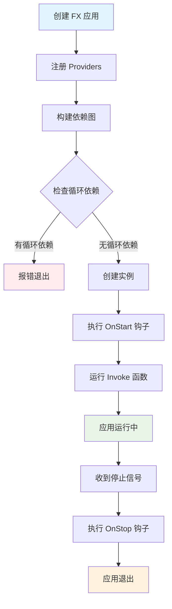
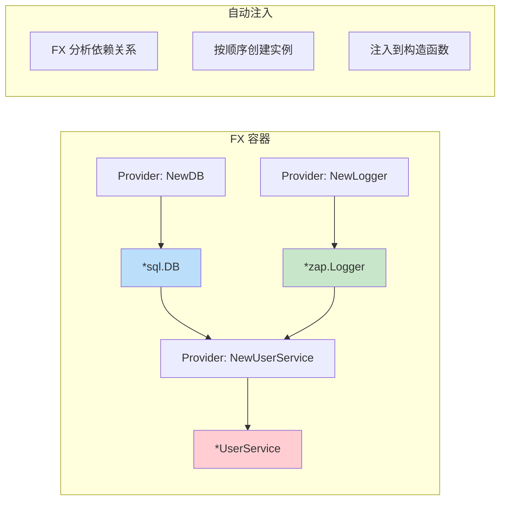
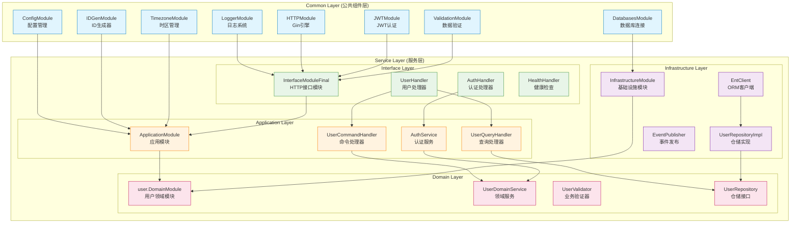
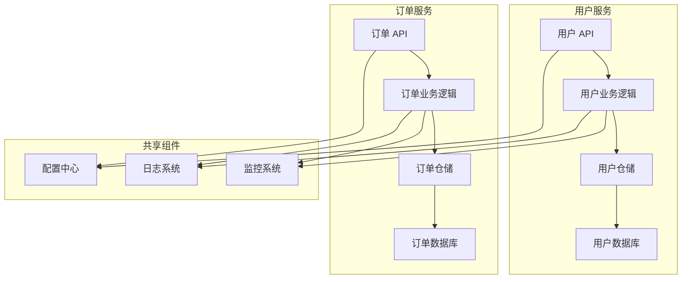
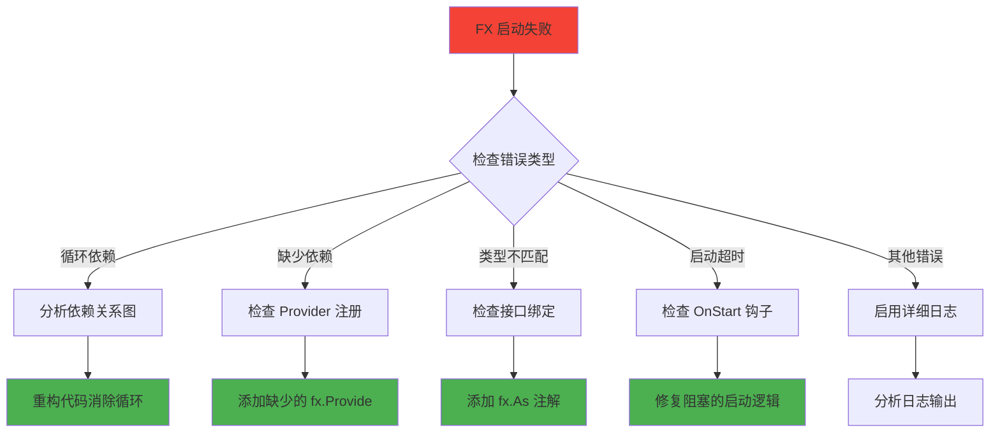

# Uber FX 框架完整学习指南

## 📚 目录

- [1. 什么是 Uber FX](#1-什么是-uber-fx)
- [2. 核心概念](#2-核心概念)
- [3. FX 核心函数详解](#3-fx-核心函数详解)
- [4. 实战示例](#4-实战示例)
- [5. 常见问题与解决方案](#5-常见问题与解决方案)
- [6. 调试与故障排除](#6-调试与故障排除)
- [7. 最佳实践](#7-最佳实践)
- [8. 总结](#8-总结)

---

## 1. 什么是 Uber FX

### 🎯 简介

Uber FX 是一个基于**依赖注入（Dependency Injection）**的 Go 应用程序框架。它帮助开发者构建**模块化**、**可测试**、**易维护**的应用程序。

### 🚀 核心价值

- **自动依赖管理**：无需手动创建和传递依赖
- **模块化设计**：将应用拆分为独立的模块
- **生命周期管理**：自动处理启动和关闭逻辑
- **提高可测试性**：轻松替换依赖进行测试

### 📊 FX 应用启动流程



---

## 2. 核心概念

### 🔧 依赖注入（Dependency Injection）

**传统方式**：
```go
// ❌ 硬编码依赖
func NewUserService() *UserService {
    db := mysql.Connect("localhost:3306")  // 硬编码
    logger := zap.NewProduction()          // 硬编码
    return &UserService{db: db, logger: logger}
}
```

**FX 方式**：
```go
// ✅ 依赖注入
func NewUserService(db *sql.DB, logger *zap.Logger) *UserService {
    return &UserService{db: db, logger: logger}
}
```

### 🏗️ 依赖注入工作原理



### 📦 模块化架构



---

## 3. FX 核心函数详解

### 3.1 fx.New

#### 🎯 作用
创建一个新的 FX 应用实例，这是所有 FX 应用的入口点。

#### 📝 语法
```go
app := fx.New(options...)
```

#### 🌟 示例
```go
func main() {
    app := fx.New(
        fx.Provide(NewDatabase),
        fx.Provide(NewUserService),
        fx.Invoke(StartServer),
    )
    
    app.Run() // 启动应用并等待信号
}
```

### 3.2 fx.Provide

#### 🎯 作用
注册**构造函数（Provider）**到 FX 容器中。FX 会自动调用这些函数来创建依赖实例。

#### 📝 语法
```go
fx.Provide(constructorFunc)
```

#### 🌟 示例
```go
// 简单的 Provider
fx.Provide(func() *Config {
    return &Config{Port: 8080}
})

// 带依赖的 Provider
fx.Provide(func(config *Config, logger *zap.Logger) *Server {
    return &Server{
        port:   config.Port,
        logger: logger,
    }
})

// 多个返回值的 Provider
fx.Provide(func() (*Database, error) {
    db, err := sql.Open("mysql", "connection-string")
    return &Database{db}, err
})
```

### 3.3 fx.Invoke

#### 🎯 作用
注册**启动函数**，在所有依赖创建完成后执行。通常用于启动服务、注册路由等。

#### 📝 语法
```go
fx.Invoke(startupFunc)
```

#### 🌟 示例
```go
// 启动 HTTP 服务器
fx.Invoke(func(server *http.Server, lc fx.Lifecycle) {
    lc.Append(fx.Hook{
        OnStart: func(ctx context.Context) error {
            go server.ListenAndServe()
            return nil
        },
        OnStop: func(ctx context.Context) error {
            return server.Shutdown(ctx)
        },
    })
})

// 注册路由
fx.Invoke(func(router *gin.Engine, userHandler *UserHandler) {
    router.GET("/users", userHandler.GetUsers)
    router.POST("/users", userHandler.CreateUser)
})
```

### 3.4 fx.Module

#### 🎯 作用
将相关的 Providers 和 Invokes 组织成一个**模块**，提高代码的组织性和复用性。

#### 📝 语法
```go
var ModuleName = fx.Module("module-name", options...)
```

#### 🌟 示例
```go
// Common层模块 - 基础设施组件
var DatabasesModule = fx.Module("databases",
    databases.Module,
)

var LoggerModule = fx.Module("logger",
    logger.Module,
)

// Domain层模块 - 业务领域
var DomainModule = fx.Module("user_domain",
    fx.Provide(
        // 验证器
        validator.NewUserValidator,
        
        // 领域服务
        service.NewUserDomainService,
        
        // 仓储实现
        fx.Annotate(
            repository.NewUserRepositoryImpl,
            fx.As(new(domainrepo.UserRepository)),
        ),
    ),
)

// Application层模块 - 应用服务
var ApplicationModule = fx.Module("application",
    fx.Provide(
        commandhandler.NewUserCommandHandler,
        queryhandler.NewUserQueryHandler,
        service.NewAuthService,
        service.NewPermissionService,
    ),
)

// 主应用
func main() {
    fx.New(
        commonDI.GetWebModules(),
        user.DomainModule,
        application.ApplicationModule,
        infrastructure.InfrastructureModule,
        http.InterfaceModuleFinal,
    ).Run()
}
```

### 3.5 fx.Annotate 和 fx.As

#### 🎯 作用
- `fx.Annotate`：为 Provider 添加元数据
- `fx.As`：实现接口绑定，支持依赖倒置原则

#### 📝 语法
```go
fx.Annotate(
    constructorFunc,
    fx.As(new(InterfaceType)),
)
```

#### 🌟 示例
```go
// 接口定义 (在领域层)
package repository

import (
    "context"
    "user-services/internal/domain/user/entity"
)

type UserRepository interface {
    Create(ctx context.Context, user *entity.User) error
    GetByID(ctx context.Context, id string) (*entity.User, error)
    List(ctx context.Context, offset, limit int) ([]*entity.User, int64, error)
    ExistsByPhoneNumber(ctx context.Context, phoneNumber string) (bool, error)
}

// 具体实现 (在基础设施层)
package repository

import (
    "user-services/internal/infrastructure/persistence/ent/gen"
    domainrepo "user-services/internal/domain/user/repository"
)

type UserRepositoryImpl struct {
    client *gen.Client
}

func NewUserRepository(client *gen.Client) domainrepo.UserRepository {
    return &UserRepositoryImpl{client: client}
}

// 在基础设施模块中注册
var InfrastructureModule = fx.Module("infrastructure",
    fx.Provide(
        // Ent客户端
        NewEntClient,
        
        // 仓储实现 (自动绑定到接口)
        repository.NewUserRepository,
    ),
)

// 使用接口 (在领域服务中)
func NewUserDomainService(repo repository.UserRepository) *UserDomainService {
    return &UserDomainService{repo: repo}
}
```

#### 🏷️ 命名依赖
```go
// 多个相同类型的依赖
fx.Provide(
    fx.Annotate(
        NewPrimaryDB,
        fx.ResultTags(`name:"primary"`),
    ),
    fx.Annotate(
        NewSecondaryDB,
        fx.ResultTags(`name:"secondary"`),
    ),
)

// 注入时指定名称
func NewUserService(
    primaryDB *sql.DB `name:"primary"`,
    secondaryDB *sql.DB `name:"secondary"`,
) *UserService {
    return &UserService{
        primaryDB:   primaryDB,
        secondaryDB: secondaryDB,
    }
}
```

### 3.6 生命周期管理 (fx.Lifecycle)

#### 🎯 作用
管理应用程序的启动和关闭过程，确保资源的正确初始化和清理。

#### 📝 语法
```go
fx.Invoke(func(lc fx.Lifecycle) {
    lc.Append(fx.Hook{
        OnStart: func(ctx context.Context) error { /* 启动逻辑 */ },
        OnStop:  func(ctx context.Context) error { /* 关闭逻辑 */ },
    })
})
```

#### 🌟 示例
```go
// HTTP 服务器生命周期管理
fx.Invoke(func(server *http.Server, lc fx.Lifecycle, logger *zap.Logger) {
    lc.Append(fx.Hook{
        OnStart: func(ctx context.Context) error {
            logger.Info("Starting HTTP server", zap.String("addr", server.Addr))
            go func() {
                if err := server.ListenAndServe(); err != nil && err != http.ErrServerClosed {
                    logger.Error("Server failed", zap.Error(err))
                }
            }()
            return nil
        },
        OnStop: func(ctx context.Context) error {
            logger.Info("Stopping HTTP server")
            ctx, cancel := context.WithTimeout(ctx, 5*time.Second)
            defer cancel()
            return server.Shutdown(ctx)
        },
    })
})

// 数据库连接生命周期管理
fx.Invoke(func(db *sql.DB, lc fx.Lifecycle, logger *zap.Logger) {
    lc.Append(fx.Hook{
        OnStart: func(ctx context.Context) error {
            logger.Info("Testing database connection")
            return db.PingContext(ctx)
        },
        OnStop: func(ctx context.Context) error {
            logger.Info("Closing database connection")
            return db.Close()
        },
    })
})
```

---

## 4. 实战示例

### 4.1 简单的 Hello World

```go
package main

import (
    "fmt"
    "go.uber.org/fx"
    "go.uber.org/zap"
)

// 服务定义
type Greeter struct {
    logger *zap.Logger
}

func NewGreeter(logger *zap.Logger) *Greeter {
    return &Greeter{logger: logger}
}

func (g *Greeter) Greet(name string) {
    g.logger.Info("Greeting", zap.String("name", name))
    fmt.Printf("Hello, %s!\n", name)
}

func main() {
    fx.New(
        fx.Provide(
            zap.NewDevelopment, // 提供 logger
            NewGreeter,         // 提供 greeter
        ),
        fx.Invoke(func(greeter *Greeter) {
            greeter.Greet("FX World")
        }),
    ).Run()
}
```

### 4.2 完整的 Web 应用

```go
package main

import (
    "context"
    "fmt"
    "net/http"
    "time"

    "go.uber.org/fx"
    "go.uber.org/zap"
)

// ===== 配置 =====
type Config struct {
    Port int
    Host string
}

func NewConfig() Config {
    return Config{
        Port: 8080,
        Host: "localhost",
    }
}

// ===== 服务层 =====
type UserService struct {
    logger *zap.Logger
}

func NewUserService(logger *zap.Logger) *UserService {
    return &UserService{logger: logger}
}

func (s *UserService) GetUsers() []string {
    s.logger.Info("Getting users")
    return []string{"Alice", "Bob", "Charlie"}
}

// ===== 处理器层 =====
type UserHandler struct {
    service *UserService
    logger  *zap.Logger
}

func NewUserHandler(service *UserService, logger *zap.Logger) *UserHandler {
    return &UserHandler{service: service, logger: logger}
}

func (h *UserHandler) HandleUsers(w http.ResponseWriter, r *http.Request) {
    h.logger.Info("Handling users request")
    users := h.service.GetUsers()
    
    w.Header().Set("Content-Type", "application/json")
    fmt.Fprintf(w, `{"users": %q}`, users)
}

// ===== HTTP 服务器 =====
type Server struct {
    server *http.Server
    logger *zap.Logger
}

func NewServer(handler *UserHandler, config Config, logger *zap.Logger) *Server {
    mux := http.NewServeMux()
    mux.HandleFunc("/users", handler.HandleUsers)

    server := &http.Server{
        Addr:    fmt.Sprintf("%s:%d", config.Host, config.Port),
        Handler: mux,
    }

    return &Server{server: server, logger: logger}
}

// ===== 模块定义 =====
var ConfigModule = fx.Module("config",
    fx.Provide(NewConfig),
)

var ServiceModule = fx.Module("service",
    fx.Provide(NewUserService),
)

var HandlerModule = fx.Module("handler",
    fx.Provide(NewUserHandler),
)

var ServerModule = fx.Module("server",
    fx.Provide(NewServer),
    fx.Invoke(func(s *Server, lc fx.Lifecycle) {
        lc.Append(fx.Hook{
            OnStart: func(ctx context.Context) error {
                s.logger.Info("Starting server", zap.String("addr", s.server.Addr))
                go func() {
                    if err := s.server.ListenAndServe(); err != nil && err != http.ErrServerClosed {
                        s.logger.Error("Server failed", zap.Error(err))
                    }
                }()
                return nil
            },
            OnStop: func(ctx context.Context) error {
                s.logger.Info("Stopping server")
                ctx, cancel := context.WithTimeout(ctx, 5*time.Second)
                defer cancel()
                return s.server.Shutdown(ctx)
            },
        })
    }),
)

// ===== 主应用 =====
func main() {
    fx.New(
        fx.Provide(zap.NewDevelopment),
        ConfigModule,
        ServiceModule,
        HandlerModule,
        ServerModule,
    ).Run()
}
```

### 4.3 微服务架构示例



```go
// 基于实际项目的微服务应用
package main

import (
    "flag"
    "fmt"
    "log"
    "os"
    "go.uber.org/fx"
    
    commonDI "common/di"
    "user-services/internal/application"
    "user-services/internal/domain/user"
    "user-services/internal/infrastructure"
    "user-services/internal/interfaces/http"
)

func main() {
    // 添加命令行参数
    var (
        generateGraph = flag.Bool("graph", false, "Generate dependency graph and exit")
        graphOutput   = flag.String("graph-output", "dependency-graph.dot", "Output file for dependency graph")
    )
    flag.Parse()

    // 创建应用容器
    app := fx.New(
        // 使用common库的Web模块
        commonDI.GetWebModules(),

        // 领域模块
        user.DomainModule,

        // 应用模块
        application.ApplicationModule,

        // 基础设施模块
        infrastructure.InfrastructureModule,

        // 接口模块
        http.InterfaceModuleFinal,
    )

    if err := app.Err(); err != nil {
        log.Fatalf("Failed to initialize application: %v", err)
    }

    // 如果请求生成依赖图
    if *generateGraph {
        generateDependencyGraph(app, *graphOutput)
        return
    }

    // 启动应用容器
    app.Run()
}

// Common库的模块组织
func GetWebModules() fx.Option {
    return fx.Options(
        GetCoreModules(),
        HTTPModule,
    )
}

func GetCoreModules() fx.Option {
    return fx.Options(
        ConfigModule,
        LoggerModule,
        DatabasesModule,
        ValidationModule,
        IDGenModule,
        JWTModule,
        TimezoneModule,
    )
}
```

---

## 5. 常见问题与解决方案

### 🚨 循环依赖问题

#### 问题描述
```go
// ❌ 循环依赖示例
type UserService struct {
    orderService *OrderService
}

type OrderService struct {
    userService *UserService  // 循环依赖！
}
```

#### 解决方案

**方案1：引入中介者模式**
```go
// ✅ 使用事件总线解耦
type EventBus interface {
    Publish(event interface{})
    Subscribe(eventType string, handler func(interface{}))
}

type UserService struct {
    eventBus EventBus
}

func (s *UserService) CreateUser(user *User) {
    // 创建用户逻辑
    s.eventBus.Publish("user.created", UserCreatedEvent{UserID: user.ID})
}

type OrderService struct {
    eventBus EventBus
}

func NewOrderService(eventBus EventBus) *OrderService {
    service := &OrderService{eventBus: eventBus}
    
    // 订阅用户创建事件
    eventBus.Subscribe("user.created", func(event interface{}) {
        userEvent := event.(UserCreatedEvent)
        service.handleUserCreated(userEvent.UserID)
    })
    
    return service
}
```

**方案2：提取共同依赖**
```go
// ✅ 提取共同的仓储层
package repository

import (
    "context"
    "user-services/internal/domain/user/entity"
)

type UserRepository interface {
    GetByID(ctx context.Context, id string) (*entity.User, error)
    ExistsByPhoneNumber(ctx context.Context, phoneNumber string) (bool, error)
}

type OrderRepository interface {
    GetOrdersByUserID(ctx context.Context, userID string) ([]*entity.Order, error)
}

// 领域服务只依赖仓储接口，不相互依赖
type UserDomainService struct {
    userRepo UserRepository
}

type OrderDomainService struct {
    orderRepo OrderRepository
    userRepo  UserRepository  // 共享仓储接口，而不是服务
}
```

### 🔍 依赖未找到问题

#### 问题描述
```
[Fx] ERROR    Failed to build dependency graph: missing dependencies for function "main.NewUserService"
```

#### 解决方案

**检查依赖注册**
```go
// ❌ 忘记注册依赖
fx.New(
    fx.Provide(NewUserService),  // UserService 需要 UserRepository，但没有注册
    fx.Invoke(StartApp),
)

// ✅ 注册所有依赖
fx.New(
    fx.Provide(
        NewUserRepository,  // 先注册依赖
        NewUserService,     // 再注册使用者
    ),
    fx.Invoke(StartApp),
)
```

**检查接口绑定**
```go
// ❌ 接口没有绑定到具体实现
fx.Provide(NewMySQLUserRepository)  // 返回 *MySQLUserRepository

func NewUserService(repo UserRepository) *UserService {  // 需要 UserRepository 接口
    return &UserService{repo: repo}
}

// ✅ 使用 fx.As 绑定接口
fx.Provide(
    fx.Annotate(
        NewMySQLUserRepository,
        fx.As(new(UserRepository)),  // 绑定到接口
    ),
)
```

### 🏷️ 同类型多实例问题

#### 问题描述
```go
// 需要两个不同的数据库连接
func NewPrimaryDB() *sql.DB { /* ... */ }
func NewSecondaryDB() *sql.DB { /* ... */ }

// ❌ FX 不知道注入哪个
func NewUserService(db *sql.DB) *UserService {  // 歧义！
    return &UserService{db: db}
}
```

#### 解决方案

**使用命名依赖**
```go
// ✅ 使用标签区分
fx.Provide(
    fx.Annotate(
        NewPrimaryDB,
        fx.ResultTags(`name:"primary"`),
    ),
    fx.Annotate(
        NewSecondaryDB,
        fx.ResultTags(`name:"secondary"`),
    ),
)

// 注入时指定标签
func NewUserService(
    primaryDB *sql.DB `name:"primary"`,
    secondaryDB *sql.DB `name:"secondary"`,
) *UserService {
    return &UserService{
        primaryDB:   primaryDB,
        secondaryDB: secondaryDB,
    }
}
```

### 🔧 生命周期钩子问题

#### 问题描述
```go
// ❌ 阻塞的 OnStart 钩子
lc.Append(fx.Hook{
    OnStart: func(ctx context.Context) error {
        return server.ListenAndServe()  // 这会阻塞！
    },
})
```

#### 解决方案
```go
// ✅ 在 goroutine 中启动服务
lc.Append(fx.Hook{
    OnStart: func(ctx context.Context) error {
        go func() {
            if err := server.ListenAndServe(); err != nil && err != http.ErrServerClosed {
                logger.Error("Server failed", zap.Error(err))
            }
        }()
        return nil  // 立即返回
    },
    OnStop: func(ctx context.Context) error {
        return server.Shutdown(ctx)
    },
})
```

---

## 6. 调试与故障排除

### 🔍 启用详细日志

```go
import "go.uber.org/fx/fxevent"

func main() {
    fx.New(
        // 启用详细的 FX 日志
        fx.WithLogger(func(logger *zap.Logger) fxevent.Logger {
            return &fxevent.ZapLogger{Logger: logger}
        }),
        
        // 你的模块...
        UserModule,
        HTTPModule,
    ).Run()
}
```

### 📊 依赖关系可视化

**项目内置的依赖图生成**：
```go
// 使用项目内置的依赖图生成功能
func main() {
    // 添加命令行参数
    var (
        generateGraph = flag.Bool("graph", false, "Generate dependency graph and exit")
        graphOutput   = flag.String("graph-output", "dependency-graph.dot", "Output file for dependency graph")
    )
    flag.Parse()

    app := fx.New(
        commonDI.GetWebModules(),
        user.DomainModule,
        application.ApplicationModule,
        infrastructure.InfrastructureModule,
        http.InterfaceModuleFinal,
    )

    // 如果请求生成依赖图
    if *generateGraph {
        generateDependencyGraph(app, *graphOutput)
        return
    }

    app.Run()
}
```

**使用方法**：
```bash
# 生成依赖关系图
go run cmd/server/main.go -graph

# 生成可视化图片
dot -Tpng dependency-graph.dot -o dependency-graph.png
dot -Tsvg dependency-graph.dot -o dependency-graph.svg
```

### 🐛 错误诊断流程



### 🛠️ 常用调试技巧

#### 1. 使用 fx.Populate 检查依赖

```go
func main() {
    var (
        userService *UserService
        httpServer  *http.Server
    )
    
    app := fx.New(
        UserModule,
        HTTPModule,
        fx.Populate(&userService, &httpServer),  // 填充变量以便检查
    )
    
    if err := app.Start(context.Background()); err != nil {
        log.Fatal("Failed to start:", err)
    }
    
    // 检查依赖是否正确注入
    fmt.Printf("UserService: %+v\n", userService)
    fmt.Printf("HTTPServer: %+v\n", httpServer)
    
    app.Stop(context.Background())
}
```

#### 2. 分阶段启动调试

```go
func main() {
    // 第一阶段：只启动核心依赖
    coreApp := fx.New(
        ConfigModule,
        LoggerModule,
        fx.Invoke(func(logger *zap.Logger) {
            logger.Info("Core dependencies loaded")
        }),
    )
    
    if err := coreApp.Start(context.Background()); err != nil {
        log.Fatal("Core failed:", err)
    }
    coreApp.Stop(context.Background())
    
    // 第二阶段：添加数据库
    dbApp := fx.New(
        ConfigModule,
        LoggerModule,
        DatabaseModule,
        fx.Invoke(func(logger *zap.Logger) {
            logger.Info("Database dependencies loaded")
        }),
    )
    
    if err := dbApp.Start(context.Background()); err != nil {
        log.Fatal("Database failed:", err)
    }
    dbApp.Stop(context.Background())
    
    // 最终：完整应用
    fx.New(
        ConfigModule,
        LoggerModule,
        DatabaseModule,
        UserModule,
        HTTPModule,
    ).Run()
}
```

### 🛠️ 项目特定的调试技巧

#### 1. 常见启动问题诊断

**问题：循环依赖错误**
```bash
# 错误信息示例
[Fx] ERROR    Failed to build dependency graph: cycle detected in dependency graph
```

**解决方案**：
```go
// ✅ 检查模块间的依赖关系
// 确保Domain层不依赖Application层或Infrastructure层
// 使用接口进行依赖倒置

// 错误示例：Domain层直接依赖Infrastructure层
// ❌ func NewUserService(repo *ent.UserRepository) *UserService

// 正确示例：Domain层依赖接口
// ✅ func NewUserService(repo repository.UserRepository) *UserService
```

#### 2. 数据库连接问题调试

**问题：数据库连接失败**
```bash
# 使用项目内置的数据库连接测试
go run cmd/cli/main.go migrate
```

**调试步骤**：
```yaml
# 1. 检查配置文件
# services/configs/app.yaml
databases:
  mysql:
    host: "localhost"
    port: 3306
    username: "root"
    password: "password"
    database: "go_micro_scaffold"
    max_open_conns: 100
    max_idle_conns: 10
    conn_max_lifetime: "1h"
```

```go
// 2. 验证数据库连接
// 在common/databases/dbms包中已有连接验证逻辑
func NewManager(config *config.Config, logger *zap.Logger) (*Manager, error) {
    // 数据库连接逻辑
    db, err := sql.Open("mysql", dsn)
    if err != nil {
        return nil, err
    }
    
    // 测试连接
    if err := db.Ping(); err != nil {
        return nil, err
    }
    
    return &Manager{db: db}, nil
}
```

#### 3. HTTP路由问题调试

**问题：路由未生效**
```go
// ✅ 检查路由注册顺序
// 确保在services/internal/interfaces/http/routes/main.go中
// 正确调用了SetupRoutesFinal函数

package routes

import (
    "github.com/gin-gonic/gin"
    "go.uber.org/zap"
    "user-services/internal/interfaces/http/handler"
)

type RoutesParams struct {
    Engine        *gin.Engine
    UserHandler   *handler.UserHandler
    AuthHandler   *handler.AuthHandler
    HealthHandler *handler.HealthHandler
    ZapLogger     *zap.Logger
}

func SetupRoutesFinal(p RoutesParams) {
    // 1. 系统路由（无需认证）
    SetupSystemRoutes(p.Engine, p.HealthHandler, p.ZapLogger)
    
    // 2. API v1 路由组
    v1 := p.Engine.Group("/api/v1")
    
    // 3. 业务路由
    SetupUserRoutes(v1, p.UserHandler, p.ZapLogger)
    SetupAuthRoutes(v1, p.AuthHandler, p.ZapLogger)
}
```

#### 4. JWT认证问题调试

**问题：JWT验证失败**
```go
// ✅ 检查JWT配置
package jwt

import (
    "time"
    "github.com/golang-jwt/jwt/v4"
    "common/config"
)

type JWT struct {
    secretKey     []byte
    expiredTime   time.Duration
    issuer        string
}

func NewJWTService(config *config.Config) *JWT {
    return &JWT{
        secretKey:   []byte(config.System.SecretKey),
        expiredTime: time.Duration(config.Token.ExpiredTime) * time.Minute,
        issuer:      config.System.Name,
    }
}

// 调试JWT问题的步骤：
// 1. 检查配置文件中的secret_key
// 2. 验证token格式 (Bearer <token>)
// 3. 确认token未过期
// 4. 检查中间件是否正确应用
```

#### 5. 使用项目日志进行调试

**启用详细日志**：
```yaml
# services/configs/app.yaml
logger:
  level: "debug"  # 设置为debug级别
  format: "json"  # 使用json格式便于分析
  output: "both"  # 同时输出到控制台和文件
  file:
    enabled: true
    path: "./logs"
    max_size: 100    # MB
    max_backups: 10
    max_age: 30      # 天
```

**查看日志文件**：
```bash
# 项目日志文件位置
tail -f services/logs/app.$(date +%Y-%m-%d).log
tail -f services/logs/error.$(date +%Y-%m-%d).log
tail -f services/logs/info.$(date +%Y-%m-%d).log

# 使用jq解析JSON日志
tail -f services/logs/app.$(date +%Y-%m-%d).log | jq '.'

# 过滤特定级别的日志
tail -f services/logs/app.$(date +%Y-%m-%d).log | jq 'select(.level=="ERROR")'
```

#### 6. 使用CLI工具进行调试

**数据库迁移和验证**：
```bash
# 执行数据库迁移
go run cmd/cli/main.go migrate

# 验证数据库连接
go run cmd/cli/main.go db:ping

# 查看数据库状态
go run cmd/cli/main.go db:status
```

**生成依赖关系图**：
```bash
# 生成依赖关系图
go run cmd/server/main.go -graph -graph-output=debug-graph.dot

# 转换为可视化图片
dot -Tpng debug-graph.dot -o debug-graph.png
dot -Tsvg debug-graph.dot -o debug-graph.svg

# 在线查看（如果没有安装Graphviz）
# 上传debug-graph.dot到 http://magjac.com/graphviz-visual-editor/
```

#### 7. 常见启动问题快速诊断

**问题1：端口被占用**
```bash
# 检查端口占用
lsof -i :8080
netstat -tulpn | grep :8080

# 解决方案：修改配置文件端口或杀死占用进程
kill -9 <PID>
```

**问题2：数据库连接失败**
```bash
# 检查数据库服务状态
systemctl status mysql
brew services list | grep mysql

# 测试数据库连接
mysql -h localhost -u root -p -e "SELECT 1"

# 检查配置文件
cat services/configs/app.yaml | grep -A 10 mysql
```

**问题3：Redis连接失败**
```bash
# 检查Redis服务状态
systemctl status redis
brew services list | grep redis

# 测试Redis连接
redis-cli ping

# 检查Redis配置
cat services/configs/app.yaml | grep -A 10 redis
```

#### 8. 性能调试工具

**使用pprof进行性能分析**：
```go
// 在main.go中添加pprof支持
import (
    _ "net/http/pprof"
    "net/http"
)

func main() {
    // 启动pprof服务器
    go func() {
        log.Println(http.ListenAndServe("localhost:6060", nil))
    }()
    
    // 正常的FX应用启动
    fx.New(
        commonDI.GetWebModules(),
        // ... 其他模块
    ).Run()
}
```

**性能分析命令**：
```bash
# CPU性能分析
go tool pprof http://localhost:6060/debug/pprof/profile?seconds=30

# 内存分析
go tool pprof http://localhost:6060/debug/pprof/heap

# Goroutine分析
go tool pprof http://localhost:6060/debug/pprof/goroutine

# 生成火焰图
go tool pprof -http=:8081 http://localhost:6060/debug/pprof/profile?seconds=30
```

#### 9. 集成测试调试

**使用测试数据库**：
```go
// 测试配置
func NewTestConfig() *config.Config {
    return &config.Config{
        Database: config.Database{
            MySQL: config.MySQL{
                Host:     "localhost",
                Port:     3306,
                Username: "test",
                Password: "test",
                Database: "go_micro_scaffold_test",
            },
        },
    }
}

// 集成测试示例
func TestUserAPI(t *testing.T) {
    var server *gin.Engine
    
    app := fx.New(
        fx.Provide(NewTestConfig),
        commonDI.GetCoreModules(),
        user.DomainModule,
        application.ApplicationModule,
        infrastructure.InfrastructureModule,
        http.InterfaceModuleFinal,
        fx.Populate(&server),
    )
    
    require.NoError(t, app.Start(context.Background()))
    defer app.Stop(context.Background())
    
    // 执行API测试
    w := httptest.NewRecorder()
    req, _ := http.NewRequest("GET", "/api/v1/users", nil)
    server.ServeHTTP(w, req)
    
    assert.Equal(t, 200, w.Code)
}
```

---

## 7. 最佳实践

### 📁 项目结构建议

```
go-micro-scaffold/
├── common/                  # 公共库
│   ├── config/             # 配置管理
│   ├── databases/          # 数据库相关
│   ├── di/                 # 依赖注入模块
│   ├── http/               # HTTP 服务
│   ├── logger/             # 日志系统
│   ├── middleware/         # 中间件
│   ├── pkg/                # 通用工具包
│   ├── response/           # 响应处理
│   └── go.mod
├── services/               # 服务模块
│   ├── cmd/
│   │   └── server/
│   │       └── main.go     # 应用入口
│   ├── internal/           # Clean Architecture实现
│   │   ├── application/    # 应用层
│   │   ├── domain/         # 领域层
│   │   ├── infrastructure/ # 基础设施层
│   │   └── interfaces/     # 接口层
│   └── go.mod
└── go.work                 # Go 工作区
```

### 🎯 模块设计原则

#### 1. 单一职责原则
```go
// ✅ 每个模块只负责一个领域或层次
var UserDomainModule = fx.Module("user_domain",
    fx.Provide(
        // 只包含用户领域的组件
        validator.NewUserValidator,
        service.NewUserDomainService,
    ),
)

var ApplicationModule = fx.Module("application",
    fx.Provide(
        // 只包含应用层组件
        commandhandler.NewUserCommandHandler,
        queryhandler.NewUserQueryHandler,
        service.NewAuthService,
        service.NewPermissionService,
    ),
)

var InfrastructureModule = fx.Module("infrastructure",
    fx.Provide(
        // 只包含基础设施组件
        NewEntClient,
        repository.NewUserRepository,
        messaging.NewEventPublisher,
    ),
)
```

#### 2. 依赖倒置原则
```go
// ✅ 依赖接口而不是具体实现
package service

import (
    "user-services/internal/domain/user/repository"
    "go.uber.org/zap"
)

type UserDomainService struct {
    repo   repository.UserRepository    // 领域接口
    logger *zap.Logger                  // 具体实现（基础设施）
}

func NewUserDomainService(
    repo repository.UserRepository,
    logger *zap.Logger,
) *UserDomainService {
    return &UserDomainService{
        repo:   repo,
        logger: logger,
    }
}

// 在基础设施模块中提供具体实现
var InfrastructureModule = fx.Module("infrastructure",
    fx.Provide(
        // 仓储实现自动绑定到接口
        repository.NewUserRepository,  // 返回 repository.UserRepository 接口
    ),
)
```

#### 3. 接口隔离原则
```go
// ✅ 小而专一的接口
type UserReader interface {
    GetUser(id string) (*User, error)
}

type UserWriter interface {
    CreateUser(user *User) error
    UpdateUser(user *User) error
}

// 根据需要组合接口
type UserRepository interface {
    UserReader
    UserWriter
}
```

### 🧪 测试策略

#### 1. 单元测试
```go
func TestUserService(t *testing.T) {
    // 创建测试模块
    var testModule = fx.Module("test",
        fx.Provide(
            fx.Annotate(
                NewMockUserRepository,
                fx.As(new(UserRepository)),
            ),
            NewUserService,
            zap.NewNop, // 测试用的空日志
        ),
    )
    
    var service *UserService
    
    app := fx.New(
        testModule,
        fx.Populate(&service),
    )
    
    require.NoError(t, app.Start(context.Background()))
    defer app.Stop(context.Background())
    
    // 测试业务逻辑
    user, err := service.GetUser("123")
    assert.NoError(t, err)
    assert.Equal(t, "test-user", user.Name)
}
```

#### 2. 集成测试
```go
func TestHTTPEndpoints(t *testing.T) {
    var server *http.Server
    
    app := fx.New(
        ConfigModule,
        DatabaseModule,
        UserModule,
        HTTPModule,
        fx.Populate(&server),
    )
    
    require.NoError(t, app.Start(context.Background()))
    defer app.Stop(context.Background())
    
    // 测试 HTTP 端点
    resp, err := http.Get("http://localhost:8080/users")
    assert.NoError(t, err)
    assert.Equal(t, http.StatusOK, resp.StatusCode)
}
```

### ⚡ 性能优化

#### 1. 延迟初始化
```go
// 对于昂贵的资源，使用延迟初始化
fx.Provide(func() func() *ExpensiveResource {
    var resource *ExpensiveResource
    var once sync.Once
    
    return func() *ExpensiveResource {
        once.Do(func() {
            resource = NewExpensiveResource()
        })
        return resource
    }
})
```

#### 2. 监控依赖创建时间
```go
// ✅ 监控数据库连接创建时间
fx.Provide(
    fx.Annotate(
        func(config *config.Config, logger *zap.Logger) (*mysql.Manager, error) {
            start := time.Now()
            defer func() {
                logger.Info("MySQL Manager created",
                    zap.Duration("duration", time.Since(start)))
            }()
            
            return mysql.NewManager(config, logger)
        },
    ),
)

// ✅ 监控Ent客户端创建时间
fx.Provide(
    fx.Annotate(
        func(manager *mysql.Manager, logger *zap.Logger) (*gen.Client, error) {
            start := time.Now()
            defer func() {
                logger.Info("Ent Client created",
                    zap.Duration("duration", time.Since(start)))
            }()
            
            return gen.NewClient(gen.Driver(manager.GetDB())), nil
        },
    ),
)
```

#### 3. 连接池优化
```go
// ✅ 数据库连接池配置优化
func NewManager(config *config.Config, logger *zap.Logger) (*Manager, error) {
    db, err := sql.Open("mysql", dsn)
    if err != nil {
        return nil, err
    }
    
    // 连接池配置
    db.SetMaxOpenConns(config.Database.MySQL.MaxOpenConns)    // 最大连接数
    db.SetMaxIdleConns(config.Database.MySQL.MaxIdleConns)    // 最大空闲连接数
    db.SetConnMaxLifetime(config.Database.MySQL.ConnMaxLifetime) // 连接最大生存时间
    
    return &Manager{db: db}, nil
}

// ✅ Redis连接池配置优化
func NewRedisClient(config *config.Config) *redis.Client {
    return redis.NewClient(&redis.Options{
        Addr:         config.Database.Redis.Addr,
        Password:     config.Database.Redis.Password,
        DB:           config.Database.Redis.DB,
        PoolSize:     config.Database.Redis.PoolSize,     // 连接池大小
        MinIdleConns: config.Database.Redis.MinIdleConns, // 最小空闲连接数
        MaxRetries:   config.Database.Redis.MaxRetries,   // 最大重试次数
    })
}
```

#### 3. 基于实际项目的优化建议

**模块组织优化**：
```go
// ✅ 使用GetWebModules()统一管理公共组件
func GetWebModules() fx.Option {
    return fx.Options(
        GetCoreModules(),  // 核心模块
        HTTPModule,        // HTTP模块
    )
}

func GetCoreModules() fx.Option {
    return fx.Options(
        ConfigModule,      // 配置管理
        LoggerModule,      // 日志系统
        DatabasesModule,   // 数据库连接
        ValidationModule,  // 数据验证
        IDGenModule,       // ID生成器
        JWTModule,         // JWT认证
        TimezoneModule,    // 时区管理
    )
}

// ✅ 分层模块化，清晰的依赖关系
func main() {
    fx.New(
        commonDI.GetWebModules(),              // 公共组件
        user.DomainModule,                     // 领域层
        application.ApplicationModule,         // 应用层
        infrastructure.InfrastructureModule,  // 基础设施层
        http.InterfaceModuleFinal,            // 接口层
    ).Run()
}
```

**生命周期管理优化**：
```go
// ✅ HTTP服务器生命周期管理
func RegisterServerLifecycle(
    server *gin.Engine,
    config *config.Config,
    lc fx.Lifecycle,
    logger *zap.Logger,
) {
    httpServer := &http.Server{
        Addr:    fmt.Sprintf(":%d", config.Server.Port),
        Handler: server,
    }

    lc.Append(fx.Hook{
        OnStart: func(ctx context.Context) error {
            logger.Info("Starting HTTP server",
                zap.String("addr", httpServer.Addr))
            go func() {
                if err := httpServer.ListenAndServe(); err != nil && err != http.ErrServerClosed {
                    logger.Error("HTTP server failed", zap.Error(err))
                }
            }()
            return nil
        },
        OnStop: func(ctx context.Context) error {
            logger.Info("Stopping HTTP server")
            ctx, cancel := context.WithTimeout(ctx, 30*time.Second)
            defer cancel()
            return httpServer.Shutdown(ctx)
        },
    })
}

// ✅ 数据库连接生命周期管理
func RegisterDatabaseLifecycle(
    manager *mysql.Manager,
    lc fx.Lifecycle,
    logger *zap.Logger,
) {
    lc.Append(fx.Hook{
        OnStart: func(ctx context.Context) error {
            logger.Info("Testing database connection")
            return manager.Ping(ctx)
        },
        OnStop: func(ctx context.Context) error {
            logger.Info("Closing database connections")
            return manager.Close()
        },
    })
}
```

**错误处理优化**：
```go
// ✅ 统一错误处理和依赖图生成
func main() {
    app := fx.New(
        commonDI.GetWebModules(),
        user.DomainModule,
        application.ApplicationModule,
        infrastructure.InfrastructureModule,
        http.InterfaceModuleFinal,
    )

    // 检查依赖注入错误
    if err := app.Err(); err != nil {
        // 生成依赖图帮助调试
        if visualization, verr := fx.VisualizeError(err); verr == nil {
            fmt.Println("Dependency graph visualization:")
            fmt.Println(visualization)
        }
        log.Fatalf("Failed to initialize application: %v", err)
    }

    app.Run()
}
```

**配置管理优化**：
```go
// ✅ 环境特定的配置加载
func NewConfig() (*Config, error) {
    v := viper.New()
    
    // 设置配置文件路径
    v.SetConfigName("app")
    v.SetConfigType("yaml")
    v.AddConfigPath("./configs")
    v.AddConfigPath("../configs")
    
    // 环境变量支持
    v.AutomaticEnv()
    v.SetEnvPrefix("APP")
    v.SetEnvKeyReplacer(strings.NewReplacer(".", "_"))
    
    if err := v.ReadInConfig(); err != nil {
        return nil, fmt.Errorf("failed to read config: %w", err)
    }
    
    var config Config
    if err := v.Unmarshal(&config); err != nil {
        return nil, fmt.Errorf("failed to unmarshal config: %w", err)
    }
    
    return &config, nil
}
```

---

## 8. 总结

### 🎯 FX 的核心价值

1. **简化依赖管理**：自动解析和注入依赖
2. **提高代码质量**：促进接口编程和模块化设计
3. **增强可测试性**：轻松替换依赖进行测试
4. **优雅的生命周期管理**：自动处理启动和关闭逻辑
5. **更好的错误处理**：编译时检测依赖问题

### 📚 学习路径建议

1. **入门阶段**：理解依赖注入概念，练习基本的 fx.Provide 和 fx.Invoke
2. **进阶阶段**：学习模块化设计，掌握 fx.Module 和 fx.Options
3. **高级阶段**：掌握接口绑定、生命周期管理和错误处理
4. **专家阶段**：设计复杂的微服务架构，优化性能和可维护性

### 🚀 下一步

- 在实际项目中应用 FX
- 阅读 FX 源码深入理解原理
- 贡献开源项目，分享经验
- 探索其他依赖注入框架的设计思想

### 📖 参考资源

- [Uber FX 官方文档](https://uber-go.github.io/fx/)
- [Go 依赖注入最佳实践](https://github.com/google/wire)
- [Clean Architecture in Go](https://blog.cleancoder.com/uncle-bob/2012/08/13/the-clean-architecture.html)

---

**Happy Coding with Uber FX! 🎉**