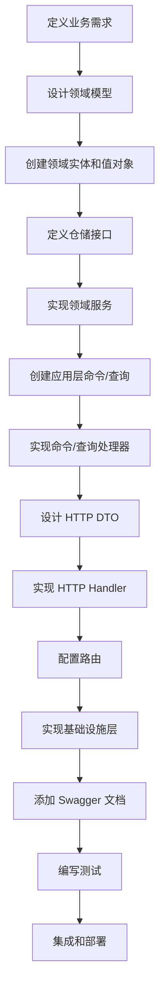

# API 开发指南

## 概述

本指南详细说明如何在 Go Micro Scaffold 项目中开发和维护 API 接口，包括 Clean Architecture 实践、Swagger 文档集成和最佳开发实践。

## 🏗️ Clean Architecture API 开发流程

### 1. 整体开发流程



### 2. 开发步骤详解

#### 步骤 1: 领域层设计

**创建实体 (Entity)**

```go
// services/internal/domain/user/entity/user.go
package entity

import (
    "time"
    "services/internal/domain/user/valueobject"
)

type User struct {
    id          string
    openID      string
    name        string
    gender      valueobject.Gender
    phoneNumber string
    password    string
    createdAt   time.Time
    updatedAt   time.Time
}

// 构造函数
func NewUser(openID, name, phoneNumber, password string, gender valueobject.Gender) *User {
    return &User{
        id:          generateID(),
        openID:      openID,
        name:        name,
        gender:      gender,
        phoneNumber: phoneNumber,
        password:    hashPassword(password),
        createdAt:   time.Now(),
        updatedAt:   time.Now(),
    }
}

// 业务方法
func (u *User) UpdateProfile(name, phoneNumber string) error {
    if name == "" {
        return errors.New("姓名不能为空")
    }
    u.name = name
    u.phoneNumber = phoneNumber
    u.updatedAt = time.Now()
    return nil
}

// Getter 方法
func (u *User) ID() string { return u.id }
func (u *User) Name() string { return u.name }
// ... 其他 getter 方法
```

**创建值对象 (Value Object)**

```go
// services/internal/domain/user/valueobject/gender.go
package valueobject

type Gender int

const (
    GenderUnknown Gender = 0
    GenderMale    Gender = 1
    GenderFemale  Gender = 2
)

func (g Gender) String() string {
    switch g {
    case GenderMale:
        return "男"
    case GenderFemale:
        return "女"
    default:
        return "未知"
    }
}

func (g Gender) IsValid() bool {
    return g >= GenderUnknown && g <= GenderFemale
}
```

**定义仓储接口 (Repository Interface)**

```go
// services/internal/domain/user/repository/user_repository.go
package repository

import (
    "context"
    "services/internal/domain/user/entity"
)

type UserRepository interface {
    Create(ctx context.Context, user *entity.User) error
    FindByID(ctx context.Context, id string) (*entity.User, error)
    FindByOpenID(ctx context.Context, openID string) (*entity.User, error)
    Update(ctx context.Context, user *entity.User) error
    Delete(ctx context.Context, id string) error
    List(ctx context.Context, offset, limit int) ([]*entity.User, int64, error)
}
```

**实现领域服务 (Domain Service)**

```go
// services/internal/domain/user/service/user_domain_service.go
package service

import (
    "context"
    "errors"
    "services/internal/domain/user/entity"
    "services/internal/domain/user/repository"
    "services/internal/domain/user/valueobject"
)

type UserDomainService struct {
    userRepo repository.UserRepository
}

func NewUserDomainService(userRepo repository.UserRepository) *UserDomainService {
    return &UserDomainService{userRepo: userRepo}
}

func (s *UserDomainService) CreateUser(ctx context.Context, openID, name, phoneNumber, password string, gender valueobject.Gender) (*entity.User, error) {
    // 业务规则验证
    if !gender.IsValid() {
        return nil, errors.New("无效的性别值")
    }
    
    // 检查用户是否已存在
    existingUser, _ := s.userRepo.FindByOpenID(ctx, openID)
    if existingUser != nil {
        return nil, errors.New("用户已存在")
    }
    
    // 创建用户
    user := entity.NewUser(openID, name, phoneNumber, password, gender)
    if err := s.userRepo.Create(ctx, user); err != nil {
        return nil, err
    }
    
    return user, nil
}
```

#### 步骤 2: 应用层实现

**创建命令 (Command)**

```go
// services/internal/application/command/user/create_user_command.go
package user

import "services/internal/domain/user/valueobject"

type CreateUserCommand struct {
    OpenID      string              `validate:"required"`
    Name        string              `validate:"required,min=2,max=50"`
    Gender      valueobject.Gender  `validate:"required"`
    PhoneNumber string              `validate:"required,phone"`
    Password    string              `validate:"required,min=6"`
}
```

**实现命令处理器 (Command Handler)**

```go
// services/internal/application/commandhandler/user_command_handler.go
package commandhandler

import (
    "context"
    "services/internal/application/command/user"
    "services/internal/domain/user/entity"
    "services/internal/domain/user/service"
)

type UserCommandHandler struct {
    userDomainService *service.UserDomainService
}

func NewUserCommandHandler(userDomainService *service.UserDomainService) *UserCommandHandler {
    return &UserCommandHandler{userDomainService: userDomainService}
}

func (h *UserCommandHandler) HandleCreateUser(ctx context.Context, cmd *user.CreateUserCommand) (*entity.User, error) {
    return h.userDomainService.CreateUser(
        ctx,
        cmd.OpenID,
        cmd.Name,
        cmd.PhoneNumber,
        cmd.Password,
        cmd.Gender,
    )
}
```

#### 步骤 3: 接口层实现

**创建 DTO (Data Transfer Object)**

```go
// services/internal/interfaces/http/dto/request/user_request.go
package request

type CreateUserRequest struct {
    OpenID      string `json:"open_id" binding:"required" example:"wx_123456789"`      // 微信OpenID
    Name        string `json:"name" binding:"required,min=2,max=50" example:"张三"`     // 用户姓名
    Gender      int    `json:"gender" binding:"oneof=0 1 2" example:"1"`              // 性别：0-未知，1-男，2-女
    PhoneNumber string `json:"phone_number" binding:"required,phone" example:"13800138000"` // 手机号码
    Password    string `json:"password" binding:"required,min=6" example:"password123"`     // 密码
}

// services/internal/interfaces/http/dto/response/user_response.go
package response

type UserInfoResponse struct {
    ID          string `json:"id" example:"550e8400-e29b-41d4-a716-446655440000"`          // 用户ID
    OpenID      string `json:"open_id" example:"wx_123456789"`                             // 微信OpenID
    Name        string `json:"name" example:"张三"`                                         // 用户姓名
    Gender      int    `json:"gender" example:"1"`                                         // 性别
    PhoneNumber string `json:"phone_number" example:"13800138000"`                         // 手机号码
    CreatedAt   int64  `json:"created_at" example:"1640995200000"`                         // 创建时间
    UpdatedAt   int64  `json:"updated_at" example:"1640995200000"`                         // 更新时间
}
```

**实现 HTTP Handler**

```go
// services/internal/interfaces/http/handler/user_handler.go
package handler

import (
    "github.com/gin-gonic/gin"
    "services/internal/application/command/user"
    "services/internal/application/commandhandler"
    "services/internal/interfaces/http/dto/request"
    "services/internal/interfaces/http/dto/response"
    "services/internal/interfaces/http/swagger"
    "common/response"
)

type UserHandler struct {
    commandHandler *commandhandler.UserCommandHandler
}

func NewUserHandler(commandHandler *commandhandler.UserCommandHandler) *UserHandler {
    return &UserHandler{commandHandler: commandHandler}
}

// CreateUser 创建用户
// @Summary 创建新用户
// @Description 创建一个新的用户账户
// @Tags 用户管理
// @Accept json
// @Produce json
// @Param request body request.CreateUserRequest true "创建用户请求"
// @Success 200 {object} response.UserInfoResponse "创建成功"
// @Failure 400 {object} swagger.ValidationErrorResponse "请求参数验证失败"
// @Failure 409 {object} swagger.ConflictErrorResponse "用户已存在"
// @Failure 500 {object} swagger.InternalServerErrorResponse "服务器内部错误"
// @Router /api/v1/users [post]
func (h *UserHandler) CreateUser(c *gin.Context) {
    var req request.CreateUserRequest
    if err := c.ShouldBindJSON(&req); err != nil {
        response.BadRequest(c, err.Error())
        return
    }
    
    command := &user.CreateUserCommand{
        OpenID:      req.OpenID,
        Name:        req.Name,
        Gender:      valueobject.Gender(req.Gender),
        PhoneNumber: req.PhoneNumber,
        Password:    req.Password,
    }
    
    user, err := h.commandHandler.HandleCreateUser(c.Request.Context(), command)
    if err != nil {
        response.Handle(c, nil, err)
        return
    }
    
    response.Handle(c, toUserInfoResponse(user), nil)
}

// 转换函数
func toUserInfoResponse(user *entity.User) *response.UserInfoResponse {
    return &response.UserInfoResponse{
        ID:          user.ID(),
        OpenID:      user.OpenID(),
        Name:        user.Name(),
        Gender:      int(user.Gender()),
        PhoneNumber: user.PhoneNumber(),
        CreatedAt:   user.CreatedAt().UnixMilli(),
        UpdatedAt:   user.UpdatedAt().UnixMilli(),
    }
}
```

#### 步骤 4: 路由配置

```go
// services/internal/interfaces/http/routes/main.go
func SetupRoutesFinal(
    engine *gin.Engine,
    userHandler *handler.UserHandler,
    // ... 其他依赖
) {
    // API v1 路由组
    v1 := engine.Group("/api/v1")
    
    // 用户相关路由
    users := v1.Group("/users")
    {
        users.POST("", userHandler.CreateUser)
        users.GET("", userHandler.ListUsers)
        users.GET("/:id", userHandler.GetUser)
        users.PUT("/:id", userHandler.UpdateUser)
        users.DELETE("/:id", userHandler.DeleteUser)
    }
}
```

#### 步骤 5: 基础设施层实现

**数据库模式定义**

```go
// services/internal/infrastructure/persistence/ent/schema/user.go
package schema

import (
    "entgo.io/ent"
    "entgo.io/ent/schema/field"
    "entgo.io/ent/schema/index"
)

type User struct {
    ent.Schema
}

func (User) Fields() []ent.Field {
    return []ent.Field{
        field.String("id").Unique(),
        field.String("open_id").Unique(),
        field.String("name"),
        field.Int("gender").Default(0),
        field.String("phone_number"),
        field.String("password"),
        field.Time("created_at"),
        field.Time("updated_at"),
    }
}

func (User) Indexes() []ent.Index {
    return []ent.Index{
        index.Fields("open_id"),
        index.Fields("phone_number"),
        index.Fields("created_at"),
    }
}
```

**仓储实现**

```go
// services/internal/infrastructure/persistence/ent/repository/user_repository_impl.go
package repository

import (
    "context"
    "services/internal/domain/user/entity"
    "services/internal/infrastructure/persistence/ent/gen"
)

type UserRepositoryImpl struct {
    client *gen.Client
}

func NewUserRepository(client *gen.Client) *UserRepositoryImpl {
    return &UserRepositoryImpl{client: client}
}

func (r *UserRepositoryImpl) Create(ctx context.Context, user *entity.User) error {
    _, err := r.client.User.Create().
        SetID(user.ID()).
        SetOpenID(user.OpenID()).
        SetName(user.Name()).
        SetGender(int(user.Gender())).
        SetPhoneNumber(user.PhoneNumber()).
        SetPassword(user.Password()).
        SetCreatedAt(user.CreatedAt()).
        SetUpdatedAt(user.UpdatedAt()).
        Save(ctx)
    return err
}

func (r *UserRepositoryImpl) FindByID(ctx context.Context, id string) (*entity.User, error) {
    u, err := r.client.User.Get(ctx, id)
    if err != nil {
        return nil, err
    }
    return r.toDomainEntity(u), nil
}

// 转换函数
func (r *UserRepositoryImpl) toDomainEntity(u *gen.User) *entity.User {
    // 实现数据库模型到领域实体的转换
    // ...
}
```

## 🔧 开发工具和命令

### 1. 代码生成

```bash
# 生成 Ent 代码
cd services/internal/infrastructure/persistence/ent
go run -mod=mod entgo.io/ent/cmd/ent generate ./schema

# 生成 Swagger 文档
cd services
swag init -g cmd/server/main.go -o docs

# 验证 Swagger 文档
go run scripts/validate-swagger.go
```

### 2. 测试命令

```bash
# 运行单元测试
go test ./...

# 运行测试并显示覆盖率
go test -cover ./...

# 运行特定包的测试
go test ./internal/domain/user/...

# 运行集成测试
go test -tags=integration ./...
```

### 3. 开发服务器

```bash
# 启动开发服务器
cd services
go run cmd/server/main.go

# 使用 air 热重载（需要安装 air）
air

# 使用 Makefile
make run
```

## 📝 Swagger 文档最佳实践

### 1. 完整的 API 注释

每个 Handler 方法都应该包含完整的 Swagger 注释：

```go
// MethodName 方法描述
// @Summary 简短描述
// @Description 详细描述
// @Tags 标签分组
// @Accept json
// @Produce json
// @Param name type dataType required "description"
// @Success 200 {object} ResponseType "成功描述"
// @Failure 400 {object} ErrorType "错误描述"
// @Security BearerAuth
// @Router /path [method]
```

### 2. 标准化错误响应

使用项目提供的标准错误响应类型：

```go
// @Failure 400 {object} swagger.ValidationErrorResponse "参数验证失败"
// @Failure 401 {object} swagger.UnauthorizedErrorResponse "未授权"
// @Failure 403 {object} swagger.ForbiddenErrorResponse "禁止访问"
// @Failure 404 {object} swagger.NotFoundErrorResponse "资源不存在"
// @Failure 409 {object} swagger.ConflictErrorResponse "资源冲突"
// @Failure 500 {object} swagger.InternalServerErrorResponse "服务器错误"
```

### 3. DTO 字段注释

为所有 DTO 字段添加详细注释：

```go
type CreateUserRequest struct {
    Name string `json:"name" binding:"required,min=2,max=50" example:"张三" validate:"required,min=2,max=50"` // 用户姓名，长度2-50字符
}
```

## 🧪 测试策略

### 1. 单元测试

**领域层测试**

```go
// services/internal/domain/user/service/user_domain_service_test.go
package service_test

import (
    "context"
    "testing"
    "github.com/stretchr/testify/assert"
    "github.com/stretchr/testify/mock"
)

func TestUserDomainService_CreateUser(t *testing.T) {
    // Arrange
    mockRepo := &MockUserRepository{}
    service := service.NewUserDomainService(mockRepo)
    
    mockRepo.On("FindByOpenID", mock.Anything, "test_openid").Return(nil, nil)
    mockRepo.On("Create", mock.Anything, mock.AnythingOfType("*entity.User")).Return(nil)
    
    // Act
    user, err := service.CreateUser(context.Background(), "test_openid", "张三", "13800138000", "password123", valueobject.GenderMale)
    
    // Assert
    assert.NoError(t, err)
    assert.NotNil(t, user)
    assert.Equal(t, "张三", user.Name())
    mockRepo.AssertExpectations(t)
}
```

**应用层测试**

```go
// services/internal/application/commandhandler/user_command_handler_test.go
package commandhandler_test

func TestUserCommandHandler_HandleCreateUser(t *testing.T) {
    // 测试命令处理器逻辑
}
```

**接口层测试**

```go
// services/internal/interfaces/http/handler/user_handler_test.go
package handler_test

func TestUserHandler_CreateUser(t *testing.T) {
    // 测试 HTTP 处理器
}
```

### 2. 集成测试

```go
// tests/integration/user_api_test.go
//go:build integration

package integration

import (
    "bytes"
    "encoding/json"
    "net/http"
    "net/http/httptest"
    "testing"
)

func TestCreateUserAPI(t *testing.T) {
    // 设置测试环境
    app := setupTestApp()
    
    // 准备测试数据
    reqBody := map[string]interface{}{
        "open_id":      "test_openid",
        "name":         "张三",
        "gender":       1,
        "phone_number": "13800138000",
        "password":     "password123",
    }
    
    body, _ := json.Marshal(reqBody)
    req := httptest.NewRequest("POST", "/api/v1/users", bytes.NewBuffer(body))
    req.Header.Set("Content-Type", "application/json")
    
    // 执行请求
    w := httptest.NewRecorder()
    app.ServeHTTP(w, req)
    
    // 验证响应
    assert.Equal(t, http.StatusOK, w.Code)
    
    var response map[string]interface{}
    json.Unmarshal(w.Body.Bytes(), &response)
    assert.Equal(t, 0, int(response["code"].(float64)))
}
```

## 🔒 安全最佳实践

### 1. 输入验证

```go
// 使用 binding 标签进行基础验证
type CreateUserRequest struct {
    Name string `json:"name" binding:"required,min=2,max=50"`
}

// 在 Handler 中进行额外验证
func (h *UserHandler) CreateUser(c *gin.Context) {
    var req CreateUserRequest
    if err := c.ShouldBindJSON(&req); err != nil {
        response.BadRequest(c, err.Error())
        return
    }
    
    // 额外的业务验证
    if !isValidPhoneNumber(req.PhoneNumber) {
        response.BadRequest(c, "无效的手机号码格式")
        return
    }
}
```

### 2. 认证和授权

```go
// 使用认证中间件
authGroup := engine.Group("/api/v1")
authGroup.Use(middleware.AuthMiddleware(jwtService))
{
    authGroup.POST("/users", userHandler.CreateUser)
}

// 在 Handler 中获取当前用户
func (h *UserHandler) GetProfile(c *gin.Context) {
    userID, exists := middleware.GetCurrentUserID(c)
    if !exists {
        response.Unauthorized(c, "用户未登录")
        return
    }
    // 处理逻辑...
}
```

### 3. 错误处理

```go
// 不暴露内部错误信息
func (h *UserHandler) CreateUser(c *gin.Context) {
    user, err := h.commandHandler.HandleCreateUser(ctx, command)
    if err != nil {
        // 记录详细错误日志
        logger.Error("创建用户失败", zap.Error(err), zap.String("openid", command.OpenID))
        
        // 返回通用错误信息
        response.InternalServerError(c, "创建用户失败")
        return
    }
}
```

## 📊 性能优化

### 1. 数据库优化

```go
// 使用索引优化查询
func (User) Indexes() []ent.Index {
    return []ent.Index{
        index.Fields("open_id"),        // 单字段索引
        index.Fields("status", "created_at"), // 复合索引
    }
}

// 使用分页查询
func (r *UserRepositoryImpl) List(ctx context.Context, offset, limit int) ([]*entity.User, int64, error) {
    users, err := r.client.User.Query().
        Offset(offset).
        Limit(limit).
        Order(ent.Desc("created_at")).
        All(ctx)
    
    total, err := r.client.User.Query().Count(ctx)
    
    return users, total, err
}
```

### 2. 缓存策略

```go
// 在应用层添加缓存
func (h *UserQueryHandler) HandleGetUser(ctx context.Context, query *user.GetUserQuery) (*entity.User, error) {
    // 先从缓存获取
    if cached := h.cache.Get(query.UserID); cached != nil {
        return cached.(*entity.User), nil
    }
    
    // 从数据库获取
    user, err := h.userRepo.FindByID(ctx, query.UserID)
    if err != nil {
        return nil, err
    }
    
    // 写入缓存
    h.cache.Set(query.UserID, user, 5*time.Minute)
    
    return user, nil
}
```

## 📋 开发检查清单

### API 开发完成检查

- [ ] 领域实体和值对象已创建
- [ ] 仓储接口已定义
- [ ] 领域服务已实现
- [ ] 应用层命令/查询已创建
- [ ] 命令/查询处理器已实现
- [ ] HTTP DTO 已定义
- [ ] HTTP Handler 已实现
- [ ] 路由已配置
- [ ] 数据库模式已定义
- [ ] 仓储实现已完成
- [ ] Swagger 注释已添加
- [ ] 单元测试已编写
- [ ] 集成测试已编写
- [ ] 错误处理已完善
- [ ] 安全验证已实现
- [ ] 性能优化已考虑

### 代码质量检查

- [ ] 代码符合 Go 规范
- [ ] 注释清晰完整
- [ ] 错误处理恰当
- [ ] 测试覆盖率 > 80%
- [ ] 无安全漏洞
- [ ] 性能满足要求

## 🚀 部署和监控

### 1. 构建和部署

```bash
# 构建应用
make build

# 构建 Docker 镜像
docker build -t go-micro-scaffold .

# 部署到 Kubernetes
kubectl apply -f k8s/
```

### 2. 监控和日志

```go
// 在 Handler 中添加监控指标
func (h *UserHandler) CreateUser(c *gin.Context) {
    start := time.Now()
    defer func() {
        duration := time.Since(start)
        metrics.RecordAPILatency("create_user", duration)
    }()
    
    // 处理逻辑...
}
```

---

通过遵循本指南，可以确保 API 开发的质量、一致性和可维护性，同时充分利用 Clean Architecture 的优势和 Swagger 文档的便利性。